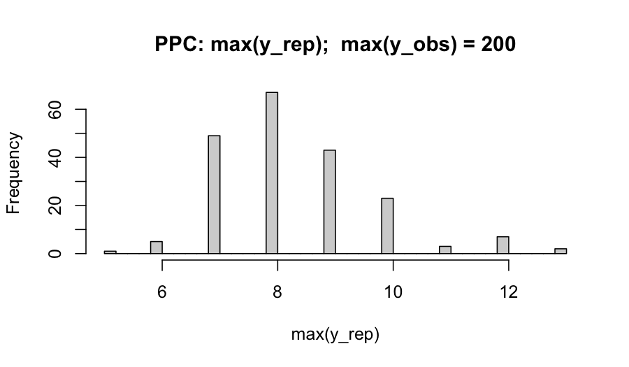

# Tutorial 10: Cross-engine triangulation: when Bayesian engines disagree

> **Premise.** Disagreement between two Bayesian inference engines on
> the same model and data is a *finding*, not a bug. This vignette walks
> through the principled diagnostic protocol implemented by
> [`flexyBayes::triangulate()`](https://aagi-aus.github.io/flexyBayes/reference/triangulate.md):
> verify each engine’s own diagnostics, classify the disagreement type,
> run targeted predictive checks, resolve, and document.

## 1. Why triangulate?

When you fit the same model to the same data on two engines — say
Hamiltonian Monte Carlo (HMC) via `greta`, and integrated nested Laplace
approximation (INLA; Rue, Martino, & Chopin, 2009) via R-INLA — you are
running two structurally different approximations to the same posterior.
Each makes a different bet.

- **Stan-/greta-NUTS**, the no-U-turn HMC sampler, converges to the true
  posterior asymptotically but introduces finite-sample MCMC noise. It
  can struggle with funnel-shaped hierarchical posteriors,
  multimodality, and very heavy tails — and it surfaces this struggle
  through *divergences* and Pareto-$`\hat{k}`$ warnings (Vehtari et al.,
  2024).
- **INLA** is a deterministic Laplace approximation valid when the model
  belongs to the latent Gaussian model (LGM) class. Outside the LGM
  class — finite mixtures, distributional regression on the scale,
  latent-class structures — INLA will silently *approximate*, often with
  visible bias.
- **Variational engines** (e.g., greta-VI, Pathfinder) seek the
  posterior mode and Gaussian curvature; they typically underestimate
  posterior variance.

Agreement across engines is informative evidence that *none* of these
approximation errors materially distorts your posterior. Disagreement is
a triangulation prompt: one or more engines is failing this particular
model–data combination, *or* the model itself is mis-specified. The
Bayesian Workflow paper (Gelman et al., 2020) explicitly endorses
cross-implementation checks as a core workflow step.

## 2. What disagreement actually means

Disagreement is *not* automatically a verdict against either engine. It
is a triangulation prompt — one or more of:

1.  The model is mis-specified for the data, and the engines disagree
    about *which* part of the misspecification dominates.
2.  The engines disagree because the posterior violates one engine’s
    structural assumption (Gaussian-conditional latent field for INLA;
    absence of severe geometry pathology for HMC).
3.  One engine has not converged (low ESS, $`\widehat{R} > 1.01`$,
    divergences, or Pareto-$`\hat{k} > 0.7`$).
4.  The user has implemented two subtly different priors or link
    functions across the two backends — what Banerjee, Carlin, and
    Gelfand (2014) call “the devil in the details”.

Modrák’s (2018) Stan-versus-INLA case study shows that for a Poisson
generalised linear mixed model (GLMM) with independent random effects,
posteriors agree to four decimal places across $`n`$ from 100 to 25,000
*when priors are matched*. Any disagreement is therefore a *signal*, not
noise.

### Reading the independence-axis label

Agreement is not one thing. Each
[`triangulate()`](https://aagi-aus.github.io/flexyBayes/reference/triangulate.md)
report carries an `independence` label naming *what kind* of convergence
the agreement underwrites, drawn from a closed three-axis vocabulary
that follows Gelman et al.’s (2020) *Bayesian Workflow* taxonomy of
cross-checks:

- **algorithmic** — the two engines use different inference paradigms
  (here HMC versus Laplace approximation). Agreement on this axis is the
  strongest claim: it rules out algorithm-specific failure modes such as
  mixing pathologies or tail-approximation error.
- **implementation** — the same paradigm through different code bases
  (different automatic-differentiation framework, code generation, or
  numerical regime). Agreement catches numerical and prior-translation
  bugs.
- **specification** — the same likelihood through different
  parameterisations. No current backend pair exercises this axis alone;
  it is reserved for future within-backend reparameterisation checks.

A greta-versus-INLA comparison is labelled
`algorithmic + implementation` (the engines differ on both paradigm and
code base), so a small Wasserstein-1 distance there is a stronger
convergence statement than the same distance between two HMC engines.
The print method colour-grades the label by methodological strength on a
colour terminal; the labels are plain text everywhere else.

## 3. The eight common disagreement patterns

| \# | Cause | Symptom | First diagnostic |
|----|----|----|----|
| 1 | **Heavy-tailed likelihood** (Student-t, Cauchy, robust REs) | INLA posterior tighter; greta posterior wider, more skewed; means similar, *quantiles diverge* | tail-quantile differences; PPC on `min`, `max`, kurtosis |
| 2 | **Variance components near zero** (boundary) | INLA over- or under-estimates small variances; greta posterior L-shaped | 5 % quantile of $`\sigma`$; non-centred reparameterisation; `inla.hyperpar()` post-correction |
| 3 | **Hyperparameter prior mismatch** (PC vs half-Cauchy vs half-Normal) | tail-disagreement on $`\sigma`$ propagating to fixed-effect SEs | refit with *identical* priors on both sides |
| 4 | **Non-LGM structure** (mixtures, ZI with REs on the zero-prob, hurdle with shared REs) | ZI-logit and shared-RE marginals diverge sharply; INLA `cpo$failure > 0` | INLA’s `cpo$failure`; PPC on zero counts; SBC |
| 5 | **Sparse data regimes** (low $`n`$, high collinearity, rare events) | skewness, multimodality in greta; INLA gives a unimodal Gaussian-like marginal | density-overlay plot; Wasserstein-1; tail-ESS in greta |
| 6 | **Strongly correlated hyperparameters** | wrong correlation structure in $`\boldsymbol{\theta}`$; downstream latent shifts | pairs plots across engines; INLA `int.strategy` sensitivity |
| 7 | **Boundary effects in spatial fields** (BYM vs BYM2; SPDE mesh extension) | spatial RE variance differs; precisions on different scales | BYM2 + `inla.scale.model = TRUE` + PC priors; verify identical neighbourhood graph |
| 8 | **Funnel-shape hierarchy** (Neal, 2003) | greta divergences \> 0; INLA confident but wrong on group-level posterior SDs | greta divergences; non-centred parameterisation; SBC on $`\tau`$ |

## 4. The five-step protocol

### Step 1 — Triangulate and quantify

Fit on engine A and engine B with identical priors, link function, and
design matrix. Convert both posteriors to a common
`posterior::draws_array`.
[`flexyBayes::triangulate()`](https://aagi-aus.github.io/flexyBayes/reference/triangulate.md)
does this for you and computes, per scalar parameter:

- mean shift in posterior-SD units;
- 1D empirical Wasserstein-1 distance;
- ratio of posterior SDs;
- tail-quantile differences (2.5 % and 97.5 %).

Threshold: flag any parameter with \|mean shift\| \> 0.1 SD *or*
Wasserstein-1 \> 0.1 SD *or* SD ratio outside \[0.9, 1.1\].

### Step 2 — Verify each engine’s own diagnostics first

**HMC.** $`\widehat{R}_{\text{rank}} < 1.01`$,
ESS$`_{\text{bulk}} > 400`$, ESS$`_{\text{tail}} > 400`$, zero
divergences, Pareto-$`\hat{k} < 0.7`$ (Vehtari et al., 2021, 2024).

**INLA.** `cpo$failure == 0`; `inla.hyperpar()` correction applied;
`mode$mode.status == 0`; no boundary hyperparameter mass within
$`10^{-3}`$ of internal-scale limits.

*Do not interpret cross-engine disagreement until both engines pass
their own tests.* Disagreement between an unconverged engine and a
converged one is a non-finding.

### Step 3 — Classify the disagreement

Map each flagged parameter to one of the eight rows in §3. In applied
work, the two most common patterns are *heavy-tailed likelihood* (when
one observation drags HMC tails wider than INLA’s mode-anchored Laplace
can capture) and *non-LGM structure* (when the user has unwittingly
written a model INLA approximates rather than fits). Variance-component
boundary is the most common in random-intercept models with small group
counts.

### Step 4 — Run targeted SBC and PPC

**Simulation-based calibration (SBC; Talts, Betancourt, Simpson,
Vehtari, & Gelman, 2018; ECDF-graphical refinement Säilynoja, Bürkner, &
Vehtari, 2022)** on the parameters that disagree. Budget: 50 to 100
replications. SBC tells you whether *either* engine is calibrated for
this model–data, independent of cross-engine agreement.

**Posterior-predictive checks (PPC; Gelman, Meng, & Stern, 1996)** on
the data features the disagreement implicates — tail statistics for
likelihood-tail disagreements, group-level summaries for hierarchical
disagreements, zero counts for ZI/hurdle.

### Step 5 — Resolve and document

- 1.  If a third engine (NIMBLE, JAGS, brms-Stan) agrees with one of the
      two, declare the agreeing pair the reference.
- 2.  If SBC fails for one engine on this model–data, that engine is
      mis-calibrated *for this problem*; trust the other and report it.
- 3.  If neither engine passes SBC, the model is mis-specified — expand
      it (heavier-tailed likelihood, non-centred parameterisation,
      hierarchical hyperprior reform).
- 4.  If PPC reveals likelihood mis-specification, refit with an
      expanded likelihood.
- 5.  When all else is equal, the more flexible engine (HMC) wins, *but
      the choice and its rationale must be documented* — the
      disagreement metric, the diagnostic that justified the choice, the
      model class (LGM-fit or not), and the prior alignment.
      Reproducibility of the *decision*, not just the fit, is what makes
      triangulation defensible.

## 5. A worked example: planted extreme observation

We simulate a hierarchical Poisson regression with one extreme
observation and fit it on greta and INLA with matched priors.

``` r

G       <- 30L                              # number of groups
n_per   <- 8L                               # observations per group
sigma_g <- 0.4
beta    <- c(`(Intercept)` = 0.5, x = 0.3)
group   <- factor(rep(seq_len(G), each = n_per))
x       <- rnorm(G * n_per)
u_g     <- rnorm(G, 0, sigma_g)
eta     <- beta[1] + beta[2] * x + as.numeric(u_g[group])
y       <- rpois(length(eta), exp(eta))
y[1]    <- 200L                             # planted extreme
dat     <- data.frame(y = y, x = x, group = group)
```

We fit the same Poisson model on both engines, with a
penalised-complexity prior on the group-level standard deviation.

``` r

library(flexyBayes)
priors <- fb_prior(
  sigma           ~ pc(upper = 1, prob = 0.05),
  sd(group = "group") ~ pc(upper = 1, prob = 0.05),
  b("x")          ~ normal(mean = 0, sd = 2.5)
)
priors
#> <fb_prior> 3 specifications
#>   sigma ~ pc(upper = 1, prob = 0.05)
#>   sd(group = "group") ~ pc(upper = 1, prob = 0.05)
#>   b("x") ~ normal(mean = 0, sd = 2.5)
```

``` r

fit_greta <- fb_greta(
  y ~ x + (1 | group),
  data         = dat,
  family       = "poisson",
  prior        = priors,
  n_samples    = 2000,
  warmup       = 5000,
  chains       = 4,
  verbose      = FALSE,
  mcmc_verbose = FALSE
)
summary(fit_greta)
#> Bayesian mixed model summary  [flexyBayes]
#> ============================================================ 
#>   Fixed  : y ~ x + (1 | group) 
#>   Family : poisson / log 
#>   N = 240 , chains = 4 , samples = 2000 
#>   Representation: exact
#>   Engine:         greta MCMC
#> 
#> -- Fixed effects (posterior)  --------------------------------- 
#>             Estimate Post.SD   2.5%  97.5%
#> (Intercept)   0.5859  0.1304 0.3261 0.8413
#> x             0.4184  0.0441 0.3319 0.5043
#> 
#> -- Variance components  -------------------------------------- 
#>     Component Estimate     SD   2.5%  97.5%
#> 1 sigma_group   0.6517 0.0957 0.4927 0.8708
#> 2 sigma_e_atg   0.3264 0.3230 0.0082 1.2028
#> 
#> -- Convergence  --------------------------------------------- 
#>   Rhat range: 1 - 1.008 
#>   ESS  range: 1534 - 7615 
#>   Run time  : 26.3 sec
```

``` r

fit_inla <- fb_inla(
  y ~ x + (1 | group),
  data    = dat,
  family  = "poisson",
  prior   = priors,
  verbose = FALSE
)
summary(fit_inla)
#> Bayesian fit summary  [flexybayes_inla / INLA backend]
#> ------------------------------------------------------------ 
#> Fixed effects:
#>               mean     sd 0.025quant 0.5quant 0.975quant   mode kld
#> (Intercept) 0.5881 0.1305     0.3270   0.5895     0.8416 0.5895   0
#> x           0.4189 0.0441     0.3324   0.4189     0.5053 0.4189   0
#> 
#> Hyperparameters:
#>                       mean    sd 0.025quant 0.5quant 0.975quant   mode
#> Precision for group 2.5035 0.718     1.3366   2.4234     4.1306 2.2663
#> 
#> Random effects:
#>   groups: group
#> ------------------------------------------------------------
```

### 5.1 Triangulate and quantify

`flexyBayes` ships a canonical parameter-name registry that reconciles
greta’s internal naming (`mu_atg`, `beta_x`, `sigma_group`) with INLA’s
internal naming (`(Intercept)`, `x`, `Precision for group`) and applies
the `sqrt(1 / precision)` transform needed to put INLA’s precision draws
on the standard-deviation scale before comparison. No user-supplied
`name_map` or `transform_b` is required for fixed effects, factor-level
coefficients, and group-level SDs.

``` r

tri <- tryCatch(
  triangulate(fit_greta, fit_inla),
  error = function(e) {
    message("triangulate() unavailable in this session: ",
            conditionMessage(e))
    NULL
  }
)
if (!is.null(tri)) tri
#> <triangulate_result>
#>   source_a: greta
#>   source_b: inla
#>   independence: algorithmic + implementation
#>     (HMC (greta on TensorFlow) versus Laplace approximation (INLA on C): different inference paradigms and different code bases.)
#>   n_common: 3
#>   only_a:   1 parameter (sigma)
#>   only_b:   270 parameters (Predictor:1, Predictor:2, Predictor:3, Predictor:4, Predictor:5, ...)
#> 
#> Metrics (per common parameter):
#>         param mean_a mean_b mean_diff   sd_a   sd_b sd_ratio q025_diff
#> 1 (Intercept) 0.5859 0.5838    0.0021 0.1304 0.1312   0.9938   -0.0092
#> 2           x 0.4184 0.4206   -0.0021 0.0441 0.0439   1.0039   -0.0103
#> 3    sd_group 0.6517 0.6463    0.0053 0.0957 0.0965   0.9918    0.0033
#>   q975_diff wasserstein_1
#> 1   -0.0077        0.0047
#> 2   -0.0077        0.0022
#> 3    0.0230        0.0155
```

The print method highlights any column that breaches the
flag-thresholds. Here the engines agree closely: the fixed effects and
the group-level SD match to within a credible-interval width, with
`sd_ratio`s near one and modest `wasserstein_1`. That agreement is the
*reassuring* outcome of a triangulation – two independent algorithms
applied to the same model land in the same place, so neither is
misleading you about the posterior.

Triangulation earns its keep on the runs where the engines do *not*
agree. The group-level SD is the usual flashpoint, whether because a
heavy-tailed observation distorts the likelihood or because INLA’s
Laplace approximation of a small-group variance is itself unreliable (it
may shrink the component, or with very few groups vary across runs); §3
classifies the patterns and the response to each. Crucially, engine
*agreement* does not mean the *model* is right: the planted extreme in
this dataset is a likelihood-misspecification problem that both engines
share, so the cross-engine table cannot reveal it. The
posterior-predictive check in §5.3 is what surfaces that – a reminder
that triangulation is a check on the *inference*, not a substitute for
checking the *model*.

User-supplied `name_map` and `transform_b` still take precedence over
the registry, so a custom alignment (e.g., for an unmapped
hyperparameter, or to override the SD canonical form) remains available;
see
[`?canonical_names`](https://aagi-aus.github.io/flexyBayes/reference/canonical_names.md)
for the per-fit map view and
[`?triangulate`](https://aagi-aus.github.io/flexyBayes/reference/triangulate.md)
for the precedence contract.

### 5.2 Visualise the comparison

``` r

# Overlay marginals via posterior::draws_array. INLA posterior sampling
# may be unavailable in CRAN's vignette re-render — wrap defensively.
if (requireNamespace("bayesplot", quietly = TRUE)) {
  ok <- tryCatch({
    da <- flexyBayes::fb_as_draws_simple(fit_greta)
    db <- flexyBayes::fb_as_draws_simple(fit_inla, n_samples = 500)
    s_a <- da$sigma_group
    s_b <- 1 / sqrt(db[["Precision for group"]])
    bayesplot::mcmc_areas(
      cbind(greta = s_a, inla = s_b),
      pars = c("greta", "inla"),
      prob = 0.9
    )
    TRUE
  }, error = function(e) {
    message("INLA posterior sampling unavailable: ", conditionMessage(e))
    FALSE
  })
}
```

The overlay either confirms the numbers from the table (densities nearly
identical → trust either engine) or shows a visible shift, shape
difference, or tail asymmetry that will be classifiable by §3.

### 5.3 Posterior-predictive check on the right tail

A planted extreme observation is precisely a likelihood-tail problem.
The PPC test quantity should be the realised maximum:

``` r

draws <- flexyBayes::fb_as_draws_simple(fit_greta)
mu_intercept <- mean(draws$mu_atg)        # greta names the global intercept mu_atg
mu_beta      <- mean(draws$beta_x)        # continuous-covariate coefficient
fitted_mu    <- exp(mu_intercept + mu_beta * dat$x)
n_rep        <- 200
y_rep        <- replicate(n_rep, rpois(length(fitted_mu), fitted_mu))
y_rep_max    <- apply(y_rep, 2, max)
y_obs_max    <- max(dat$y)
hist(y_rep_max, breaks = 30,
     main = sprintf("PPC: max(y_rep);  max(y_obs) = %d", y_obs_max),
     xlab = "max(y_rep)")
abline(v = y_obs_max, col = "firebrick", lwd = 2)
```



plot of chunk ppc-max

If the observed maximum sits in the upper tail of the replicated maxima,
the Poisson likelihood is plausibly accommodating the data; if it sits
beyond the simulated distribution, the likelihood is mis-specified for
the tail. In our planted scenario the observed maximum (200) sits well
outside the simulated distribution — the canonical signal that we should
refit with negative-binomial or zero-inflated negative-binomial.

### 5.4 What to do next

In this example, the diagnosis is *likelihood mis-specification*. The
next move is to refit with a heavier-tailed likelihood and
re-triangulate. `flexyBayes` supports `family = "negative_binomial"` on
both backends:

``` r

fit_greta_nb <- fb_greta(y ~ x + (1 | group), data = dat,
                         family = "negative_binomial", prior = priors,
                         n_samples = 500,
                         warmup = 500, chains = 2,
                         verbose = FALSE, mcmc_verbose = FALSE)
fit_inla_nb  <- fb_inla(y ~ x + (1 | group), data = dat,
                        family = "negative_binomial", prior = priors,
                        verbose = FALSE)
triangulate(fit_greta_nb, fit_inla_nb)
```

Re-triangulation on the negative-binomial fit is left as an exercise.

## 6. Best-practice summary

1.  **Match the model before you compare the posteriors.** Identical
    priors (PC versus half-Cauchy is the silent killer), identical link,
    identical neighbourhood graph for spatial models, identical
    zero-inflation structure. Only then is a difference informative. The
    [`fb_prior()`](https://aagi-aus.github.io/flexyBayes/reference/fb_prior.md)
    DSL is designed to make this matching automatic.
2.  **Pass each engine’s own diagnostics first.** Disagreement between
    an unconverged engine and a converged one is a non-finding.
3.  **Quantify disagreement on a fixed scale.** Mean shift in
    posterior-SD units, Wasserstein-1, SD ratio, tail-quantile
    differences — the same five numbers, every time. Visual overlap is
    necessary but not sufficient.
4.  **Triangulate with SBC and PPC, not just a third engine.** A third
    engine resolves *which* posterior is right; SBC tells you whether
    *either* is calibrated for this problem; PPC tells you whether the
    model itself fits.
5.  **Document the resolution explicitly.** When you trust one engine
    over another, record (a) the disagreement metric, (b) the diagnostic
    that justified the choice, (c) the model class (LGM-fit or not),
    and (d) the prior alignment.

## 7. Active prompts

1.  Re-run the worked example without the planted extreme (set
    `y[1] <- rpois(1, exp(eta[1]))` instead of 200). The Wasserstein-1
    distances should collapse toward zero and the PPC distribution
    should bracket the observed maximum.
2.  Vary `sigma_g` between 0.05 and 1.0. As `sigma_g` approaches zero
    the boundary problem (pattern 2 in §3) appears; observe how the
    posterior on `sigma_group` behaves on each engine and how
    [`triangulate()`](https://aagi-aus.github.io/flexyBayes/reference/triangulate.md)
    reports it.
3.  Replace the Poisson likelihood with negative-binomial (set
    `family = "negative_binomial"` on both engines) and re-triangulate.

## 8. Session information

``` r

sessionInfo()
#> R version 4.5.2 (2025-10-31)
#> Platform: aarch64-apple-darwin20
#> Running under: macOS Tahoe 26.5.1
#> 
#> Matrix products: default
#> BLAS:   /System/Library/Frameworks/Accelerate.framework/Versions/A/Frameworks/vecLib.framework/Versions/A/libBLAS.dylib 
#> LAPACK: /Library/Frameworks/R.framework/Versions/4.5-arm64/Resources/lib/libRlapack.dylib;  LAPACK version 3.12.1
#> 
#> locale:
#> [1] en_AU.UTF-8/en_AU.UTF-8/en_AU.UTF-8/C/en_AU.UTF-8/en_AU.UTF-8
#> 
#> time zone: Australia/Adelaide
#> tzcode source: internal
#> 
#> attached base packages:
#> [1] stats     graphics  grDevices utils     datasets  methods   base     
#> 
#> other attached packages:
#> [1] flexyBayes_0.8.3
#> 
#> loaded via a namespace (and not attached):
#>   [1] tidyselect_1.2.1       dplyr_1.2.1            farver_2.1.2          
#>   [4] tensorflow_2.20.0      loo_2.9.0              S7_0.2.2              
#>   [7] tensorA_0.36.2.1       INLA_25.10.19          TH.data_1.1-5         
#>  [10] digest_0.6.39          estimability_1.5.1     lifecycle_1.0.5       
#>  [13] gretaR_0.2.0           sf_1.1-0               survival_3.8-3        
#>  [16] processx_3.9.0         magrittr_2.0.5         posterior_1.7.0       
#>  [19] compiler_4.5.2         rlang_1.2.0            progress_1.2.3        
#>  [22] tools_4.5.2            data.table_1.18.2.1    sn_2.1.3              
#>  [25] knitr_1.51             prettyunits_1.2.0      bridgesampling_1.2-1  
#>  [28] mnormt_2.1.2           bit_4.6.0              classInt_0.4-11       
#>  [31] reticulate_1.45.0      plyr_1.8.9             RColorBrewer_1.1-3    
#>  [34] multcomp_1.4-29        abind_1.4-8            KernSmooth_2.23-26    
#>  [37] numDeriv_2016.8-1.1    withr_3.0.2            stats4_4.5.2          
#>  [40] grid_4.5.2             xtable_1.8-8           e1071_1.7-17          
#>  [43] future_1.70.0          ggplot2_4.0.3          ggridges_0.5.7        
#>  [46] globals_0.19.1         emmeans_2.0.2          scales_1.4.0          
#>  [49] MASS_7.3-65            dichromat_2.0-0.1      cli_3.6.6             
#>  [52] mvtnorm_1.3-6          crayon_1.5.3           generics_0.1.4        
#>  [55] RcppParallel_5.1.11-2  otel_0.2.0             reshape2_1.4.5        
#>  [58] tfruns_1.5.4           DBI_1.3.0              proxy_0.4-29          
#>  [61] stringr_1.6.0          splines_4.5.2          bayesplot_1.15.0      
#>  [64] parallel_4.5.2         coro_1.1.0             matrixStats_1.5.0     
#>  [67] base64enc_0.1-6        marginaleffects_0.32.0 brms_2.23.0           
#>  [70] vctrs_0.7.3            Matrix_1.7-4           sandwich_3.1-1        
#>  [73] jsonlite_2.0.0         greta_0.5.1            callr_3.7.6           
#>  [76] hms_1.1.4              bit64_4.8.0            listenv_0.10.1        
#>  [79] units_1.0-1            glue_1.8.1             parallelly_1.47.0     
#>  [82] codetools_0.2-20       distributional_0.7.0   stringi_1.8.7         
#>  [85] gtable_0.3.6           tibble_3.3.1           pillar_1.11.1         
#>  [88] Brobdingnag_1.2-9      torch_0.17.0           R6_2.6.1              
#>  [91] fmesher_0.7.0          evaluate_1.0.5         lattice_0.22-7        
#>  [94] png_0.1-9              backports_1.5.1        tfautograph_0.3.2     
#>  [97] MatrixModels_0.5-4     rstantools_2.6.0       class_7.3-23          
#> [100] Rcpp_1.1.1-1.1         checkmate_2.3.4        coda_0.19-4.1         
#> [103] nlme_3.1-168           whisker_0.4.1          xfun_0.57             
#> [106] zoo_1.8-15             pkgconfig_2.0.3
```

## References

Banerjee, S., Carlin, B. P., & Gelfand, A. E. (2014). *Hierarchical
modeling and analysis for spatial data* (2nd ed.). Chapman & Hall/CRC.

Gelman, A., Meng, X.-L., & Stern, H. (1996). Posterior predictive
assessment of model fitness via realized discrepancies. *Statistica
Sinica*, 6(4), 733–760.

Gelman, A., Vehtari, A., Simpson, D., Margossian, C. C., Carpenter, B.,
Yao, Y., Kennedy, L., Gabry, J., Bürkner, P.-C., & Modrák, M. (2020).
Bayesian workflow. *arXiv preprint* arXiv:2011.01808.

Modrák, M. (2018). A gentle Stan vs. INLA comparison.
<https://www.martinmodrak.cz/2018/02/02/a-gentle-stan-vs.-inla-comparison/>

Neal, R. M. (2003). Slice sampling. *Annals of Statistics*, 31(3),
705–767.

Rue, H., Martino, S., & Chopin, N. (2009). Approximate Bayesian
inference for latent Gaussian models by using integrated nested Laplace
approximations. *Journal of the Royal Statistical Society: Series B*,
71(2), 319–392.

Säilynoja, T., Bürkner, P.-C., & Vehtari, A. (2022). Graphical test for
discrete uniformity and its applications in goodness-of-fit evaluation
and multiple sample comparison. *Statistics and Computing*, 32, 32.

Talts, S., Betancourt, M., Simpson, D., Vehtari, A., & Gelman, A.
(2018). Validating Bayesian inference algorithms with simulation- based
calibration. *arXiv preprint* arXiv:1804.06788.

Vehtari, A., Gelman, A., Simpson, D., Carpenter, B., & Bürkner, P.-C.
(2021). Rank-normalization, folding, and localization: An improved
$`\widehat{R}`$ for assessing convergence of MCMC. *Bayesian Analysis*,
16(2), 667–718.

Vehtari, A., Simpson, D., Gelman, A., Yao, Y., & Gabry, J. (2024).
Pareto smoothed importance sampling. *Journal of Machine Learning
Research*, 25(72), 1–58.
