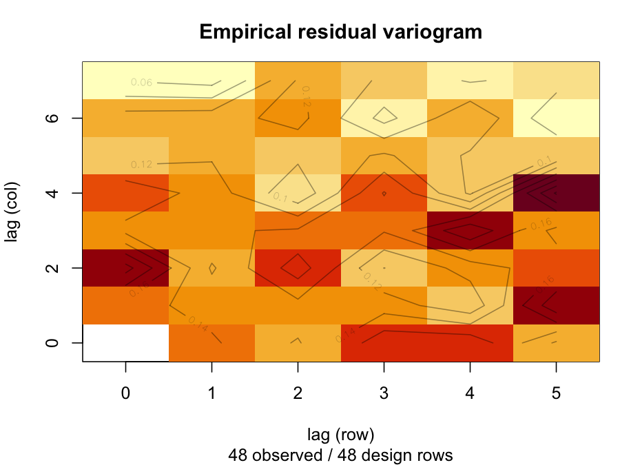

# 1. Scope

This page is for the reader who arrives with last season's `asreml()`
call in hand. It translates that call, then the six commands typed after
it, and it says plainly where the answer is the same shape and where it
is a different quantity. It is deliberately short. The *getting started*
vignette is the full on-ramp, and the *formula surface* vignette is the
complete term catalogue.

> **`flexyBayes` does not depend on the proprietary `asreml` package.**
> The DSL borrows ASReml's notation. The inference engine is INLA (a
> Laplace approximation) or brms (Stan, Hamiltonian Monte Carlo), chosen
> automatically for the model you write. ASReml syntax is referenced as
> a vocabulary, not invoked as a dependency, and no ASReml call on this
> page is executed.

# 2. The call you already have

A field trial, six rows by eight columns, twelve varieties in four
blocks. The call an ASReml user writes:


``` r
library(asreml)

asr <- asreml(
  fixed    = yield ~ Variety,
  random   = ~ Block,
  residual = ~ ar1(col):ar1(row),
  data     = trial
)
```

The translation is line for line, with one exception. The `fixed`,
`random` and `data` arguments carry over unchanged. The `residual` line
does not: ASReml's separable autoregressive residual is a three-parameter
structure with no independent plot error, and the engines here represent
a separable AR1 process as a latent field plus observation noise, which
is four parameters. That model is written on the random side, and
Section 6 shows the refusal you get if you paste the residual line as it
stands.

Simulated data of that shape, so the page reproduces:


``` r
library(flexyBayes)

set.seed(20260817)
trial <- expand.grid(row = factor(1:6), col = factor(1:8))
attr(trial, "out.attrs") <- NULL
trial$Block   <- factor(rep(1:4, each = 12))
trial$Variety <- factor(paste0("V", rep(1:12, times = 4)))

v_eff <- rnorm(12, 0, 0.6)
b_eff <- rnorm(4, 0, 0.4)
trial$yield <- 5 +
  v_eff[as.integer(trial$Variety)] +
  b_eff[as.integer(trial$Block)] +
  rnorm(nrow(trial), 0, 0.5)

head(trial)
#>   row col Block Variety    yield
#> 1   1   1     1      V1 5.275053
#> 2   2   1     1      V2 6.607965
#> 3   3   1     1      V3 6.397117
#> 4   4   1     1      V4 5.841378
#> 5   5   1     1      V5 4.865873
#> 6   6   1     1      V6 5.858152
```

The block model, which the rest of this page reads:


``` r
fit <- flexybayes(
  fixed   = yield ~ Variety,
  random  = ~ Block,
  data    = trial,
  verbose = FALSE
)
fit
#> Bayesian mixed model  [flexyBayes / inla]
#> -------------------------------------------------------------- 
#>   Fixed    : yield ~ Variety 
#>   Random   : ~Block 
#>   Model    : G: Block iid; R: units 
#>   Family   : gaussian / identity 
#>   Representation: exact (model, not inference)
#>   Engine:         INLA Laplace
#>   N        : 48 design rows, 48 observed responses
#>   na_action: augment; 0 missing response(s); 0 cell(s) completed
#>   Runtime  : 2.4 sec
#>   INLA formula: yield ~ 1 + Variety + f(Block, model = "iid", <prior: uniform-SD(0, 4.425)>)
#>   Params   : 12 fixed, 1 random, 2 hyperparameter(s)
#>   numerical confirm: PASS
#> -------------------------------------------------------------- 
#>   Object of class <flexybayes_inla>
#>   $inla -- raw INLA fit (use INLA's summary, plot, etc.)
#>   $fb   -- the fb_terms IR used for dispatch
```

The print names the engine for what it did. There is no chain count on a
Laplace approximation, and the design and observed row counts are both
reported because on an augmented fit they are different numbers.

# 3. The next six things you type

| ASReml | flexyBayes | What comes back |
|---|---|---|
| `summary(fit)$varcomp` | `summary(fit)$varcomp` | The same rows. A posterior mean, a credible interval, and the prior each component ran under. |
| `wald(fit)` | No equivalent, by decision | A posterior carries no Wald test. Read the credible interval in `summary(fit)$fixed`, which answers the same question without a null distribution. |
| `plot(fit)` | `plot(fit)`, `plot(fit, type = "variogram")` | Residuals and a quantile-quantile plot on a Laplace fit, sampler diagnostics on a sampled fit. The variogram is the empirical residual semivariance over the array. |
| `predict(fit, classify = "Variety")` | `predict(fit, classify = "Variety")` | Marginal means with credible intervals. No `sed` block and no pairwise table. |
| `coef(fit)$random` | `coef(fit, what = "random")`, or `ranef(fit)` | One data frame per grouping factor, with the level, the estimate and its interval. |
| `update(fit, random = ~ Block + row)` | The same call | A re-fit on either engine, with the recorded `na_action` carried forward. |
| `na.method(y = "include", x = "fail")` | `na_action = list(y = "include", x = "fail")` | Accepted directly, and the `na.method()` object itself is accepted too. |

## 3.1 Variance components

`summary()` prints its report and returns the object behind it, so the
table you read is the table you can subset:


``` r
fb_sum <- summary(fit)
#> Bayesian mixed model summary  [flexyBayes / inla]
#> ============================================================== 
#>   Fixed    : yield ~ Variety 
#>   Random   : ~Block 
#>   Model    : G: Block iid; R: units 
#>   Family   : gaussian / identity 
#>   Representation: exact (model, not inference)
#>   Engine:         INLA Laplace
#>   N        : 48 design rows, 48 observed responses
#>   na_action: augment; 0 missing response(s); 0 cell(s) completed
#>   Runtime  : 2.4 sec
#> 
#> -- Fixed effects (posterior mean, 95% credible interval) --------
#>         term estimate std.error conf.low conf.high
#>  (Intercept)   4.0785    0.6020   2.8473    5.3097
#>   VarietyV10   1.3882    0.3612   0.6761    2.1002
#>   VarietyV11   1.3520    0.3612   0.6398    2.0640
#>   VarietyV12   1.6329    0.3612   0.9207    2.3449
#>    VarietyV2   1.4491    0.3612   0.7370    2.1612
#>    VarietyV3   1.5269    0.3612   0.8147    2.2389
#>    VarietyV4   1.4673    0.3612   0.7552    2.1793
#>    VarietyV5   0.0824    0.3612  -0.6298    0.7944
#>    VarietyV6   1.0017    0.3612   0.2896    1.7137
#>    VarietyV7   1.0599    0.3612   0.3477    1.7719
#>    VarietyV8   0.2009    0.3612  -0.5112    0.9129
#>    VarietyV9   1.1900    0.3612   0.4778    1.9020
#> 
#> -- Variance components (95% credible interval) ------------------
#> Estimate = posterior mean (not REML). Prior column is the prior that was used.
#>  component estimate std.error conf.low conf.high                         prior
#>      sigma   0.5082    0.0642   0.3969    0.6482 uniform(lower=0, upper=4.425)
#>   sd_Block   1.0155    0.6367   0.3351    2.8608 uniform(lower=0, upper=4.425)
#>  note
#>      
#>      
#> 
#> -- Hyperparameters (INLA, precision scale) ---------------------
#>                                           mean     sd 0.025quant 0.5quant
#> Precision for the Gaussian observations 4.0576 1.0195     2.3749   3.9493
#> Precision for Block                     2.1885 2.5712     0.1360   1.3802
#>                                         0.975quant   mode
#> Precision for the Gaussian observations     6.3607 3.7564
#> Precision for Block                         8.9826 0.3649
#> 
#> -- Convergence -----------------------------------------------
#>   Engine    : INLA nested Laplace approximation
#>   Mode status: 0 (0 = converged)
#>   Marginal log-likelihood: -91.684
#>   Largest symmetric KLD between the Gaussian approximation and the
#>   corrected marginal: 0.00157
#>   Numerical confirm: PASS

names(fb_sum)
#>  [1] "fixed"      "varcomp"    "random"     "missing"    "converge"  
#>  [6] "n_design"   "n_observed" "na_action"  "model"      "engine"    
#> [11] "call"
fb_sum$varcomp
#>   component  estimate  std.error  conf.low conf.high
#> 1     sigma 0.5081552 0.06417041 0.3969494 0.6482452
#> 2  sd_Block 1.0155492 0.63668546 0.3350752 2.8607575
#>                                   prior note
#> 1 uniform(lower=0, upper=4.42517479054)     
#> 2 uniform(lower=0, upper=4.42517479054)
```

## 3.2 Random effects


``` r
coef(fit, what = "random")$Block
#>   group level    estimate std.error   conf.low conf.high
#> 1 Block     1  0.83272358 0.5557801 -0.2998811 2.0216576
#> 2 Block     2 -0.07518618 0.5543720 -1.2380005 1.0825429
#> 3 Block     3 -0.27282074 0.5545129 -1.4423682 0.8782740
#> 4 Block     4 -0.48471753 0.5548418 -1.6615466 0.6593264
```

`ranef(fit)` returns the same object. Where `nlme` or `lme4` is attached
in the same session, `flexyBayes::ranef(fit)` is the collision-proof
spelling.

## 3.3 Predicted means


``` r
head(predict(fit, classify = "Variety"), 4)
#> Predicted means: Variety  (95% credible interval)
#> Estimate = posterior mean of the marginal mean. Not an SED table.
#> INLA: intervals from the Gaussian approximation of the fixed effects.
#>  Variety estimate std.error conf.low conf.high
#>       V1   4.0785    0.6389   2.8263    5.3306
#>      V10   5.4667    0.6422   4.2081    6.7253
#>      V11   5.4304    0.6312   4.1933    6.6675
#>      V12   5.7114    0.6386   4.4598    6.9630
```

The banner is part of the table. `classify` averages the fitted model
over the levels of the factors you name, which is the table an ASReml
user reaches `predict(..., classify = )` for, and it is built on
`emmeans`, so `emmeans::emmeans(fit, ~ Variety)` reaches the same
machinery when you want the contrast vocabulary. Each package weights
that average by its own rules, so read the two as answering the same
question rather than as returning the same numbers.

## 3.4 Observation counts, and a re-fit


``` r
c(design = nobs(fit), observed = nobs(fit, type = "observed"))
#>   design observed 
#>       48       48

fit_two <- update(fit, random = ~ Block + row)
#> 
#> -- flexyBayes: INLA fit ----------------------------------------
#>   formula: yield ~ 1 + Variety + f(Block, model = "iid", <prior: uniform-SD(0, 4.425)>) + f(row, model = "iid", <prior: uniform-SD(0, 4.425)>)
#>   family:  gaussian
#> ------------------------------------------------------------
```

The banner is the re-fit announcing itself. The recorded `na_action`
travels with it, so an augmented fit re-fits as an augmented fit rather
than quietly becoming a complete-case one.

The added term is the field's row stratum, which the block model did not
carry. It has to be a term the model does not already have: writing
`random = ~ Block + Variety` here would put `Variety` on both sides of a
model whose fixed part is `yield ~ Variety`, and Section 6 shows what
that gets you.

# 4. Missing plots

The field-book rule is one sentence: a lost plot is a row with the design
columns filled in and the response `NA`, never a row that is absent.

`na_action` accepts ASReml's own vocabulary, by shape rather than by
class, so no asreml licence is needed to write it:

| ASReml | flexyBayes | Behaviour |
|---|---|---|
| `na.method(y = "include")` | `na_action = "augment"` (the default) | The missing response is kept as a latent quantity the engine marginalises, and the design grid is completed where the absent cells are determinable. |
| `na.method(y = "omit")` | `na_action = "omit"` | The rows are deleted. A structured covariance over the resulting broken grid then refuses downstream. |
| `na.method(y = "fail")` | `na_action = "fail"` | A missing response is refused, and the design grid is left alone. |
| `na.method(x = "fail")` | `na_action = list(x = "fail")` | The default on both sides. A missing predictor is refused. |
| `na.method(x = "omit")` | `na_action = list(x = "omit")` | The affected rows are dropped, with a warning naming the count and the columns. |
| `na.method(x = "include")` | Refused by name | ASReml's zero-fill. Section 6 says why it stays unimplemented. |

Two plots lost, written the way a field book writes them:


``` r
holed <- trial
holed$yield[c(5, 9)] <- NA

fit_holed <- flexybayes(
  fixed     = yield ~ Variety,
  random    = ~ Block,
  data      = holed,
  na_action = list(y = "include", x = "fail"),
  verbose   = FALSE
)

c(design = nobs(fit_holed), observed = nobs(fit_holed, type = "observed"))
#>   design observed 
#>       48       46
```

The two unobserved cells are a table of their own, on the response
scale, rather than a hole in the fitted values. It is the `missing` slot
of the summary, and `coef()` reaches the same table without printing the
whole report:


``` r
coef(fit_holed, what = "missing")
#>   row estimate std.error conf.low conf.high
#> 1   5 5.015217 0.3589734 4.303642  5.718630
#> 2   9 5.987535 0.3589741 5.275952  6.690942
```

## 4.1 When the plot is missing from the file altogether

A trial whose lost plots were never typed in has an incomplete grid, and
a separable field needs one observation per node. `fb_complete_grid()`
reinstates the absent cells with the response `NA`:


``` r
absent <- trial[-c(3, 17), c("row", "col", "yield")]
padded <- fb_complete_grid(absent, ~ row * col, response = "yield")

c(rows = nrow(padded), missing = sum(is.na(padded$yield)))
#>    rows missing 
#>      48       2
```

That worked because every column at the reinstated cells was determined.
Add the variety and the block back, and it refuses:


``` r
refused <- tryCatch(
  fb_complete_grid(trial[-c(3, 17), ], ~ row * col, response = "yield"),
  error = function(e) e
)
cat(conditionMessage(refused))
#> 2 cell(s) of the row x col grid are absent from the data altogether, and Block, Variety is not constant across the trial -- so completing the grid would mean inventing a level of it for a plot nobody recorded. ASReml's own nin89 example codes such plots as LANCER, a variety name standing in for "nothing was sown here"; flexyBayes will not write a level you did not. Supply the field-book rows instead -- one row per sown plot, with the design columns filled in and the response set to NA -- or name the level the empty cells should carry, fb_complete_grid(..., unused_level = "UNSOWN").
```

The refusal names the habit it declines to copy. A variety label at an
unsown plot is a real quantity nobody recorded, and every table
downstream would report it as data. The door is open, and it has a name
on it:


``` r
padded_named <- fb_complete_grid(
  trial[-c(3, 17), ],
  ~ row * col,
  response     = "yield",
  unused_level = "UNSOWN"
)
#> Warning: flexyBayes: filled 2 reinstated design cell(s) with the unused level
#> "UNSOWN" in Block, Variety. Those cells now carry a design assignment nobody
#> recorded; every estimate that reads the named column(s) is conditional on it.
nrow(padded_named)
#> [1] 48
```

The warning names every column that was filled. That is the difference
between a default and a decision.

# 5. Reading `$varcomp` next to ASReml's

The rows are the same rows, and the estimator is not the same estimator.
`$varcomp` reports the posterior mean of each component with a credible
interval, where `summary(asr)$varcomp` reports a REML point estimate with
its asymptotic standard error. Reading one against the other is a
same-design, different-estimator comparison, and a difference is not
evidence that either is wrong.

The package's own validation sweep records what that difference looks
like in bulk. On complete data the agreement rate between the augmenting
Bayesian fit and the ASReml device runs 0.63 to 0.69 on the incomplete
block, multi-environment, randomised-complete-block and spatial designs,
and 1.00 on the row-column design, and the sweep report that ships with
the package (`inst/validation/report_sweep.txt`) carries the whole table.
Where a REML-to-REML identity does hold -- ASReml's `y = "include"`
against an independently written observed-data REML -- the sweep records
it separately, and it is not this comparison.

Three things to read off the table before comparing anything.

**The prior column.** Every component ran under a prior, and the column
names it. A weakly-informative bounded uniform on the standard deviation
is not the same estimator as an unpenalised restricted likelihood, and
the difference is largest exactly where the data are thinnest, which is
usually the component with few levels.

**The scale.** Components are reported on the standard-deviation scale on
both engines. INLA's own hyperparameter table is on the precision scale
and is printed beside it, unmodified, so both are available and neither
is silently converted.

**The parameter count on a spatial model.** The respelled field is four
parameters where ASReml's residual is three, and the summary says so on
the table itself:


``` r
fit_field <- flexybayes(
  fixed   = yield ~ Variety,
  random  = ~ ar1(row):ar1(col),
  data    = trial,
  verbose = FALSE
)

fb_field <- summary(fit_field)
#> Bayesian mixed model summary  [flexyBayes / inla]
#> ============================================================== 
#>   Fixed    : yield ~ Variety 
#>   Random   : ~ar1(row):ar1(col) 
#>   Model    : G: ar1(row):ar1(col) field + nugget (4 parameters); R: units 
#>              this is not ASReml residual = ~ ar1:ar1 (3 parameters)
#>   Family   : gaussian / identity 
#>   Representation: exact (model, not inference)
#>   Engine:         INLA Laplace
#>   N        : 48 design rows, 48 observed responses
#>   na_action: augment; 0 missing response(s); 0 cell(s) completed
#>   Runtime  : 2.1 sec
#> 
#> -- Fixed effects (posterior mean, 95% credible interval) --------
#>         term estimate std.error conf.low conf.high
#>  (Intercept)   4.1010    0.4954   3.1197    5.1389
#>   VarietyV10   1.4523    0.5265   0.3854    2.4841
#>   VarietyV11   1.4182    0.5448   0.3179    2.4920
#>   VarietyV12   1.6950    0.5597   0.5628    2.7983
#>    VarietyV2   1.4516    0.4263   0.6074    2.3041
#>    VarietyV3   1.4913    0.4717   0.5266    2.4106
#>    VarietyV4   1.4264    0.5021   0.3952    2.4039
#>    VarietyV5   0.0386    0.5245  -1.0402    1.0606
#>    VarietyV6   0.9579    0.5420  -0.1575    2.0151
#>    VarietyV7   1.1633    0.4098   0.3487    1.9670
#>    VarietyV8   0.3091    0.4651  -0.6071    1.2377
#>    VarietyV9   1.2680    0.5007   0.2623    2.2539
#> 
#> -- Variance components (95% credible interval) ------------------
#> Estimate = posterior mean (not REML). Prior column is the prior that was used.
#>   component estimate std.error conf.low conf.high                         prior
#>       sigma   0.5043    0.0790   0.3711    0.6803 uniform(lower=0, upper=4.425)
#>  sd_spatial   0.5309    0.1819   0.2708    0.9800                engine default
#>     rho_row   0.8749    0.1425   0.4691    0.9951                engine default
#>     rho_col   0.6790    0.2309   0.0928    0.9619                engine default
#>  note
#>      
#>      
#>      
#>      
#> The field and the nugget are separate parameters: this is not ASReml's nugget-free residual.
#> 
#> -- Hyperparameters (INLA, precision scale) ---------------------
#>                                           mean     sd 0.025quant 0.5quant
#> Precision for the Gaussian observations 4.2224 1.3160     2.1556   4.0495
#> Precision for row_id                    4.8650 3.3913     1.0460   4.0080
#> Rho for row_id                          0.8749 0.1425     0.4691   0.9247
#> GroupRho for row_id                     0.6790 0.2309     0.0928   0.7369
#>                                         0.975quant   mode
#> Precision for the Gaussian observations     7.2820 3.7334
#> Precision for row_id                       13.7080 2.6149
#> Rho for row_id                              0.9951 0.9887
#> GroupRho for row_id                         0.9619 0.8811
#> 
#> Separable AR1 field (posterior median, 95% interval):
#>                        parameter median   2.5%  97.5%
#>  correlation along row (rho_row) 0.9247 0.4691 0.9951
#>  correlation along col (rho_col) 0.7369 0.0928 0.9619
#>           field SD (sigma_field) 0.4995 0.2701 0.9778
#>              nugget SD (sigma_e) 0.4969 0.3706 0.6811
#>   The field and the nugget are separate parameters: this is a latent
#>   autoregressive field plus independent observation noise, not ASReml's
#>   nugget-free separable residual. Variances are the squares of the SDs.
#> 
#> -- Convergence -----------------------------------------------
#>   Engine    : INLA nested Laplace approximation
#>   Mode status: 0 (0 = converged)
#>   Marginal log-likelihood: -104.037
#>   Largest symmetric KLD between the Gaussian approximation and the
#>   corrected marginal: 3.07e-05
#>   Numerical confirm: PASS
```

The row correlations from the two models are not comparable quantities.
One is the correlation of a latent field that has independent plot noise
beside it, the other is the correlation of the residual itself.

The empirical variogram runs over the array and is computed on the
observed rows -- a residual is `NA` on an augmented row by construction.
`plot()` returns the table it drew, so the semivariance is readable as
well as visible:


``` r
vg <- plot(fit_field, type = "variogram")
```



``` r
head(vg, 4)
#>   lag_row lag_col semivariance n_pairs
#> 1       0       1    0.1475912      42
#> 2       0       2    0.2077084      36
#> 3       0       3    0.1340452      30
#> 4       0       4    0.1555844      24
```

There is no fitted-variogram overlay. The surface is the empirical
semivariance and nothing is fitted to it.

# 6. What still refuses

Each refusal names the nearest supported model in one sentence. The full
vocabulary is `fb_refusals()`.

**The separable residual.** Pasted as it stands, the residual line is
refused, and the refusal carries the respelling:


``` r
refused_ar1 <- tryCatch(
  flexybayes(
    fixed    = yield ~ Variety,
    residual = ~ ar1(col):ar1(row),
    data     = trial,
    verbose  = FALSE
  ),
  error = function(e) e
)
cat(conditionMessage(refused_ar1))
#> residual = ~ ar1(col):ar1(row) asks for ASReml's separable autoregressive residual: a single correlated residual with no independent plot error, three parameters on a field grid (row correlation, column correlation, one variance). INLA represents a separable AR1 process as a latent random field plus the observation-level Gaussian noise -- four parameters -- which nests ASReml's model as the nugget goes to zero but returns different correlations on data with real plot-to-plot noise. flexyBayes will not fit the four-parameter model under the three-parameter name. Two routes: write the field on the random side, random = ~ ar1(col):ar1(row), which fits the field-plus-nugget model under its own name on INLA (one observation per grid node); or use ASReml itself for the exact residual formulation (Gilmour, Cullis, & Verbyla, 1997).
```

**Factor-analytic terms.** `fa(env, k):geno` needs an engine, not a
table, and neither active engine emits one:


``` r
refused_fa <- tryCatch(
  flexybayes(
    fixed   = yield ~ 1,
    random  = ~ fa(Block, 2):Variety,
    data    = trial,
    verbose = FALSE
  ),
  error = function(e) e
)
cat(conditionMessage(refused_fa))
#> fa(Block, 2):Variety requests a factor-analytic covariance -- a rank-k loading matrix plus a diagonal. Neither active engine emits one: INLA's f() has no factor-analytic latent model, and brms group-level effects are either uncorrelated or fully unstructured. Use us(Block):Variety for the full unstructured covariance, diag(Block):Variety for heterogeneous variances with no correlation, or ASReml for the factor-analytic model itself. The term still parses, so fb_terms() will describe it.
```

**A term on both sides.** ASReml accepts `yield ~ Variety` with
`random = ~ Block + Variety` and fits it, so a translated script can
arrive carrying it. The fixed part already estimates one mean per
variety, which leaves the random copy identified by its prior alone:


``` r
refused_alias <- tryCatch(
  flexybayes(
    fixed   = yield ~ Variety,
    random  = ~ Block + Variety,
    data    = trial,
    verbose = FALSE
  ),
  error = function(e) e
)
cat(conditionMessage(refused_alias))
#> The term `Variety` is on both the fixed and the random side. The fixed part already estimates one mean per level of Variety, so the random copy has no information left to describe -- its deviations are held up by their prior alone, and the variance component reported for Variety would be a reading of that prior rather than of the data. Two ways to write what was probably meant: drop `Variety` from `random` to keep population-level means for it, or drop it from the fixed part to keep shrunk level effects (a variance component and BLUPs). ASReml accepts this spelling and fits it, so a script translated from ASReml can arrive here unchanged.
```

**Marginal means for a random factor.** `predict(classify = )` averages
the fitted model over a reference grid built from the fixed part, and a
factor that enters only as a grouping term is not in that grid. The
level effects themselves are on the fit, so the refusal points at them:


``` r
refused_classify <- tryCatch(
  predict(fit, classify = "Block"),
  error = function(e) e
)
cat(conditionMessage(refused_classify))
#> predict(classify = "Block") asks for marginal means of Block, and Block enters this model only as a random-effects grouping factor. The marginal-means table is built over the population-level reference grid, which carries the fixed part of the model only, so there is no Block to average over there. The level effects themselves are on the fit: coef(fit, what = "random") or ranef(fit) return the shrunk predictions for Block with their intervals. Population-level marginal means for a random factor are planned; they are not in this release.
```

**Covariate zero-fill.** ASReml's `x = "include"` treats a missing
predictor as zero. That setting is refused here, because a zero is a
value the plot did not have and nothing downstream would say so:


``` r
with_cov <- trial
with_cov$moisture <- rnorm(nrow(with_cov))
with_cov$moisture[4] <- NA

refused_x <- tryCatch(
  flexybayes(
    fixed     = yield ~ Variety + moisture,
    random    = ~ Block,
    data      = with_cov,
    na_action = list(y = "include", x = "include"),
    verbose   = FALSE
  ),
  error = function(e) e
)
cat(conditionMessage(refused_x))
#> The predictor(s) moisture have missing values and the covariate policy is `include`. ASReml treats a missing covariate as zero under that setting (ASReml-R Reference Manual 4.2, section 3.11). A zero is a value the plot did not have: the fit would report a coefficient estimated partly from observations nobody made, and nothing downstream would say so. Supply the values, or pass na_action = list(y = "include", x = "omit") to drop the affected rows and see the count.
```

**A missing response on a non-Gaussian family, routed to brms.** brms
drops `NA`-response rows silently, and its `mi()` addition term, which
would sample them instead, is Gaussian-only. Rather than let augmentation
become complete-case deletion under another name, that route refuses
(`brms_cannot_augment_nongaussian`) and points at INLA, which carries a
missing response as a native prediction target for every family. On a
non-identity link the unobserved-cell table is withheld with a named
warning, because those rows are computed on the linear predictor and the
rows beside them are on the response scale.

# 7. Two doors

The accessors above are views over an ordinary Bayesian fit. Nothing is
converted and nothing is hidden, so the same object answers to the
ecosystem generics a Bayesian reaches for.

| ASReml hands | Bayesian hands |
|---|---|
| `summary(fit)$varcomp` | `posterior::as_draws_df(fit)` |
| `coef(fit, what = "random")`, `ranef(fit)` | `posterior::as_draws()`, `posterior::as_draws_matrix()`, `fb_as_draws_simple(fit)` |
| `predict(fit, classify = "Variety")` | `emmeans` or `marginaleffects` on the same fit |
| `plot(fit, type = "variogram")` | `pp_check(fit)`, `plot(fit, type = "diagnostics")` |
| `summary(fit)$converge` | The same slot, reporting the engine's own diagnostics |
| No ASReml counterpart | `prior_summary(fit)`, `loo(fit)`, `triangulate(fit_a, fit_b)` |

The generics live in their home packages, so the short spellings
(`loo(fit)`, `pp_check(fit)`) work once **loo** or **bayesplot** is
attached -- otherwise call them qualified, `loo::loo(fit)` and
`bayesplot::pp_check(fit)`, as the examples below do.

Draws, under canonical names, with the variance components on the
standard-deviation scale -- the same names `triangulate()` compares:


``` r
draws <- posterior::as_draws_df(fit, n_draws = 500)
dim(draws)
#> [1] 500  17
grep("^sd_|^sigma", names(draws), value = TRUE)
#> [1] "sigma"    "sd_Block"

as.data.frame(posterior::summarise_draws(
  posterior::subset_draws(draws, variable = c("(Intercept)", "sd_Block")),
  "mean", "sd", ~ quantile(.x, probs = c(0.025, 0.975))
))
#>      variable     mean        sd      2.5%    97.5%
#> 1 (Intercept) 4.070088 0.6270806 2.8411921 5.330986
#> 2    sd_Block 1.009737 0.6546407 0.3235653 2.540375
```

On an INLA fit those draws are sampled from the fitted Laplace
approximation through the configuration store. The fit draws no random
numbers, so it is deterministic in principle, though the optimiser's
landing point can move between runs. The sampling step carries its own
seed semantics and is not pinned by `set.seed()` alone, so raise
`n_draws` before reading a small difference between two sets of draws as
a difference between two posteriors. The *cross-engine triangulation*
vignette works through what that means in practice.

Where the fit does not carry what a generic needs, the generic refuses by
name and says what the fit does hold:


``` r
refused_loo <- tryCatch(loo::loo(fit), error = function(e) e)
cat(conditionMessage(refused_loo))
#> loo() estimates the expected log pointwise predictive density by importance-weighting the log-likelihood of each observation at each posterior draw, and this fit does not store that quantity, so there is nothing to leave one observation out of. This fit was estimated by INLA's nested Laplace approximation, which returns marginal densities rather than draws of the log-likelihood. This fit does carry the two information criteria INLA computed at fit time: WAIC 86.0617 at `fit$inla$waic$waic`, and DIC 85.8022 at `fit$inla$dic$dic`. Neither is a leave-one-out estimate, and neither carries the Pareto-k diagnostics loo() reports. For a leave-one-out estimate on this model, re-fit it on the brms engine -- flexybayes(..., backend = "brms") -- whose sampler stores the pointwise log-likelihood loo() reads. The sibling refusal fit_lacks_posterior_draws is raised when a fit carries no posterior at all.
```


``` r
refused_pp <- tryCatch(bayesplot::pp_check(fit), error = function(e) e)
cat(conditionMessage(refused_pp))
#> pp_check() draws replicated datasets from the posterior predictive distribution and overlays them on the observed response, and this fit carries no predictive draws to replicate from. The fit's class is <flexybayes_inla, flexybayes, list>, and its engine (inla) returns an approximation to the posterior rather than simulated datasets. The diagnostics it does answer are plot(fit, type = "residuals"), residuals against fitted values beside a normal quantile-quantile plot, and, on a fit carrying a design index, plot(fit, type = "variogram"), the empirical semivariance of the residuals over the array. For a posterior predictive check on this model, re-fit it on the brms engine -- flexybayes(..., backend = "brms").
```

On a brms-engine fit both of those pass through to the real thing --
`brms::loo()` and `brms::pp_check()`, replicated datasets and all --
because the sampler stores the pointwise log-likelihood and the
predictive draws that each one reads.

The prior every component ran under is a first-class surface, and it is
the same resolved object the `prior` column projects:


``` r
prior_summary(fit)
#> <prior_summary>  backend = inla
#>   Source: auto-default bounded uniform on SD (weakly-informative; half-Cauchy advised for small J)
#>     Upper bound U = 4.425175
#>     Scale basis    = identity_sd_uniform
#> 
#> <fb_prior> 2 specifications
#>   sigma ~ uniform(lower = 0, upper = 4.425175)
#>   sd(group = "Block") ~ uniform(lower = 0, upper = 4.425175)
```

The *priors and regularisation* vignette is where that object is built
rather than read, and it is the place to go before changing a default.
For the full Bayesian on-ramp -- production sampling budgets, the
convergence diagnostics, and the trustworthy-fit workflow -- start at the
*getting started* vignette.
