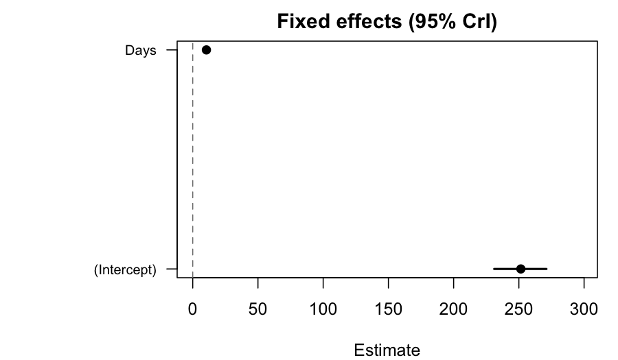

# 1. Why Bayesian mixed models?

Restricted maximum likelihood (REML) — the workhorse behind `lme4`,
`nlme`, and ASReml — returns a single point estimate of each variance
component plus a Wald-style standard error. Two situations make this
summary uncomfortable.

- **Small group counts.** When the number of clusters is modest
  (fewer than roughly thirty), the sampling distribution of the
  variance-component estimator has a long right tail. The Wald
  interval is informative only near the centre, where the posterior
  is approximately quadratic.
- **Boundary problems.** A maximum-likelihood variance estimate can
  land on zero. That is *uninformative*: the data may not have ruled
  out a small-but-nonzero variance, but the boundary collapses both
  the estimate and the uncertainty.

A Bayesian fit replaces the point estimate with the *full posterior
distribution*. You see directly how much mass the data place near
zero, and you can propagate that uncertainty into derived quantities
— predictions, contrasts, best linear unbiased predictors (BLUPs) —
without leaning on quadratic approximations.

`flexyBayes` is built around one principle: switching from REML to
Bayesian inference should not change the formula you write. If you
can express the model in ASReml-style syntax, `flexybayes()` fits
it. If you prefer brms-style notation, `fb()` fits the same model
(it auto-detects which grammar you used). Both routes go through a
shared internal representation, and
the same fitted object supports `summary()`, `predict()`,
`emmeans::emmeans()`, `marginaleffects::predictions()`, and the
`bayesplot::*` family.

# 2. Installation

`flexyBayes` requires R 4.1.0 or later. Inference happens through one of
two engines.

- **greta** (default). A TensorFlow-backed Hamiltonian Monte Carlo
  (HMC) sampler. Covers every term type in the asreml-format domain-
  specific language (DSL).
- **INLA** — integrated nested Laplace approximation (Rue et al.,
  2009). A deterministic Laplace approximation over the latent
  Gaussian model (LGM) class. Substantially faster than HMC, but
  with a narrower scope.

Install both:

```r
# greta and its TensorFlow backend
install.packages("greta")
greta::install_greta_deps()      # one-time Python/TF setup

# INLA — not on CRAN; from the INLA team's repository
install.packages(
  "INLA",
  repos = c(getOption("repos"),
            INLA = "https://inla.r-inla-download.org/R/stable")
)

# flexyBayes itself
install.packages("flexyBayes")
# or, while on GitHub:
# remotes::install_github("AAGI-AUS/flexyBayes")
```

A handful of companion packages enrich the post-fit experience and are
introduced in subsequent vignettes:

```r
install.packages(c("emmeans", "marginaleffects", "bayesplot",
                   "posterior", "loo", "effectsize", "agridat"))
```

If INLA cannot be installed on your platform, the package degrades
gracefully. The greta backend remains available; INLA-only paths emit
clear messages and you simply do without `triangulate()` for now.

# 3. The four-verb API

`flexyBayes` exposes four user-facing entry points. Pick the verb
that matches how the model is expressed; the choice of entry never
implicitly changes the choice of backend.

| Verb | When to use |
|---|---|
| `flexybayes()` / `fb()` | Principal / universal entry. Asreml-style (`fixed = ..., random = ~ g, rcov = ~ ...`) or brms-style (`response ~ x + (1 \| g)`) formulas; auto-detects the grammar and takes a `backend` argument to choose the engine. Full term-type surface (`fa`, `us`, `at`, `ar1`, `vm`, `ped`, `spl`, `pol`). |
| `fb_greta()` / `fb_inla()` / `fb_brms()` | Engine pins: fix the backend to greta (HMC), INLA (Laplace), or Stan (brms). Each accepts the same two formula grammars; `fb_greta()` also accepts a user-built native `greta_model`. |
| `triangulate()` | Cross-engine posterior comparison. Takes two fits from different backends and reports per-parameter agreement metrics. |

The universal entries `flexybayes()` / `fb()` take a `backend`
argument: `"auto"` (the default — gate-driven routing: INLA on
accept, greta on refuse, with a silenceable note carrying the
reason), `"greta"` (HMC), `"inla"` (explicit LGM fast path; refuses
non-LGM models with a structured message), and `"brms"` (Stan). The
engine pins `fb_greta()` / `fb_inla()` / `fb_brms()` fix the backend
instead of taking the argument. The dispatch trace is available
post-fit via `backend_decision()`. The *backend internals* vignette
walks through the dispatch flow end-to-end.

# 4. Your first model

We use `lme4::sleepstudy` (Belenky et al., 2003): reaction times for
eighteen subjects across ten days of restricted sleep. The natural
mixed model has a fixed linear time trend and a random subject
intercept.


``` r
library(flexyBayes)
data(sleepstudy, package = "lme4")
str(sleepstudy)
#> 'data.frame':	180 obs. of  3 variables:
#>  $ Reaction: num  250 259 251 321 357 ...
#>  $ Days    : num  0 1 2 3 4 5 6 7 8 9 ...
#>  $ Subject : Factor w/ 18 levels "308","309","310",..: 1 1 1 1 1 1 1 1 1 1 ...
```

We start with a brms-style formula -- it reads exactly as in
`lme4::lmer()` or `brms::brm()`: `Reaction ~ Days + (1 | Subject)` --
and fit it with the brms (Stan) engine pin `fb_brms()`, which samples
this small hierarchical model to clean convergence:


``` r
fit_brms <- fb_brms(
  Reaction ~ Days + (1 | Subject),
  data         = sleepstudy,
  n_samples    = 1000,
  warmup       = 1000,
  chains       = 4,
  verbose      = FALSE,
  mcmc_verbose = FALSE
)
fit_brms
#> Bayesian mixed model  [flexyBayes / brms passthrough]
#> ------------------------------------------------------- 
#>   Fixed  : Reaction ~ Days + (1 | Subject) 
#>   Family : gaussian ( identity link )
#>   MCMC   : 4 chain(s) x 1000 samples (warmup = 1000 ) -- 22.3 sec (Stan via brms)
#>   Params : 25 monitored; 2 fixed, 1 random terms
#>   Max Rhat: 1.003  [OK] 
#>   Min ESS: 525 
#> ------------------------------------------------------- 
#>   $glm    -- GLM-compatible shim (coef, vcov, fitted, etc.)
#>   $brms   -- live brmsfit (loo, posterior_predict, summary)
#>   $extras -- diagnostics, variance components, call info
```

The printed summary includes a `Representation: exact` line. This reports that
the model was emitted to the backend without structural approximation: every
term in the formula is represented as written, with no low-rank or sparse
truncation. It describes the model *representation*, not the *inference*. The
greta and brms (Stan) backends draw from the posterior by MCMC, so their only
inferential error is Monte Carlo sampling error, whereas the INLA backend
always performs *approximate* inference (integrated nested Laplace
approximation) whether or not its representation is exact. flexyBayes treats
"exact representation" and "exact inference" as separate claims and makes only
the first (see `API_STABILITY.md`, section "Inference semantics").

### A note on random *intercepts* versus random *slopes*

The same data also supports `Reaction ~ Days + (Days | Subject)` — a
per-subject slope on top of the intercept. The brms-style grammar
accepts random intercepts only (single or crossed); random slopes
raise a structured refusal naming the offending construct:

```r
fb_greta(Reaction ~ Days + (Days | Subject), data = sleepstudy)
#> Error: random slopes (Days | Subject) are not in the supported
#>   brms-style corpus. Express the random structure in asreml-style
#>   form via flexybayes(fixed = Reaction ~ Days,
#>                       random = ~ Subject + Subject:Days, ...).
```

The asreml-style entry `flexybayes()` covers a wider term surface
(factor-analytic, unstructured, autoregressive, pedigree, smooths)
and is documented in the *asreml-shaped formulas* vignette; the
*hierarchical models* vignette covers the random-slope case via the
asreml route. For the remainder of this introduction we keep the
random intercept.

# 5. What is inside a fit?

`fit_brms` is an object of class `flexybayes`. The default print method
is concise; `summary()` gives the full posterior digest:


``` r
summary(fit_brms)
#> Bayesian mixed model summary  [flexyBayes]
#> ============================================================ 
#>   Fixed  : Reaction ~ Days + (1 | Subject) 
#>   Family : gaussian / identity 
#>   N = 180 , chains = 4 , samples = 1000 
#>   Representation: exact
#>   Engine:         brms / Stan HMC
#> 
#> -- Fixed effects (posterior)  --------------------------------- 
#>             Estimate Post.SD     2.5%    97.5%
#> (Intercept) 251.5273 10.1695 231.0889 271.1541
#> Days         10.4903  0.8493   8.8704  12.1267
#> 
#> -- Variance components  -------------------------------------- 
#>    Component Estimate     SD    2.5%   97.5%
#> 1 sd_Subject  39.9453 7.8968 27.4310 57.9798
#> 2      sigma  31.2680 1.7057 28.0121 34.6908
#> 
#> -- Convergence  --------------------------------------------- 
#>   Rhat range: 1 - 1.003 
#>   ESS  range: 525 - 4536 
#>   Run time  : 22.3 sec
```

The output is laid out in three blocks.

1. **Fixed effects.** Posterior mean, posterior standard deviation
   (SD), and equal-tailed 95 % credible interval for each design-
   matrix column. Here `(Intercept)` is the baseline reaction time
   and `Days` is the per-day slope.
2. **Variance components.** The Subject-level SD and the residual SD,
   both on the response scale.
3. **Sampler diagnostics.** Effective sample size (ESS) and the
   rank-normalised $\widehat{R}$ (Vehtari et al., 2021). The targets
   for a trustworthy fit are ESS $\ge 400$ and $\widehat{R} \le 1.01$
   on every parameter. The fixed effects and the residual SD reach
   them; the Subject-level variance component and its latent
   per-subject deviations mix more slowly -- variance components are
   among the slowest-mixing quantities in hierarchical MCMC -- so the
   worst of them does not reach the strict bar at a vignette-scale
   budget. How far above it lands varies from run to run, because
   greta's TensorFlow-backed sampler is not fully seed-reproducible; in
   practice it sits in roughly the $\widehat{R} \approx 1.1$ to $1.4$
   range. The honest reading: the quantities you interpret are
   reliable, while the hardest-mixing nuisance parameter is not yet at
   the strict bar. Two moves address it -- run longer (more warmup and
   draws), or cross-check against a different algorithm, which the next
   section does with INLA.

A coefficient plot of the fixed effects is one line:


``` r
plot(fit_brms, type = "effects")
```



### Variance-component priors

When you call any entry (`flexybayes()` / `fb()` or an engine pin)
without specifying a prior, `flexyBayes` announces the default it uses on every
random-effect SD and the residual SD: a **bounded uniform on the SD
scale**, $\sigma \sim \mathrm{Uniform}(0, U)$, with a family-aware
upper bound (Gelman, 2006). The announcement names $U$, the scale
basis, and the override knobs, and fires once per session. Passing
`prior_vc_sd = m` opts back into the legacy
$\sigma \sim \mathrm{Lognormal}(0, m)$ default; passing a structured
`prior = fb_prior(...)` overrides both. The *priors and
regularisation* vignette articulates the choice in detail and shows
how to set priors deliberately.

Fixed-effect coefficients carry a separate weakly-informative default:
$\beta \sim \mathcal{N}(0, 100)$, applied uniformly to the intercept,
contrast levels, continuous slopes, factor-by-continuous
interactions, and `I()`-expression terms. The scale (`sd = 100`)
covers responses with central tendency up to several hundred on the
natural scale without crushing the posterior toward zero, while
still regularising at small per-coefficient sample sizes (Gelman et
al., 2008). Override via `prior_fixed_sd = ...` or, for individual
coefficients, via `b("name") ~ normal(...)` in `fb_prior()`.

# 6. The same model on a second engine

`fit_brms` is a Markov chain Monte Carlo (MCMC) fit; INLA runs a
fundamentally different algorithm — a Laplace approximation over a
small set of hyperparameters — and finishes almost instantly:


``` r
fit_inla <- fb_inla(
  Reaction ~ Days + (1 | Subject),
  data    = sleepstudy,
  verbose = FALSE
)
summary(fit_inla)
#> Bayesian fit summary  [flexybayes_inla / INLA backend]
#> ------------------------------------------------------------ 
#> Fixed effects:
#>                 mean     sd 0.025quant 0.5quant 0.975quant     mode kld
#> (Intercept) 251.4786 6.6716   238.3836 251.4783   264.5757 251.4783   0
#> Days         10.4509 1.2494     7.9982  10.4510    12.9033  10.4510   0
#> 
#> Hyperparameters:
#>                                                 mean           sd   0.025quant
#> Precision for the Gaussian observations 4.000000e-04 0.000000e+00 4.000000e-04
#> Precision for Subject                   2.772571e+12 1.140429e+12 1.326318e+12
#>                                             0.5quant   0.975quant         mode
#> Precision for the Gaussian observations 4.000000e-04 5.000000e-04 4.000000e-04
#> Precision for Subject                   2.527563e+12 5.700903e+12 2.082286e+12
#> 
#> Random effects:
#>   groups: Subject
#> ------------------------------------------------------------
```

Both engines have fitted the same posterior, one by Stan's Hamiltonian
Monte Carlo and one by INLA's Laplace approximation. *How well do they
agree?* That is the question `triangulate()` answers. The canonical
parameter-name registry reconciles each engine's internal names -- brms's
`b_Intercept`, `b_Days`, `sd_Subject__Intercept`, `sigma`, and INLA's
`(Intercept)`, `Days`, `Precision for Subject`,
`Precision for the Gaussian observations` -- automatically; no
`name_map` is needed for the common cases.


``` r
# INLA's posterior sampler can be flaky under restricted-process
# environments (e.g., CRAN's vignette re-render). Wrap so a failure
# is informative rather than fatal.
tri <- tryCatch(
  triangulate(fit_brms, fit_inla),
  error = function(e) {
    message("triangulate() unavailable in this session: ",
            conditionMessage(e))
    NULL
  }
)
if (!is.null(tri)) tri
#> <triangulate_result>
#>   source_a: brms
#>   source_b: inla
#>   independence: algorithmic + implementation
#>     (HMC (brms on Stan) versus Laplace approximation (INLA on C): different inference paradigms and different code bases.)
#>   n_common: 4
#>   only_a:   21 parameters (Intercept, r_Subject[308,Intercept], r_Subject[309,Intercept], r_Subject[310,Intercept], r_Subject[330,Intercept], ...)
#>   only_b:   198 parameters (Predictor:1, Predictor:2, Predictor:3, Predictor:4, Predictor:5, ...)
#> 
#> Metrics (per common parameter):
#>         param   mean_a   mean_b mean_diff    sd_a   sd_b     sd_ratio q025_diff
#> 1 (Intercept) 251.5273 251.2888    0.2385 10.1695 6.8851 1.477000e+00   -6.9009
#> 2        Days  10.4903  10.5096   -0.0192  0.8493 1.2666 6.705000e-01    0.8091
#> 3  sd_Subject  39.9453   0.0000   39.9453  7.8968 0.0000 4.682797e+07   27.4310
#> 4       sigma  31.2680  48.1621  -16.8941  1.7057 2.5135 6.786000e-01  -15.9653
#>   q975_diff wasserstein_1
#> 1    7.1057        2.5152
#> 2   -0.9302        0.3095
#> 3   57.9798       39.8564
#> 4  -18.9459       16.8888
```

The output is a per-parameter readout. The column to focus on first is
`wasserstein_1` — a scale-respecting distance between the two posterior
marginals — read alongside the SD ratio and the tail-quantile
differences. Values near zero indicate agreement.

For the fixed effects the two engines agree closely -- the intercept
and the `Days` slope match to within a credible-interval width. The
Subject variance component is where an approximate engine earns
scrutiny. INLA's integrated nested Laplace approximation is fast and
accurate for the fixed-effect structure of a latent Gaussian model, but
its estimate of a *small-group* variance component -- here there are
only eighteen subjects -- is fragile: depending on the numerical
optimisation it may track the MCMC estimate or shrink the component
sharply toward zero. The `sd_ratio` column is where any such divergence
shows. That fragility is the lesson, not a detail to hide: a single
approximate fit of a small-group variance component is not trustworthy
on its own. Triangulate it against MCMC, or supply an explicit
penalised-complexity prior on the SD (the *priors and regularisation*
vignette shows how). The *cross-engine triangulation* vignette
catalogues this and the other common disagreement patterns and the
protocol for diagnosing each. A divergence of more than 0.1 SD on a
parameter you care about is a *finding*, not a bug.

### Letting the package choose the backend

`backend = "auto"` runs the model through `lgm_gate()` and routes to
INLA on accept, greta on refuse:


``` r
fit_auto <- flexybayes(
  Reaction ~ Days + (1 | Subject),
  data         = sleepstudy,
  backend      = "auto",
  n_samples    = 200,
  warmup       = 200,
  chains       = 1,
  verbose      = FALSE,
  mcmc_verbose = FALSE
)
backend_decision(fit_auto)
#> $backend
#> [1] "inla"
#> 
#> $path
#> [1] "auto_accept"
#> 
#> $gate_checks
#> [1] "lgm_compatible"      "gretaR_slot_dormant"
#> 
#> $reason
#> [1] "lgm_gate() accepted; INLA dispatch."
#> 
#> $preflight_summary
#> NULL
#> 
#> $representation_plan
#> NULL
#> 
#> $rejected_routes
#> $rejected_routes[[1]]
#> $rejected_routes[[1]]$backend
#> [1] "greta"
#> 
#> $rejected_routes[[1]]$reason
#> [1] "not_chosen_by_policy"
#> 
#> 
#> $rejected_routes[[2]]
#> $rejected_routes[[2]]$backend
#> [1] "gretaR"
#> 
#> $rejected_routes[[2]]$reason
#> [1] "backend_not_activated"
#> 
#> 
#> 
#> $routing_policy_version
#> [1] "stage5a_v1"
```

`backend_decision()` returns the dispatch trace: which backend ran,
which gate checks were evaluated, and the reason. On a Gaussian
random-intercept model the gate accepts and (when INLA is installed)
the auto path lands on INLA; otherwise it falls back to greta with a
silenceable note.

# 7. Where to next?

The remaining vignettes are organised by topic, not by engine. A
suggested reading order:

| Vignette | What it covers |
|---|---|
| Foundational regression | one- and two-way fixed effects; smooths via `mgcv::s()`; comparison with `lm()` |
| Hierarchical models | random intercepts, nested and crossed effects, Poisson and binomial generalised linear mixed models (GLMMs); backend dispatch in practice |
| asreml-shaped formulas | the full term-type catalogue: `factor`, `fa`, `us`, `at`, `ar1`, `vm`, `ped`, … |
| Priors and regularisation | the `fb_prior()` DSL, the uniform-on-SD default, the fixed-effect default, prior-predictive checks |
| Cross-engine triangulation | the signature feature: when engines disagree, what it means, what to do |
| LGM feasibility | what `lgm_gate()` accepts, what it refuses, and how to override |
| Downstream analysis | `emmeans`, `marginaleffects`, `bayesplot`, `loo` |
| Backend internals | the IR, `emit_greta`, `emit_inla`, capability gating, the gretaR slot |
| Structured covariance | `us`, `fa`, `at`, design variance components |
| Spatio-temporal | AR1, geostatistical, temporal correlation |
| Multi-environment trials and genomics | MET, genotype-by-environment interaction (GxE), GBLUP (genomic BLUP) |

# 8. Pitfalls

**Never `R CMD INSTALL` while `flexyBayes` is loaded.** R's lazy-load
database can be corrupted when a package is overwritten under a live
session. Restart R first.

**Convergence is not correctness.** A passing $\widehat{R}$ tells you
that the chains explored the same posterior; it does not tell you
whether that posterior is the right one for the problem. Posterior-
predictive checks (Gelman, Meng, & Stern, 1996) and the cross-engine
triangulation vignette address that distinction.

**The uniform default is not always what you want.** The default
scales the prior to the observed response. If you have strong
external information about a variance component (for example a known
measurement-error magnitude), set it explicitly via `fb_prior()`. If
you are reproducing a published analysis that used a different prior,
use that prior.

**INLA's scope is narrower than greta's.** Random slopes, structured
covariance models, finite mixtures, and a few non-Gaussian families
fall outside the LGM class. `flexyBayes` detects these structurally
via `lgm_gate()` and either routes to greta or refuses with a
structured message that names the rule violated.

# 9. Active prompts

Try the following while the package is loaded:

1. Re-fit `fit_greta` at a much shorter `warmup = 300` and then a much
   longer `warmup = 12000`. How do the ESS and $\widehat{R}$ of
   `sigma_Subject` respond, and which parameters are most sensitive to
   the warmup budget? Does the posterior mean of `Days` shift at all?
2. Inspect `fit_greta$extras$code`: this is the literal greta program
   that `flexyBayes` generated. Compare it with the program generated
   by the asreml-style call
   `flexybayes(fixed = Reaction ~ Days, random = ~ Subject,
   data = sleepstudy, ...)`.
3. Pass `prior_vc_sd = 1` to `fb_greta()` and refit. The default-prior
   announcement disappears (you have opted into the legacy
   lognormal). Does the posterior on `sigma_Subject` change
   appreciably?

# 10. Session information


``` r
sessionInfo()
#> R version 4.5.2 (2025-10-31)
#> Platform: aarch64-apple-darwin20
#> Running under: macOS Tahoe 26.5.1
#> 
#> Matrix products: default
#> BLAS:   /System/Library/Frameworks/Accelerate.framework/Versions/A/Frameworks/vecLib.framework/Versions/A/libBLAS.dylib 
#> LAPACK: /Library/Frameworks/R.framework/Versions/4.5-arm64/Resources/lib/libRlapack.dylib;  LAPACK version 3.12.1
#> 
#> locale:
#> [1] en_AU.UTF-8/en_AU.UTF-8/en_AU.UTF-8/C/en_AU.UTF-8/en_AU.UTF-8
#> 
#> time zone: Australia/Adelaide
#> tzcode source: internal
#> 
#> attached base packages:
#> [1] stats     graphics  grDevices utils     datasets  methods   base     
#> 
#> other attached packages:
#> [1] flexyBayes_0.8.3
#> 
#> loaded via a namespace (and not attached):
#>   [1] mnormt_2.1.2           DBI_1.3.0              gridExtra_2.3         
#>   [4] inline_0.3.21          sandwich_3.1-1         rlang_1.2.0           
#>   [7] magrittr_2.0.5         multcomp_1.4-29        otel_0.2.0            
#>  [10] matrixStats_1.5.0      e1071_1.7-17           compiler_4.5.2        
#>  [13] loo_2.9.0              png_0.1-9              callr_3.7.6           
#>  [16] vctrs_0.7.3            reshape2_1.4.5         stringr_1.6.0         
#>  [19] pkgconfig_2.0.3        crayon_1.5.3           backports_1.5.1       
#>  [22] MatrixModels_0.5-4     bit_4.6.0              torch_0.17.0          
#>  [25] INLA_25.10.19          xfun_0.57              jsonlite_2.0.0        
#>  [28] progress_1.2.3         parallel_4.5.2         prettyunits_1.2.0     
#>  [31] tensorflow_2.20.0      R6_2.6.1               stringi_1.8.7         
#>  [34] RColorBrewer_1.1-3     StanHeaders_2.32.10    reticulate_1.45.0     
#>  [37] parallelly_1.47.0      numDeriv_2016.8-1.1    estimability_1.5.1    
#>  [40] Rcpp_1.1.1-1.1         rstan_2.32.7           knitr_1.51            
#>  [43] zoo_1.8-15             base64enc_0.1-6        bayesplot_1.15.0      
#>  [46] Matrix_1.7-4           splines_4.5.2          tidyselect_1.2.1      
#>  [49] dichromat_2.0-0.1      abind_1.4-8            codetools_0.2-20      
#>  [52] curl_7.0.0             processx_3.9.0         listenv_0.10.1        
#>  [55] pkgbuild_1.4.8         gretaR_0.5.0           lattice_0.22-7        
#>  [58] tibble_3.3.1           plyr_1.8.9             withr_3.0.2           
#>  [61] bridgesampling_1.2-1   S7_0.2.2               posterior_1.7.0       
#>  [64] coda_0.19-4.1          evaluate_1.0.5         marginaleffects_0.32.0
#>  [67] future_1.70.0          survival_3.8-3         sf_1.1-0              
#>  [70] units_1.0-1            proxy_0.4-29           RcppParallel_5.1.11-2 
#>  [73] pillar_1.11.1          tensorA_0.36.2.1       whisker_0.4.1         
#>  [76] KernSmooth_2.23-26     checkmate_2.3.4        stats4_4.5.2          
#>  [79] sn_2.1.3               distributional_0.7.0   generics_0.1.4        
#>  [82] hms_1.1.4              ggplot2_4.0.3          rstantools_2.6.0      
#>  [85] scales_1.4.0           coro_1.1.0             globals_0.19.1        
#>  [88] xtable_1.8-8           class_7.3-23           glue_1.8.1            
#>  [91] emmeans_2.0.2          tools_4.5.2            data.table_1.18.2.1   
#>  [94] mvtnorm_1.3-6          grid_4.5.2             QuickJSR_1.9.0        
#>  [97] colorspace_2.1-2       nlme_3.1-168           cli_3.6.6             
#> [100] tfruns_1.5.4           fmesher_0.7.0          Brobdingnag_1.2-9     
#> [103] dplyr_1.2.1            V8_8.0.1               gtable_0.3.6          
#> [106] greta_0.5.1            digest_0.6.39          classInt_0.4-11       
#> [109] TH.data_1.1-5          brms_2.23.0            farver_2.1.2          
#> [112] lifecycle_1.0.5        bit64_4.8.0            MASS_7.3-65
```

# References

Belenky, G., Wesensten, N. J., Thorne, D. R., Thomas, M. L., Sing,
H. C., Redmond, D. P., Russo, M. B., & Balkin, T. J. (2003). Patterns
of performance degradation and restoration during sleep restriction
and subsequent recovery: A sleep dose-response study. *Journal of
Sleep Research*, 12(1), 1–12.

Bates, D., Mächler, M., Bolker, B., & Walker, S. (2015). Fitting
linear mixed-effects models using lme4. *Journal of Statistical
Software*, 67(1), 1–48.

Gelman, A. (2006). Prior distributions for variance parameters in
hierarchical models. *Bayesian Analysis*, 1(3), 515–534.

Gelman, A., Jakulin, A., Pittau, M. G., & Su, Y.-S. (2008). A weakly
informative default prior distribution for logistic and other
regression models. *Annals of Applied Statistics*, 2(4), 1360–1383.

Gelman, A., Meng, X.-L., & Stern, H. (1996). Posterior predictive
assessment of model fitness via realized discrepancies. *Statistica
Sinica*, 6(4), 733–760.

Rue, H., Martino, S., & Chopin, N. (2009). Approximate Bayesian
inference for latent Gaussian models by using integrated nested
Laplace approximations. *Journal of the Royal Statistical Society:
Series B*, 71(2), 319–392.

Vehtari, A., Gelman, A., Simpson, D., Carpenter, B., & Bürkner, P.-C.
(2021). Rank-normalization, folding, and localization: An improved
$\widehat{R}$ for assessing convergence of MCMC. *Bayesian Analysis*,
16(2), 667–718.
