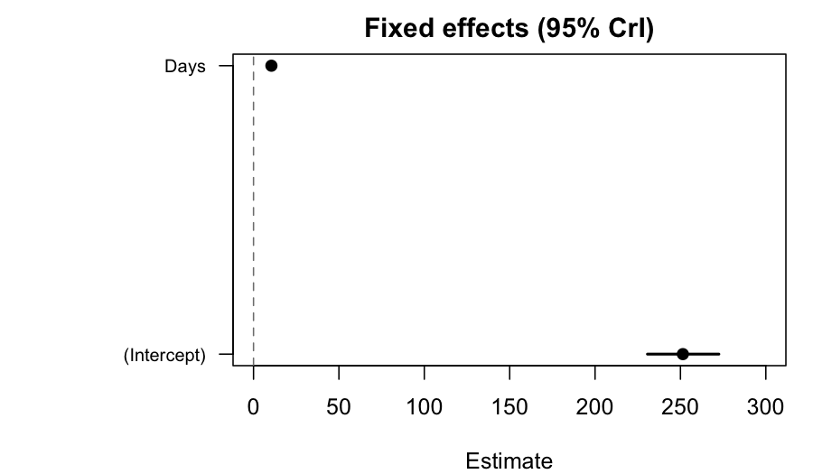

# 1. Why Bayesian mixed models?

Restricted maximum likelihood (REML) -- the workhorse behind `lme4`,
`nlme`, and ASReml -- returns a single point estimate of each variance
component plus a Wald-style standard error. Two situations make this
summary uncomfortable.

- **Small group counts.** When the number of clusters is modest
  (fewer than roughly thirty), the sampling distribution of the
  variance-component estimator has a long right tail. The Wald
  interval is informative only near the centre, where the posterior
  is approximately quadratic.
- **Boundary problems.** A maximum-likelihood variance estimate can
  land on zero. That is *uninformative*: the data may not have ruled
  out a small-but-nonzero variance, but the boundary collapses both
  the estimate and the uncertainty.

A Bayesian fit replaces the point estimate with the *full posterior
distribution*. You see directly how much mass the data place near
zero, and you can propagate that uncertainty into derived quantities
-- predictions, contrasts, best linear unbiased predictors (BLUPs) --
without leaning on quadratic approximations.

`flexyBayes` is built around one principle: switching from REML to
Bayesian inference should not change the formula you write. Write the
model in ASReml-style syntax and `flexybayes()` either fits it on an
active engine or refuses it by name, telling you which structure has
no representation and what the nearest supported model is. Write it in
brms-style notation and `fb()` does the same with the same
guarantee (it auto-detects which grammar you used). The refusal is the
point: the alternative to refusing is fitting a neighbouring model
under the requested model's name, which is the failure mode a formula
translator has to be built against. What fits and what refuses,
per engine and per model class, is tabulated in the package README
and in `system.file("KNOWN_ISSUES.md", package = "flexyBayes")`.

Both routes go through a shared internal representation, and the same
fitted object supports `summary()`, `predict()`,
`emmeans::emmeans()`, `marginaleffects::predictions()`, and the
`bayesplot::*` family.

# 2. Installation

`flexyBayes` requires R 4.1.0 or later. Inference happens through one of
two active engines.

- **brms** (Stan). A Hamiltonian Monte Carlo (HMC) sampler covering
  most of the term-type surface, including structures INLA cannot
  represent.
- **INLA** -- integrated nested Laplace approximation (Rue et al.,
  2009). A deterministic approximation over the latent Gaussian model
  (LGM) class. Substantially faster than HMC, over a narrower scope,
  and *approximate*: representing a model exactly and inferring it
  exactly are separate claims, and INLA's nested Laplace is
  approximate inference even where the representation is faithful.
  Section 4 returns to this.

Install both:

```r
# brms and its Stan backend
install.packages("brms")

# INLA — not on CRAN; from the INLA team's repository
install.packages(
  "INLA",
  repos = c(getOption("repos"),
            INLA = "https://inla.r-inla-download.org/R/stable")
)

# flexyBayes itself
install.packages("flexyBayes")
# or, while on GitHub:
# remotes::install_github("AAGI-AUS/flexyBayes")
```

A handful of companion packages enrich the post-fit experience and are
introduced in subsequent vignettes:

```r
install.packages(c("emmeans", "marginaleffects", "bayesplot",
                   "posterior", "loo", "effectsize", "agridat"))
```

If INLA cannot be installed on your platform, the package degrades
gracefully: INLA-only paths (the fast LGM route, `triangulate()`
cross-checks that need a second engine) emit clear messages, and brms
covers everything else.

> **greta and gretaR.** Earlier releases fit models via greta
> (TensorFlow-backed HMC). greta and gretaR have since been
> withdrawn as fitting engines -- `backend = "greta"` now refuses with
> a structured message rather than fitting. If you have older code
> pinned to `fb_greta()` or `backend = "greta"`, drop the pin; `"auto"`
> (or an explicit `"inla"` / `"brms"`) now covers the same ground on
> the two active engines. See `NEWS.md` for the full rationale.

# 3. The four-verb API

`flexyBayes` exposes four user-facing entry points. Pick the verb
that matches how the model is expressed; the choice of entry never
implicitly changes the choice of backend.

| Verb | When to use |
|---|---|
| `flexybayes()` / `fb()` | Principal / universal entry. Asreml-style (`fixed = ..., random = ~ g, residual = ~ ...`) or brms-style (`response ~ x + (1 \| g)`) formulas; auto-detects the grammar and takes a `backend` argument to choose the engine. The ASReml term vocabulary it *parses* is wider than the set either engine emits -- `fa()`, `corh()` and an AR1 residual parse and then refuse -- so consult the capability table before assuming a term fits. |
| `fb_inla()` / `fb_brms()` | Engine pins: fix the backend to INLA (Laplace) or Stan (brms). Each accepts the same two formula grammars. `fb_greta()` still exists but refuses -- greta is quarantined (see Section 2). |
| `triangulate()` | Cross-engine posterior comparison. Takes two fits from different backends and reports per-parameter agreement metrics. |

The universal entries `flexybayes()` / `fb()` take a `backend`
argument: `"auto"` (the default -- gate-driven routing: INLA when the
model is LGM-eligible, brms otherwise, and a typed refusal when
neither can represent the model -- never a silent fallback to a
quarantined engine), `"inla"` (explicit LGM fast path; refuses
non-LGM models with a structured message), and `"brms"` (Stan). The
engine pins `fb_inla()` / `fb_brms()` fix the backend instead of
taking the argument. The dispatch trace is available post-fit via
`backend_decision()`. The *understanding dispatch and refusals*
vignette walks through the dispatch flow end-to-end.

# 4. Your first model

We use `lme4::sleepstudy` (Belenky et al., 2003): reaction times for
eighteen subjects across ten days of restricted sleep. The natural
mixed model has a fixed linear time trend and a random subject
intercept.


``` r
library(flexyBayes)
data(sleepstudy, package = "lme4")
str(sleepstudy)
#> 'data.frame':	180 obs. of  3 variables:
#>  $ Reaction: num  250 259 251 321 357 ...
#>  $ Days    : num  0 1 2 3 4 5 6 7 8 9 ...
#>  $ Subject : Factor w/ 18 levels "308","309","310",..: 1 1 1 1 1 1 1 1 1 1 ...
```

We start with a brms-style formula -- it reads exactly as in
`lme4::lmer()` or `brms::brm()`: `Reaction ~ Days + (1 | Subject)` --
and fit it with the brms (Stan) engine pin `fb_brms()`, which samples
this small hierarchical model to clean convergence. `seed` is passed
to Stan through brms, so the draws below are the draws a reader who
runs the same call gets:


``` r
fit_brms <- fb_brms(
  Reaction ~ Days + (1 | Subject),
  data         = sleepstudy,
  n_samples    = 2000,
  warmup       = 2000,
  chains       = 4,
  seed         = 20260815L,
  verbose      = FALSE,
  mcmc_verbose = FALSE
)
fit_brms
#> Bayesian mixed model  [flexyBayes / brms passthrough]
#> ------------------------------------------------------- 
#>   Fixed  : Reaction ~ Days + (1 | Subject) 
#>   Family : gaussian ( identity link )
#>   MCMC   : 4 chain(s) x 2000 samples (warmup = 2000 ) -- 17.3 sec (Stan via brms)
#>   Params : 25 monitored; 2 fixed, 1 random terms
#>   Max Rhat: 1.002  [OK] 
#>   Min ESS: 1154 
#> ------------------------------------------------------- 
#>   $glm    -- GLM-compatible shim (coef, vcov, fitted, etc.)
#>   $brms   -- live brmsfit (loo, posterior_predict, summary)
#>   $extras -- diagnostics, variance components, call info
```

The printed summary includes a `Representation: exact (model, not inference)`
line. This reports that
the model was emitted to the backend without structural approximation: every
term in the formula is represented as written, with no low-rank or sparse
truncation. It describes the model *representation*, not the *inference*. The
brms (Stan) backend draws from the posterior by MCMC, so its only inferential
error is Monte Carlo sampling error, whereas the INLA backend always performs
*approximate* inference (integrated nested Laplace approximation) whether or
not its representation is exact. flexyBayes treats "exact representation" and
"exact inference" as separate claims and makes only the first (see
`API_STABILITY.md`, section "Inference semantics").

### A note on random *intercepts* versus random *slopes*

The same data also supports a per-subject slope on `Days` on top of the
intercept. There are two spellings, and they are different models.

The **uncorrelated** form, `(Days || Subject)`, gives each subject its
own intercept deviation and its own slope deviation, each with its own
variance and no correlation parameter between them. It is supported and
emits on brms:


``` r
fit_slope <- fb_brms(
  Reaction ~ Days + (Days || Subject),
  data         = sleepstudy,
  n_samples    = 1000,
  warmup       = 1000,
  chains       = 4,
  seed         = 20260815L,
  verbose      = FALSE,
  mcmc_verbose = FALSE
)
fit_slope
#> Bayesian mixed model  [flexyBayes / brms passthrough]
#> ------------------------------------------------------- 
#>   Fixed  : Reaction ~ Days + (Days || Subject) 
#>   Family : gaussian ( identity link )
#>   MCMC   : 4 chain(s) x 1000 samples (warmup = 1000 ) -- 17 sec (Stan via brms)
#>   Params : 44 monitored; 2 fixed, 1 random terms
#>   Max Rhat: 1.004  [OK] 
#>   Min ESS: 984 
#> ------------------------------------------------------- 
#>   $glm    -- GLM-compatible shim (coef, vcov, fitted, etc.)
#>   $brms   -- live brmsfit (loo, posterior_predict, summary)
#>   $extras -- diagnostics, variance components, call info
```

The **correlated** form, `(Days | Subject)`, adds a free correlation
between a subject's intercept and slope. No active engine represents it,
so it refuses rather than quietly fitting the uncorrelated model in its
place:


``` r
refused <- tryCatch(
  fb_brms(Reaction ~ Days + (Days | Subject), data = sleepstudy),
  error = function(e) e
)
cat(conditionMessage(refused))
#> Correlated random slopes (x | g) are not yet supported.
#> Got: (Days | Subject)
#> 
#> Fit (Days || Subject) instead. That is the uncorrelated random
#> intercept and slope: a per-Subject intercept deviation
#> and a per-Subject slope on Days, each with its own
#> variance and no correlation parameter between them. It emits on brms
#> and is the right model whenever the intercept-slope correlation is not
#> itself of inferential interest.
#> 
#> Do NOT reach for the asreml crossing ~ Subject + Subject:Days.
#> With a numeric Days that is one independent deviation per
#> Subject-by-Days cell, not a per-Subject slope -- a
#> different model with a different parameter count.
#> 
#> If the correlation parameter itself is needed, it is deferred to a
#> future release (structured-covariance representation). No active
#> backend represents the correlated form today.
```

Read the last paragraph of that message carefully, because it names a
trap. The ASReml crossing `random = ~ Subject + Subject:Days` looks like
the asreml way to write a random slope and is not one: with a *numeric*
`Days` the crossing is one independent deviation per Subject-by-Day
cell -- 180 of them on `sleepstudy` -- rather than eighteen per-subject
slopes. The *hierarchical models* vignette works through both spellings
side by side. For the remainder of this introduction we keep the random
intercept.

# 5. What is inside a fit?

`fit_brms` is an object of class `flexybayes`. The default print method
is concise; `summary()` gives the full posterior digest:


``` r
summary(fit_brms)
#> Bayesian mixed model summary  [flexyBayes]
#> ============================================================ 
#>   Fixed  : Reaction ~ Days + (1 | Subject) 
#>   Family : gaussian / identity 
#>   N = 180 , chains = 4 , samples = 2000 
#>   Representation: exact
#>   Engine:         brms / Stan HMC
#> 
#> -- Fixed effects (posterior)  --------------------------------- 
#>             Estimate Post.SD    2.5%    97.5%
#> (Intercept) 251.4187 10.4912 230.674 272.5085
#> Days         10.4686  0.7852   8.893  11.9674
#> 
#> -- Variance components  -------------------------------------- 
#>    Component Estimate     SD    2.5%   97.5%
#> 1 sd_Subject  40.3762 8.2476 27.4740 59.4381
#> 2      sigma  31.2593 1.7626 28.0074 34.9194
#> 
#> -- Convergence  --------------------------------------------- 
#>   Rhat range: 1 - 1.002 
#>   ESS  range: 1154 - 8391 
#>   Run time  : 17.3 sec
```

The output is laid out in three blocks.

1. **Fixed effects.** Posterior mean, posterior standard deviation
   (SD), and equal-tailed 95 % credible interval for each design-
   matrix column. Here `(Intercept)` is the baseline reaction time
   and `Days` is the per-day slope.
2. **Variance components.** The Subject-level SD and the residual SD,
   both on the response scale.
3. **Sampler diagnostics.** Effective sample size (ESS) and the
   rank-normalised $\widehat{R}$ (Vehtari et al., 2021). The targets
   for a trustworthy fit are ESS $\ge 400$ and $\widehat{R} \le 1.01$
   on every parameter. The Subject-level variance component and its
   latent per-subject deviations mix more slowly than the fixed effects
   -- variance components are among the slowest-mixing quantities in
   hierarchical MCMC -- and at a shorter budget than the one used here
   the worst of them does not reach the strict bar, which is why the
   budget is what it is. The call above passes `seed = 20260815L`
   through to Stan, so a repeat run reproduces these numbers on the
   same machine and toolchain -- across machines, or when Stan runs its
   chains under threading, the reduction order can move the last
   digits. Read the block as printed: the quantities you
   interpret are at the bar, and any parameter that is not says so on
   its own row. Two moves address a short one -- run longer (more
   warmup and draws), or cross-check against a different algorithm,
   which the next section does with INLA.

A coefficient plot of the fixed effects is one line:


``` r
plot(fit_brms, type = "effects")
```



### Variance-component priors

When you call any entry (`flexybayes()` / `fb()` or an engine pin)
without specifying a prior, `flexyBayes` announces the default it uses on every
random-effect SD and the residual SD: a **bounded uniform on the SD
scale**, $\sigma \sim \mathrm{Uniform}(0, U)$, with a family-aware
upper bound (Gelman, 2006). The announcement names $U$, the scale
basis, and the override knobs, and fires once per session. Passing
`prior_vc_sd = m` opts back into the legacy
$\sigma \sim \mathrm{Lognormal}(0, m)$ default; passing a structured
`prior = fb_prior(...)` overrides both. The *priors and
regularisation* vignette articulates the choice in detail and shows
how to set priors deliberately.

Fixed-effect coefficients carry a separate weakly-informative default:
$\beta \sim \mathcal{N}(0, 100)$, applied uniformly to the intercept,
contrast levels, continuous slopes, factor-by-continuous
interactions, and `I()`-expression terms. The scale (`sd = 100`)
covers responses with central tendency up to several hundred on the
natural scale without crushing the posterior toward zero, while
still regularising at small per-coefficient sample sizes (Gelman et
al., 2008). Override via `prior_fixed_sd = ...` or, for individual
coefficients, via `b("name") ~ normal(...)` in `fb_prior()`.

# 6. The same model on a second engine

`fit_brms` is a Markov chain Monte Carlo (MCMC) fit; INLA runs a
fundamentally different algorithm -- a Laplace approximation over a
small set of hyperparameters -- and finishes almost instantly:


``` r
fit_inla <- fb_inla(
  Reaction ~ Days + (1 | Subject),
  data    = sleepstudy,
  verbose = FALSE
)
summary(fit_inla)
#> Bayesian fit summary  [flexybayes_inla / INLA backend]
#> ------------------------------------------------------------ 
#> Fixed effects:
#>                 mean     sd 0.025quant 0.5quant 0.975quant     mode kld
#> (Intercept) 251.4787 6.6752   238.3770 251.4784   264.5824 251.4784   0
#> Days         10.4509 1.2501     7.9969  10.4510    12.9045  10.4510   0
#> 
#> Hyperparameters:
#>                                                 mean          sd   0.025quant
#> Precision for the Gaussian observations 4.000000e-04           0 4.000000e-04
#> Precision for Subject                   1.068371e+11 65449887843 3.619491e+10
#>                                             0.5quant   0.975quant         mode
#> Precision for the Gaussian observations 4.000000e-04 5.000000e-04 4.000000e-04
#> Precision for Subject                   8.999207e+10 2.804887e+11 6.568275e+10
#> 
#> Random effects:
#>   groups: Subject
#> ------------------------------------------------------------
```


``` r
hp <- fit_inla$inla$summary.hyperpar
1 / sqrt(hp["Precision for Subject", "mean"])
#> [1] 3.059419e-06
```

> **Read that number before going further.** On this dataset, INLA's
> default prior on the `Subject`-level variance frequently drives it
> to a numerically-collapsed near-zero value -- not a modest
> shrinkage, a genuine degeneracy (`sigma` many orders of magnitude
> below anything physically plausible). This is a known instability
> specific to this model on this dataset, not a general property of
> INLA. It is shown deliberately, not patched away, because it is
> exactly the failure mode the next paragraph exists to catch.
>
> The collapsed value does not reproduce either. Repeated runs of this
> same call return `Precision for Subject` many orders of magnitude
> apart, because nothing in the data fixes where a degenerate mode
> sits, and the fixed effects move in the last decimals with it. A
> `seed` cannot help: the Laplace approximation draws no random
> numbers, so the movement is in the optimiser's landing point rather
> than in a sampler. The brms block above is seeded and reproduces
> exactly. Treat instability across re-runs of a *deterministic* engine
> as the same signal as a failed convergence diagnostic on a sampler.

Both engines were given the same model. Stan's Hamiltonian Monte Carlo
and INLA's Laplace approximation are two routes to the posterior of
that model, and on this dataset they do not arrive at the same place --
the INLA Subject variance collapsed, the brms one did not. *How far
apart are they?* That is the question `triangulate()` answers. The canonical
parameter-name registry reconciles each engine's internal names -- brms's
`b_Intercept`, `b_Days`, `sd_Subject__Intercept`, `sigma`, and INLA's
`(Intercept)`, `Days`, `Precision for Subject`,
`Precision for the Gaussian observations` -- automatically; no
`name_map` is needed for the common cases.


``` r
# INLA's posterior sampler can be flaky under restricted-process
# environments (e.g., CRAN's vignette re-render). Wrap so a failure
# is informative rather than fatal.
tri <- tryCatch(
  triangulate(fit_brms, fit_inla),
  error = function(e) {
    message("triangulate() unavailable in this session: ",
            conditionMessage(e))
    NULL
  }
)
if (!is.null(tri)) tri
#> <triangulate_result>
#>   status:   discordant
#>     - (Intercept): Wasserstein-1 0.28 SD; SD ratio 1.61
#>     - Days: Wasserstein-1 0.28 SD; SD ratio 0.64
#>     - sd_Subject: mean shift 4.90 SD; Wasserstein-1 4.88 SD; SD ratio 7939986.96
#>     - sigma: mean shift 6.57 SD; Wasserstein-1 6.58 SD; SD ratio 0.68
#>   source_a: brms
#>   source_b: inla
#>   independence: algorithmic + implementation
#>     (HMC (brms on Stan) versus Laplace approximation (INLA on C): different inference paradigms and different code bases.)
#>   n_common: 4
#>   compared: 4 of 4 (matched-prior overlap)
#>   only_a:   21 parameters (Intercept, r_Subject[308,Intercept], r_Subject[309,Intercept], r_Subject[310,Intercept], r_Subject[330,Intercept], ...)
#>   only_b:   198 parameters (Predictor:1, Predictor:2, Predictor:3, Predictor:4, Predictor:5, ...)
#>   [!] common-mode caveat: agreement does NOT test a shared upstream data fact
#>       (data_independence = undeclared)
#> 
#> Metrics (per common parameter):
#>         param   mean_a   mean_b mean_shift_sd     sd_ratio  w1_sd    verdict
#> 1 (Intercept) 251.4187 251.6611        0.0231       1.6076 0.2832 discordant
#> 2        Days  10.4686  10.4205        0.0390       0.6352 0.2825 discordant
#> 3  sd_Subject  40.3762   0.0000        4.8955 7939986.9583 4.8835 discordant
#> 4       sigma  31.2593  48.2860        6.5732       0.6804 6.5754 discordant
```

The output opens with an overall status -- `concordant`, `discordant` or
`inconclusive` -- and then gives a per-parameter readout with a verdict
on each. The columns to read are `mean_shift_sd` and `w1_sd`, the mean
difference and the Wasserstein-1 distance expressed in posterior-SD
units, alongside the SD ratio. Values near zero and a ratio near one
indicate agreement.

Before any of that is reported, `triangulate()` checks that the two fits
answered the same question (same model, same data, same recorded prior
on each variance component) and that each passed its own convergence
diagnostics. A fit at too small a sampling budget returns
`inconclusive` rather than a verdict, which is why this one is sampled
at a production budget.

The Subject variance component is where an approximate engine earns
scrutiny: `sd_ratio` on that row reads as an enormous, unmissable
divergence -- exactly what a collapsed INLA estimate looks like next
to a working MCMC one. It does not stay in that row either: the
between-subject variation has to go somewhere, so the residual SD
absorbs it and the fixed effects inherit the wrong uncertainty. INLA's integrated nested Laplace approximation
is fast and accurate for the fixed-effect structure of a latent
Gaussian model, but its estimate of a *small-group* variance
component -- here there are only eighteen subjects -- can be fragile
under the default prior on some datasets, this one included. That
fragility is the lesson, not a detail to hide: a single approximate
fit of a small-group variance component is not trustworthy on its
own. Triangulate it against MCMC, or supply an explicit
penalised-complexity prior on the SD (the *priors and regularisation*
vignette shows how). The *cross-engine triangulation* vignette
catalogues this and the other common disagreement patterns and the
protocol for diagnosing each. A divergence this large on a parameter
you care about is a *finding*, not something to average away.

### Letting the package choose the backend

`backend = "auto"` runs the model through `lgm_gate()` and routes to
INLA on accept, brms otherwise -- refusing outright, never silently,
when neither can represent the model:


``` r
fit_auto <- flexybayes(
  Reaction ~ Days + (1 | Subject),
  data         = sleepstudy,
  backend      = "auto",
  n_samples    = 200,
  warmup       = 200,
  chains       = 1,
  verbose      = FALSE,
  mcmc_verbose = FALSE
)
backend_decision(fit_auto)
#> $backend
#> [1] "inla"
#> 
#> $path
#> [1] "auto_accept"
#> 
#> $gate_checks
#> [1] "lgm_compatible"      "gretaR_slot_dormant"
#> 
#> $reason
#> [1] "lgm_gate() accepted; INLA dispatch."
#> 
#> $preflight_summary
#> NULL
#> 
#> $representation_plan
#> NULL
#> 
#> $rejected_routes
#> $rejected_routes[[1]]
#> $rejected_routes[[1]]$backend
#> [1] "greta"
#> 
#> $rejected_routes[[1]]$reason
#> [1] "backend_quarantined"
#> 
#> 
#> $rejected_routes[[2]]
#> $rejected_routes[[2]]$backend
#> [1] "gretaR"
#> 
#> $rejected_routes[[2]]$reason
#> [1] "backend_quarantined"
#> 
#> 
#> 
#> $routing_policy_version
#> [1] "stage5a_v1"
```

`backend_decision()` returns the dispatch trace: which backend ran,
which gate checks were evaluated, and the reason. On a Gaussian
random-intercept model the gate accepts and (when INLA is installed)
the auto path lands on INLA -- which is exactly the fit whose
Subject-level variance collapsed above. `"auto"` optimises for speed
first; pin `backend = "brms"` explicitly whenever a small-group
variance component is itself the quantity you care about.

# 7. Where to next?

The remaining vignettes are organised by topic, not by engine. A
suggested reading order:

| Vignette | What it covers |
|---|---|
| Foundational regression | one- and two-way fixed effects; univariate smooths; comparison with `lm()` |
| Hierarchical models | random intercepts, nested and crossed effects, the two random-slope spellings, Poisson and binomial generalised linear mixed models (GLMMs) |
| The formula surface | the term-type catalogue -- what parses, what emits, what refuses -- and the structured-covariance machinery: `diag`, `us`, per-level residual variances, known-covariance carriers |
| Priors and regularisation | the `fb_prior()` DSL, the uniform-on-SD default, the fixed-effect default, prior-predictive checks |
| Multi-environment trials and genomics | MET, genotype-by-environment interaction (GxE), GBLUP (genomic BLUP) |
| Downstream analysis | `emmeans`, `marginaleffects`, `bayesplot`, `loo` |
| Spatio-temporal | the separable AR1 field, the complete-grid requirement, missing plots |
| Cross-engine triangulation | when engines disagree, what it means, what to do |
| Understanding dispatch and refusals | how `lgm_gate()` and the capability predicates choose an engine, how to read a refusal, and the backend registry a new engine registers into |
| Big-data streaming | exact sufficient-statistic aggregation for datasets that do not fit in memory |

# 8. Pitfalls

**Never `R CMD INSTALL` while `flexyBayes` is loaded.** R's lazy-load
database can be corrupted when a package is overwritten under a live
session. Restart R first.

**Convergence is not correctness.** A passing $\widehat{R}$ tells you
that the chains explored the same posterior; it does not tell you
whether that posterior is the right one for the problem. Posterior-
predictive checks (Gelman, Meng, & Stern, 1996) and the cross-engine
triangulation vignette address that distinction.

**The uniform default is not always what you want.** The default
scales the prior to the observed response. If you have strong
external information about a variance component (for example a known
measurement-error magnitude), set it explicitly via `fb_prior()`. If
you are reproducing a published analysis that used a different prior,
use that prior.

**INLA's scope is narrower than brms's, and each has terms the other
refuses.** Random slopes, interaction random effects, heterogeneous
genotype variances and heterogeneous residuals are outside what the
INLA emit represents, and `lgm_gate()` refuses them structurally;
`"auto"` routes those models to brms. The traffic runs the other way
too -- the separable AR1 spatial field and the P-spline emit on INLA
and refuse on brms. Neither engine covers the whole ASReml term
vocabulary, and a term outside both refuses rather than being
approximated. The capability table in the README says which is which.

**A collapsed variance component from INLA is not always visible in
`summary()`.** Print the derived SD explicitly (`1 / sqrt(precision)`)
rather than trusting a glance at the hyperparameter table -- an
astronomically large precision reads as a small number next to
plausible-looking fixed effects. Section 6 shows the pattern.

# 9. Active prompts

Try the following while the package is loaded:

1. Re-fit `fit_brms` at a much shorter `warmup = 300` and then a much
   longer `warmup = 12000`. How do the ESS and $\widehat{R}$ of
   `sd_Subject__Intercept` respond, and which parameters are most
   sensitive to the warmup budget? Does the posterior mean of `Days`
   shift at all?
2. Pass `return_code = TRUE` to `fb_brms()` and inspect the returned
   Stan code -- this is the literal program `flexyBayes` generated.
   Compare it with the program generated by the asreml-style call
   `flexybayes(fixed = Reaction ~ Days, random = ~ Subject,
   data = sleepstudy, return_code = TRUE)`.
3. Pass `prior_vc_sd = 1` to `fb_brms()` and refit. The default-prior
   announcement disappears (you have opted into the legacy
   lognormal). Does the posterior on `sd_Subject__Intercept` change
   appreciably?

# 10. Session information


``` r
sessionInfo()
#> R version 4.5.2 (2025-10-31)
#> Platform: aarch64-apple-darwin20
#> Running under: macOS Tahoe 26.5.2
#> 
#> Matrix products: default
#> BLAS:   /System/Library/Frameworks/Accelerate.framework/Versions/A/Frameworks/vecLib.framework/Versions/A/libBLAS.dylib 
#> LAPACK: /Library/Frameworks/R.framework/Versions/4.5-arm64/Resources/lib/libRlapack.dylib;  LAPACK version 3.12.1
#> 
#> locale:
#> [1] en_AU.UTF-8/en_AU.UTF-8/en_AU.UTF-8/C/en_AU.UTF-8/en_AU.UTF-8
#> 
#> time zone: Australia/Adelaide
#> tzcode source: internal
#> 
#> attached base packages:
#> [1] stats     graphics  grDevices utils     datasets  methods   base     
#> 
#> other attached packages:
#> [1] flexyBayes_0.9.0
#> 
#> loaded via a namespace (and not attached):
#>  [1] tidyselect_1.2.1       dplyr_1.2.1            farver_2.1.2          
#>  [4] loo_2.9.0              S7_0.2.2               INLA_25.10.19         
#>  [7] TH.data_1.1-5          tensorA_0.36.2.1       digest_0.6.39         
#> [10] estimability_1.5.1     lifecycle_1.0.5        sf_1.1-0              
#> [13] StanHeaders_2.32.10    processx_3.9.0         survival_3.8-3        
#> [16] magrittr_2.0.5         posterior_1.7.0        compiler_4.5.2        
#> [19] rlang_1.2.0            tools_4.5.2            data.table_1.18.2.1   
#> [22] sn_2.1.3               knitr_1.51             bridgesampling_1.2-1  
#> [25] mnormt_2.1.2           pkgbuild_1.4.8         classInt_0.4-11       
#> [28] curl_7.0.0             plyr_1.8.9             RColorBrewer_1.1-3    
#> [31] multcomp_1.4-29        abind_1.4-8            KernSmooth_2.23-26    
#> [34] numDeriv_2016.8-1.1    withr_3.0.2            grid_4.5.2            
#> [37] stats4_4.5.2           colorspace_2.1-2       xtable_1.8-8          
#> [40] e1071_1.7-17           future_1.70.0          inline_0.3.21         
#> [43] ggplot2_4.0.3          globals_0.19.1         emmeans_2.0.2         
#> [46] scales_1.4.0           MASS_7.3-65            dichromat_2.0-0.1     
#> [49] cli_3.6.6              mvtnorm_1.3-6          generics_0.1.4        
#> [52] otel_0.2.0             RcppParallel_5.1.11-2  reshape2_1.4.5        
#> [55] DBI_1.3.0              proxy_0.4-29           rstan_2.32.7          
#> [58] stringr_1.6.0          splines_4.5.2          bayesplot_1.15.0      
#> [61] parallel_4.5.2         matrixStats_1.5.0      marginaleffects_0.32.0
#> [64] brms_2.23.0            vctrs_0.7.3            V8_8.0.1              
#> [67] Matrix_1.7-4           sandwich_3.1-1         jsonlite_2.0.0        
#> [70] callr_3.7.6            listenv_0.10.1         units_1.0-1           
#> [73] glue_1.8.1             parallelly_1.47.0      codetools_0.2-20      
#> [76] distributional_0.7.0   stringi_1.8.7          gtable_0.3.6          
#> [79] QuickJSR_1.9.0         tibble_3.3.1           pillar_1.11.1         
#> [82] Brobdingnag_1.2-9      R6_2.6.1               fmesher_0.7.0         
#> [85] evaluate_1.0.5         lattice_0.22-7         backports_1.5.1       
#> [88] MatrixModels_0.5-4     rstantools_2.6.0       class_7.3-23          
#> [91] Rcpp_1.1.1-1.1         coda_0.19-4.1          gridExtra_2.3         
#> [94] nlme_3.1-168           checkmate_2.3.4        xfun_0.57             
#> [97] zoo_1.8-15             pkgconfig_2.0.3
```

# References

Belenky, G., Wesensten, N. J., Thorne, D. R., Thomas, M. L., Sing,
H. C., Redmond, D. P., Russo, M. B., & Balkin, T. J. (2003). Patterns
of performance degradation and restoration during sleep restriction
and subsequent recovery: A sleep dose-response study. *Journal of
Sleep Research*, 12(1), 1--12.

Bates, D., Mächler, M., Bolker, B., & Walker, S. (2015). Fitting
linear mixed-effects models using lme4. *Journal of Statistical
Software*, 67(1), 1--48.

Gelman, A. (2006). Prior distributions for variance parameters in
hierarchical models. *Bayesian Analysis*, 1(3), 515--534.

Gelman, A., Jakulin, A., Pittau, M. G., & Su, Y.-S. (2008). A weakly
informative default prior distribution for logistic and other
regression models. *Annals of Applied Statistics*, 2(4), 1360--1383.

Gelman, A., Meng, X.-L., & Stern, H. (1996). Posterior predictive
assessment of model fitness via realized discrepancies. *Statistica
Sinica*, 6(4), 733--760.

Rue, H., Martino, S., & Chopin, N. (2009). Approximate Bayesian
inference for latent Gaussian models by using integrated nested
Laplace approximations. *Journal of the Royal Statistical Society:
Series B*, 71(2), 319--392.

Vehtari, A., Gelman, A., Simpson, D., Carpenter, B., & Bürkner, P.-C.
(2021). Rank-normalization, folding, and localization: An improved
$\widehat{R}$ for assessing convergence of MCMC. *Bayesian Analysis*,
16(2), 667--718.
