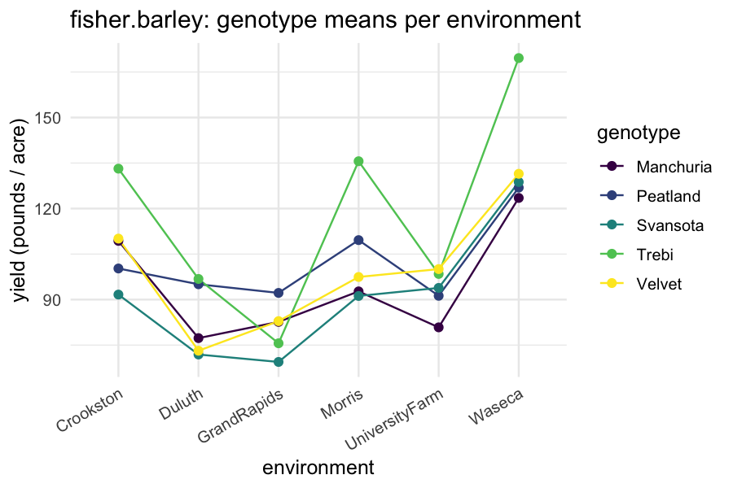
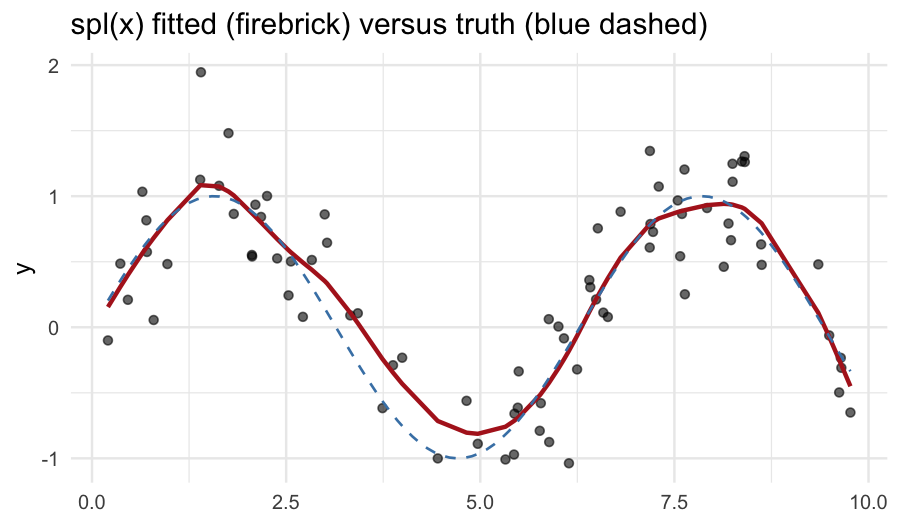
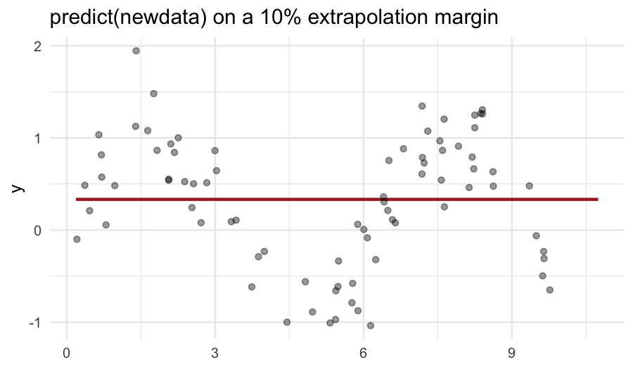

# 1. Why start with regression?

Linear regression is the simplest case `flexyBayes` handles, and
every richer model in the package is a regression model with extra
structure. Starting here makes three things explicit before the
hierarchical, formula-surface, and spatio-temporal vignettes
build on them.

1. The *fixed-effect* layer of every subsequent model is a regression
   model on its own.
2. Adding a *random effect* (one variance component on top of the
   regression) takes us into the mixed-model regime -- illustrated in
   §5 below with `sleepstudy`.
3. Smooth terms (`spl()`) sit naturally inside the mixed-model
   framework; §6 shows the simplest case.

Throughout this tutorial we use the asreml-style API:

* `fixed` -- the response and the (fixed) regression formula.
* `random` -- random effects (`~ subject`, `~ spl(time)`, `~ block`).
* `residual`  -- residual covariance (default `~ units`, i.e. iid).

`fb_brms()` is the Stan (brms) engine pin; with a brms-shaped
formula it covers the random-intercept subset of the term-type
surface, and is introduced in the *getting started* and
*hierarchical models* vignettes.

# 2. One-way analysis of variance: `PlantGrowth`

`datasets::PlantGrowth` records the dried weight of plants under
three treatment conditions: control, treatment 1, treatment 2. The
natural model is a one-way ANOVA -- fixed effect for the three-level
factor.


``` r
library(flexyBayes)
data(PlantGrowth)
str(PlantGrowth)
#> 'data.frame':	30 obs. of  2 variables:
#>  $ weight: num  4.17 5.58 5.18 6.11 4.5 4.61 5.17 4.53 5.33 5.14 ...
#>  $ group : Factor w/ 3 levels "ctrl","trt1",..: 1 1 1 1 1 1 1 1 1 1 ...
```


``` r
fit_g <- flexybayes(
  fixed     = weight ~ group, data = PlantGrowth,
  n_samples = 2000, warmup = 3000, chains = 4, verbose = FALSE, mcmc_verbose = FALSE
)
summary(fit_g)
#> Bayesian mixed model summary  [flexyBayes / aggregated-gaussian]
#> ================================================================= 
#>   family:     gaussian / identity 
#>   N = 30 , K = 3 
#>   backend:    inla 
#>   exactness:  aggregated_exact 
#>   priors:     custom (explicit prior supplied; see prior_summary()) 
#>   aggregation: N = 30 rows -> K = 3 cells (ratio 10:1)
#> 
#> -- Fixed effects (posterior)  ----------------------------------- 
#>             Estimate Post.SD
#> (Intercept)    5.032  0.1959
#> grouptrt1     -0.371  0.2770
#> grouptrt2      0.494  0.2770
#> 
#> -- Variance components  ---------------------------------------- 
#>   sigma (residual SD): 0.6016
#> 
#>   Run time: 2.02 sec
```

The fixed-effect block reports the baseline (control) mean as the
intercept, and the deviations of `trt1` and `trt2` from baseline.
The residual standard deviation block reports the within-group
spread.

A reference fit with `lm()`:


``` r
summary(lm(weight ~ group, data = PlantGrowth))
#> 
#> Call:
#> lm(formula = weight ~ group, data = PlantGrowth)
#> 
#> Residuals:
#>     Min      1Q  Median      3Q     Max 
#> -1.0710 -0.4180 -0.0060  0.2627  1.3690 
#> 
#> Coefficients:
#>             Estimate Std. Error t value Pr(>|t|)    
#> (Intercept)   5.0320     0.1971  25.527   <2e-16 ***
#> grouptrt1    -0.3710     0.2788  -1.331   0.1944    
#> grouptrt2     0.4940     0.2788   1.772   0.0877 .  
#> ---
#> Signif. codes:  0 '***' 0.001 '**' 0.01 '*' 0.05 '.' 0.1 ' ' 1
#> 
#> Residual standard error: 0.6234 on 27 degrees of freedom
#> Multiple R-squared:  0.2641,	Adjusted R-squared:  0.2096 
#> F-statistic: 4.846 on 2 and 27 DF,  p-value: 0.01591
```

The frequentist least-squares estimates and the Bayesian posterior
means agree to about the second decimal -- exactly as expected for a
linear model with weakly informative priors and a moderate sample
size.

# 3. Multiple regression with two factors: `fisher.barley`

`agridat::fisher.barley` (Fisher, 1935) is a small classic: barley
yield in pounds per acre for five varieties grown at six locations
across two years. We model yield as additive in genotype and
environment.


``` r
data(fisher.barley, package = "agridat")
str(fisher.barley)
#> 'data.frame':	60 obs. of  4 variables:
#>  $ yield: num  81 80.7 146.6 100.4 82.3 ...
#>  $ gen  : Factor w/ 5 levels "Manchuria","Peatland",..: 1 1 1 1 1 1 1 1 1 1 ...
#>  $ env  : Factor w/ 6 levels "Crookston","Duluth",..: 5 5 6 6 4 4 1 1 3 3 ...
#>  $ year : int  1931 1932 1931 1932 1931 1932 1931 1932 1931 1932 ...
```


``` r
fit_barley <- flexybayes(
  fixed     = yield ~ gen + env, data = fisher.barley,
  n_samples = 2000, warmup = 3000, chains = 4, verbose = FALSE, mcmc_verbose = FALSE
)
summary(fit_barley)
#> Bayesian mixed model summary  [flexyBayes / aggregated-gaussian]
#> ================================================================= 
#>   family:     gaussian / identity 
#>   N = 60 , K = 30 
#>   backend:    inla 
#>   exactness:  aggregated_exact 
#>   priors:     custom (explicit prior supplied; see prior_summary()) 
#>   aggregation: N = 60 rows -> K = 30 cells (ratio 2:1)
#> 
#> -- Fixed effects (posterior)  ----------------------------------- 
#>                   Estimate Post.SD
#> (Intercept)       101.6944  7.1445
#> genPeatland         7.0749  7.3498
#> genSvansota        -4.0035  7.3484
#> genTrebi           22.2803  7.3525
#> genVelvet           3.8137  7.3493
#> envDuluth         -23.8372  7.9304
#> envGrandRapids    -26.0385  7.9311
#> envMorris          -2.1424  7.9247
#> envUniversityFarm -14.1339  7.9275
#> envWaseca          27.5273  7.9214
#> 
#> -- Variance components  ---------------------------------------- 
#>   sigma (residual SD): 18.6453
#> 
#>   Run time: 1.74 sec
```

The two factor blocks are reported relative to the (alphabetically
first) baseline level of each. To get *marginal means* per genotype
and per environment, use `emmeans` -- see Tutorial 08 (downstream
analysis).

A standard exploratory plot of the cell means:


``` r
library(ggplot2)
ggplot(fisher.barley,
       aes(x = env, y = yield, group = gen, colour = gen)) +
  geom_line(stat = "summary", fun = mean) +
  geom_point(stat = "summary", fun = mean, size = 2) +
  scale_colour_viridis_d() +
  theme_minimal(base_size = 12) +
  theme(axis.text.x = element_text(angle = 30, hjust = 1)) +
  labs(x = "environment", y = "yield (pounds / acre)",
       colour = "genotype",
       title = "fisher.barley: genotype means per environment")
```



# 4. Continuous predictors: pooled `sleepstudy`

`lme4::sleepstudy` records reaction time under sleep restriction
across 18 subjects and 10 days. Ignoring the subject grouping for
now -- a *pooled* regression of reaction on days:


``` r
data(sleepstudy, package = "lme4")
fit_pool <- flexybayes(
  fixed     = Reaction ~ Days, data = sleepstudy,
  n_samples = 2000, warmup = 3000, chains = 4, verbose = FALSE, mcmc_verbose = FALSE
)
summary(fit_pool)
#> Bayesian fit summary  [flexybayes_inla / INLA backend]
#> ------------------------------------------------------------ 
#> Fixed effects:
#>                 mean     sd 0.025quant 0.5quant 0.975quant     mode kld
#> (Intercept) 251.4786 6.6693   238.3864 251.4782   264.5731 251.4782   0
#> Days         10.4510 1.2490     7.9987  10.4510    12.9027  10.4510   0
#> 
#> Hyperparameters:
#>                                          mean sd 0.025quant 0.5quant 0.975quant
#> Precision for the Gaussian observations 4e-04  0      4e-04    4e-04      5e-04
#>                                          mode
#> Precision for the Gaussian observations 4e-04
#> 
#> Random effects:
#>   (none)
#> ------------------------------------------------------------
```

The slope on `Days` is the average per-day increase in reaction
time. The residual standard deviation absorbs *both* within-subject
and between-subject variation, which is wasteful -- different
subjects have different baseline reaction times, and a pooled
regression spends one big residual on what is structurally two
separate sources of variation.

# 5. Adding a random intercept on `Subject`

The minimal upgrade from §4: keep the same fixed slope on `Days` but
let each subject have its own baseline reaction time. In ASReml
syntax, this is one extra random term:


``` r
fit_re <- flexybayes(
  fixed     = Reaction ~ Days, data = sleepstudy,
  random    = ~ Subject,
  backend   = "brms",
  n_samples = 2000, warmup = 3000, chains = 4, verbose = FALSE, mcmc_verbose = FALSE
)
summary(fit_re)
#> Bayesian mixed model summary  [flexyBayes]
#> ============================================================ 
#>   Fixed  : Reaction ~ Days 
#>   Random : ~Subject 
#>   Family : gaussian / identity 
#>   N = 180 , chains = 4 , samples = 2000 
#>   Representation: exact
#>   Engine:         brms / Stan HMC
#> 
#> -- Fixed effects (posterior)  --------------------------------- 
#>             Estimate Post.SD     2.5%    97.5%
#> (Intercept) 251.2921 10.3765 230.0620 271.8134
#> Days         10.4676  0.8193   8.8441  12.0919
#> 
#> -- Variance components  -------------------------------------- 
#>    Component Estimate     SD    2.5%   97.5%
#> 1 sd_Subject  40.3913 8.2402 27.3919 59.6139
#> 2      sigma  31.2041 1.7674 27.9967 34.8615
#> 
#> -- Convergence  --------------------------------------------- 
#>   Rhat range: 1 - 1.007 
#>   ESS  range: 1094 - 7840 
#>   Run time  : 17.6 sec
```

> **`backend = "brms"` pinned deliberately.** INLA's default prior on
> this particular model (`sleepstudy`'s `Subject` random intercept)
> has a known instability -- the variance component can collapse to
> numerically zero, run to run. brms does not share the failure mode.
> Tutorial 04 (hierarchical models) discusses this further.

Two things change relative to the pooled fit in §4.

* A second variance component appears: the standard deviation of the
  `Subject`-level random intercepts. Under the default this is
  given a bounded uniform prior -- `sd(Subject) ~ uniform(0, 5*sd(y))`
  -- a weakly-informative choice for this moderate group count (for
  very small `J`, Gelman (2006) recommends a half-Cauchy instead).
* The residual standard deviation drops, because between-subject
  variance is no longer absorbed into it.

The `Reaction ~ Days + (1 | Subject)` formulation in `lme4` /
`brms` is a notational shortcut for exactly this model. Tutorial 04
(hierarchical models) extends this by adding random *slopes* on
`Days` per subject; structurally that is just one more random term.

This is the smallest mixed-model regression, and the structural
template every subsequent vignette builds on.

# 6. Smooth terms via `spl()`

A penalised spline lets us add a smooth, non-linear effect of a
continuous predictor without committing to a specific functional
form. `flexyBayes`'s native ASReml-style spline term,
`spl(x, type = "ps", df = m)`, builds a penalised B-spline basis and
fits it as a random effect with a smoothness-penalising covariance
-- so `spl(x, ...)` lives in the `random` formula, not `fixed`.

We illustrate with a synthetic sinusoid plus noise -- a clean test
of how well a flexible smoother recovers the underlying signal.


``` r
n  <- 80
x  <- sort(runif(n, 0, 10))
y  <- sin(x) + rnorm(n, 0, 0.3)
sim_dat <- data.frame(y = y, x = x)
```


``` r
fit_smooth <- flexybayes(
  fixed     = y ~ 1,
  random    = ~ spl(x, type = "ps", df = 10),
  data      = sim_dat,
  n_samples = 2000, warmup = 3000, chains = 4,
  verbose = FALSE, mcmc_verbose = FALSE
)
summary(fit_smooth)
#> Bayesian fit summary  [flexybayes_inla / INLA backend]
#> ------------------------------------------------------------ 
#> Fixed effects:
#>               mean    sd 0.025quant 0.5quant 0.975quant   mode kld
#> (Intercept) 0.3327 0.038     0.2581   0.3327     0.4074 0.3327   0
#> 
#> Hyperparameters:
#>                                           mean     sd 0.025quant 0.5quant
#> Precision for the Gaussian observations 8.9121 1.5691     6.1827   8.7904
#> Precision for x                         1.7103 0.9657     0.4952   1.4971
#>                                         0.975quant   mode
#> Precision for the Gaussian observations    12.3399 8.5738
#> Precision for x                             4.1668 1.1267
#> 
#> Random effects:
#>   groups: x
#> ------------------------------------------------------------
```

The fixed block has only an intercept and the random block names the
spline. Read the hyperparameter block carefully: INLA parameterises a
Gaussian variance component by its **precision**, the reciprocal of the
variance, so the numbers above are not standard deviations. The residual
standard deviation is $\sigma = \tau^{-1/2}$, and because that map is
monotone decreasing the interval flips end for end -- the lower bound on
$\sigma$ comes from the *upper* bound on $\tau$.

The simulation used a noise standard deviation of 0.3, so this is a
recovery check with a known answer, and the vignette should perform it
rather than assert it:


``` r
hyp <- fit_smooth$inla$summary.hyperpar
prec_row <- hyp["Precision for the Gaussian observations", ]

sigma_est <- c(
  `2.5%` = 1 / sqrt(prec_row[["0.975quant"]]),
  median = 1 / sqrt(prec_row[["0.5quant"]]),
  `97.5%` = 1 / sqrt(prec_row[["0.025quant"]])
)
round(sigma_est, 4)
#>   2.5% median  97.5% 
#> 0.2847 0.3373 0.4022

# The simulation used sigma = 0.3. Does the interval cover it?
0.3 > sigma_est[["2.5%"]] && 0.3 < sigma_est[["97.5%"]]
#> [1] TRUE
```

The same conversion applies to the spline's own precision: a large
precision for `x` is a *small* smoothing variance, which is a stiffer
curve, not a wigglier one.

A fitted-curve overlay:


``` r
sim_dat$fitted <- as.numeric(fitted(fit_smooth))
sim_dat <- sim_dat[order(sim_dat$x), ]
ggplot(sim_dat, aes(x = x, y = y)) +
  geom_point(alpha = 0.6) +
  geom_line(aes(y = fitted), colour = "firebrick", linewidth = 1) +
  geom_function(fun = sin, colour = "steelblue", linewidth = 0.6,
                linetype = "dashed") +
  theme_minimal(base_size = 12) +
  labs(title = "spl(x) fitted (firebrick) versus truth (blue dashed)",
       x = NULL, y = "y")
```



The fitted curve traces the underlying sinusoid; the residual is
unstructured noise. Choosing the basis dimension `df` is a trade-off
-- too few and the curve cannot bend enough; too many and the
penalty must do more work to avoid overfitting. `df = 10` is a
sensible starting point; pass `df = 15` to widen.

## 6.1 Predicting on new `x` values

`predict(fit, newdata = ...)` on a smooth fit re-evaluates the
spline basis on the new `x` positions rather than reusing the
training-data basis, so it extrapolates the fitted curve correctly
beyond the training range.


``` r
newx <- data.frame(
  x = seq(min(sim_dat$x) * 0.9, max(sim_dat$x) * 1.1,
          length.out = 50L)
)
newx$fitted <- predict(fit_smooth, newdata = newx)
```


``` r
ggplot(newx, aes(x = x, y = fitted)) +
  geom_line(colour = "firebrick", linewidth = 1) +
  geom_point(data = sim_dat, aes(x = x, y = y), alpha = 0.4,
             inherit.aes = FALSE) +
  theme_minimal(base_size = 12) +
  labs(title = "predict(newdata) on a 10% extrapolation margin",
       x = NULL, y = "y")
```



The fitted curve stays sensible on the extrapolation margin either
side of the training range, tracking the penalty rather than
diverging.

> **`mgcv::s()` syntax is parsed but not fitted.** The vignette title
> named mgcv smooths until 0.9.0, which promised a capability no active
> engine has. `flexyBayes` parses the `mgcv` smooth specifier `s(x)` as
> an alternative spelling of the same idea
> (basis via `mgcv::smoothCon()`, ingested as a `smooth_mgcv` random
> term). That specific ingestion path is not yet representable by
> either active engine (INLA or brms) -- it was greta-only, and greta
> has been withdrawn as a fitting engine (see `NEWS.md`). Use `spl()`
> until `smooth_mgcv` is re-routed. Tensor-product smooths `te()`,
> `ti()`, and `t2()` remain deferred to a future release regardless.

# 7. Pitfalls

**The intercept absorbs the reference level.** Factor coefficients
are reported as deviations from the alphabetical-first level. Set
`contrasts(...)` explicitly if you need a different baseline.

**`spl()` and `s()` are *random* terms.** A common mistake is to
write `fixed = y ~ x + spl(x)`. That fails -- smooths belong in the
`random` formula. The recommended pattern is
`fixed = y ~ 1, random = ~ spl(x, type = "ps", df = m)` for a
smooth-only model, or `fixed = y ~ z, random = ~ spl(x, ...)` for a
partially linear model.

**`predict()` on factor newdata.** When predicting at unseen factor
levels, R will throw an error or produce an `NA`. Pre-process
`newdata` to set factor levels explicitly.

**Smooth prediction at new x's.**
`predict.flexybayes(fit, newdata = ...)` correctly re-evaluates the
spline basis on the new `x` positions rather than reusing the
training basis. See section 6.1 above for the extrapolation-margin
demonstration.

# 8. Active prompts

1. Refit `PlantGrowth` with the contrast set to `contr.sum`. How do
   the fixed-effect coefficients change? How does the intercept
   change?
2. Vary `df` in `spl(x, type = "ps", df = ...)` from 5 to 30 on the
   synthetic sinusoid. At what `df` does the penalty start to bite?
3. Add a random effect on a subject identifier in your own data and
   compare the residual sigma to the pooled-regression residual
   sigma. By how much does the residual shrink?

# 9. Session information


``` r
sessionInfo()
#> R version 4.5.2 (2025-10-31)
#> Platform: aarch64-apple-darwin20
#> Running under: macOS Tahoe 26.5.2
#> 
#> Matrix products: default
#> BLAS:   /System/Library/Frameworks/Accelerate.framework/Versions/A/Frameworks/vecLib.framework/Versions/A/libBLAS.dylib 
#> LAPACK: /Library/Frameworks/R.framework/Versions/4.5-arm64/Resources/lib/libRlapack.dylib;  LAPACK version 3.12.1
#> 
#> locale:
#> [1] en_AU.UTF-8/en_AU.UTF-8/en_AU.UTF-8/C/en_AU.UTF-8/en_AU.UTF-8
#> 
#> time zone: Australia/Adelaide
#> tzcode source: internal
#> 
#> attached base packages:
#> [1] stats     graphics  grDevices utils     datasets  methods   base     
#> 
#> other attached packages:
#> [1] ggplot2_4.0.3    flexyBayes_0.9.0
#> 
#> loaded via a namespace (and not attached):
#>  [1] tidyselect_1.2.1       viridisLite_0.4.3      dplyr_1.2.1           
#>  [4] farver_2.1.2           loo_2.9.0              S7_0.2.2              
#>  [7] INLA_25.10.19          TH.data_1.1-5          tensorA_0.36.2.1      
#> [10] digest_0.6.39          estimability_1.5.1     lifecycle_1.0.5       
#> [13] sf_1.1-0               StanHeaders_2.32.10    processx_3.9.0        
#> [16] survival_3.8-3         agridat_1.26           magrittr_2.0.5        
#> [19] posterior_1.7.0        compiler_4.5.2         rlang_1.2.0           
#> [22] tools_4.5.2            data.table_1.18.2.1    knitr_1.51            
#> [25] labeling_0.4.3         bridgesampling_1.2-1   curl_7.0.0            
#> [28] pkgbuild_1.4.8         classInt_0.4-11        plyr_1.8.9            
#> [31] RColorBrewer_1.1-3     multcomp_1.4-29        abind_1.4-8           
#> [34] KernSmooth_2.23-26     withr_3.0.2            grid_4.5.2            
#> [37] stats4_4.5.2           colorspace_2.1-2       xtable_1.8-8          
#> [40] e1071_1.7-17           future_1.70.0          inline_0.3.21         
#> [43] globals_0.19.1         emmeans_2.0.2          scales_1.4.0          
#> [46] MASS_7.3-65            dichromat_2.0-0.1      cli_3.6.6             
#> [49] mvtnorm_1.3-6          generics_0.1.4         otel_0.2.0            
#> [52] RcppParallel_5.1.11-2  reshape2_1.4.5         DBI_1.3.0             
#> [55] proxy_0.4-29           rstan_2.32.7           stringr_1.6.0         
#> [58] splines_4.5.2          bayesplot_1.15.0       parallel_4.5.2        
#> [61] matrixStats_1.5.0      marginaleffects_0.32.0 brms_2.23.0           
#> [64] vctrs_0.7.3            V8_8.0.1               Matrix_1.7-4          
#> [67] sandwich_3.1-1         jsonlite_2.0.0         callr_3.7.6           
#> [70] listenv_0.10.1         units_1.0-1            glue_1.8.1            
#> [73] parallelly_1.47.0      codetools_0.2-20       distributional_0.7.0  
#> [76] stringi_1.8.7          gtable_0.3.6           QuickJSR_1.9.0        
#> [79] tibble_3.3.1           pillar_1.11.1          Brobdingnag_1.2-9     
#> [82] R6_2.6.1               fmesher_0.7.0          evaluate_1.0.5        
#> [85] lattice_0.22-7         backports_1.5.1        rstantools_2.6.0      
#> [88] class_7.3-23           MatrixModels_0.5-4     Rcpp_1.1.1-1.1        
#> [91] gridExtra_2.3          coda_0.19-4.1          nlme_3.1-168          
#> [94] checkmate_2.3.4        mgcv_1.9-3             xfun_0.57             
#> [97] zoo_1.8-15             pkgconfig_2.0.3
```

# References

Eilers, P. H. C., & Marx, B. D. (1996). Flexible smoothing with
B-splines and penalties. *Statistical Science*, 11(2), 89--121.

Fisher, R. A. (1935). *The design of experiments*. Edinburgh:
Oliver & Boyd.

Gelman, A. (2006). Prior distributions for variance parameters in
hierarchical models. *Bayesian Analysis*, 1(3), 515--534.

Wood, S. N. (2017). *Generalized additive models: An introduction
with R* (2nd ed.). Chapman & Hall / CRC.
