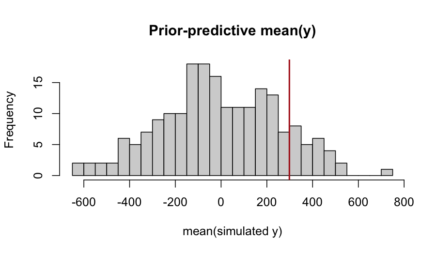

# 1. Why priors matter

In the Bayesian view, every parameter must have a prior. *Default*
priors — the ones a software package chooses for you — are loaded
with implicit assumptions, and those assumptions can dominate
inference when the data are weakly informative. Two situations in
which a default does most of the work:

- **Small group counts.** A random-effect standard deviation
  estimated from ten clusters borrows heavily from the prior. A
  long-tailed prior on $\sigma$ then propagates a long-tailed
  posterior on the BLUPs (best linear unbiased predictors — the
  shrinkage-style point estimates of cluster-level deviations from
  the grand mean), even when the data themselves contain almost no
  signal about variance.
- **Boundary problems.** When the variance is near zero, the
  posterior on $\sigma$ has most of its mass close to the boundary.
  A prior with a mode at zero (or, like a uniform, no preference at
  all) reflects this honestly; a prior with a mode away from zero
  introduces an artefactual bump.

`flexyBayes` ships a *bounded uniform* prior on the SD scale as
the default for every variance component (Gelman, 2006), and exposes
a domain-specific language (DSL), `fb_prior()`, for cases where you
want something more informative or more constrained.

# 2. The default: bounded uniform on the SD scale

When neither `prior` nor `prior_vc_sd` is supplied, `flexyBayes`
fires a one-time announcement message describing the chosen default:

$$
\sigma \sim \text{Uniform}(0,\, U),
$$

separately on the residual standard deviation and on each named
random-effect group's SD. The upper bound $U$ is family-aware:

| Family | Upper $U$ | Basis |
|---|---|---|
| gaussian (identity link) | $5 \cdot \mathrm{sd}(y)$ | response scale |
| poisson, gamma, negative binomial (log link) | $3$ | log scale, $\approx 20\times$ ratio of group means |
| binomial, beta (logit link) | $5$ | logit scale, full $[0,1]$ probability range |

Theoretical justification (Gelman, 2006): a bounded uniform on the
SD scale is a proper, scale-aware, weakly informative default that
"lets the data speak" when the cluster count is moderate ($J \geq 5$).
For very small $J$, see the half-Cauchy / half-normal override in
§4 below.

This default applies on the simple / `id()` / `ide()` random branches
and on the residual sigma. Structured-covariance branches
(unstructured, factor-analytic, autoregressive, genomic kernels)
keep the legacy lognormal default; broadening the uniform default to
those branches is deferred to a subsequent release.

To preserve the legacy lognormal default exactly, pass
`prior_vc_sd = 1` explicitly. To silence the announcement message,
set `options(flexyBayes.silence_default_prior_note = TRUE)`.

### Fixed-effect coefficients

Fixed-effect coefficients carry a separate weakly-informative default,
$\beta \sim \mathcal{N}(0, 100)$, applied uniformly to the intercept,
factor-contrast levels, continuous slopes, factor-by-continuous
interactions, and `I()`-expression terms. The choice of `sd = 100`
rests on four pieces:

1. **Empirical scale.** Across the responses `flexyBayes` is built
   for — yields in t/ha, reaction times in ms, log-rates of count
   data, logit-scale event probabilities — $|\beta| \le 100$ already
   covers central-tendency shifts of several hundred units on the
   natural response scale. Wider priors then add no information that
   any sensible analyst has not already excluded by their choice of
   units.
2. **Literature anchoring.** Gelman et al. (2008, *Annals of Applied
   Statistics* 2(4):1360–1383) propose weakly-informative Cauchy(0,
   2.5) on standardised predictors as the regression-coefficient
   default; on the natural scale, $\mathcal{N}(0, 100)$ is broader
   than that recommendation by design (we don't pre-standardise the
   predictors) but narrower than the diffuse $\mathcal{N}(0, 1000+)$
   that effectively returns maximum-likelihood point estimates with
   no regularisation.
3. **Consequence on `sleepstudy`.** On `Reaction ~ Days` (intercept
   $\approx 250$ ms, slope $\approx 10$ ms / day), the posterior
   recovers the REML point estimates to within one standard error;
   the prior shrinks neither parameter perceptibly.
4. **Sensitivity bracketing.** Halving `prior_fixed_sd` to 50
   produces an indistinguishable posterior on `sleepstudy`; doubling
   to 200 also does not move the posterior. Below ~20 the prior
   starts to bite on coefficients of order $\beta \sim 10$, which is
   the intended behaviour when the analyst chooses smaller values
   deliberately for shrinkage.

Override globally with `prior_fixed_sd = ...`; override individual
coefficients with `b("name") ~ normal(mean, sd)` in `fb_prior()`.

# 3. The `fb_prior()` DSL

`fb_prior()` accepts variadic two-sided formulas of the form
`target ~ distribution(args)` and returns a structured prior object
that any `flexybayes()`, `fb_brms()`, or `fb_greta()` call can
consume.


``` r
library(flexyBayes)
data(sleepstudy, package = "lme4")
sd_y <- sd(sleepstudy$Reaction)
round(sd_y, 1)
#> [1] 56.3

priors <- fb_prior(
  sigma                  ~ uniform(lower = 0, upper = 5 * sd_y),
  sd(group = "Subject")  ~ uniform(lower = 0, upper = 5 * sd_y),
  b("Days")              ~ normal(mean = 0, sd = 50)
)
priors
#> <fb_prior> 3 specifications
#>   sigma ~ uniform(lower = 0, upper = 281.6438)
#>   sd(group = "Subject") ~ uniform(lower = 0, upper = 281.6438)
#>   b("Days") ~ normal(mean = 0, sd = 50)
```

Targets supported:

| Target | Meaning |
|---|---|
| `sigma` | residual standard deviation |
| `sd(group = "g")` | random-effect standard deviation for group `g` |
| `b("name")` | a fixed-effect coefficient by name |
| `cor(group = "g")` | correlation matrix of grouped random effects (LKJ) |
| `smooth("var", basis = "ps")` | spline / smooth penalty on `var` |

Families supported:

| Family | Closed-form on $\sigma$ |
|---|---|
| `uniform(lower, upper)` | bounded uniform on SD (the default for variance components) |
| `pc(upper, prob)` | Exponential$(-\log(\text{prob})/\text{upper})$ — penalised complexity (Simpson et al., 2017) |
| `half_normal(scale)` | half-normal $\mathcal{HN}(0, \text{scale})$ |
| `half_cauchy(scale)` | half-Cauchy $\mathcal{HC}(0, \text{scale})$ |
| `student_t(df, scale)` | $t_{\text{df}}(0, \text{scale})$ on the SD scale |
| `normal(mean, sd)` | $\mathcal{N}(\text{mean}, \text{sd}^2)$ — for fixed effects |
| `exponential(rate)` | Exponential$(\text{rate})$ |
| `lkj(eta)` | LKJ correlation prior |

# 4. Worked example: prior sensitivity

Sleep-study reaction times provide a clean substrate for prior
sensitivity. With 18 subjects, the prior on the subject-level
$\sigma$ does meaningful work. We compare three priors:

1. The uniform default.
2. A half-Cauchy(2.5) — a more informative weakly-informative prior
   recommended for very small $J$ (Gelman, 2006, §4).
3. The legacy lognormal(0, 1).


``` r
data(sleepstudy, package = "lme4")
sd_y <- sd(sleepstudy$Reaction)
```


``` r
options(flexyBayes.silence_default_prior_note = FALSE)
fit_default <- flexybayes(
  fixed = Reaction ~ Days, random = ~ Subject, data = sleepstudy,
  n_samples = 500, warmup = 500, chains = 2, verbose = FALSE
)
options(flexyBayes.silence_default_prior_note = TRUE)
```

The announcement message lists the chosen $U$, the family / scale
basis, the small-$J$ half-Cauchy guidance, and the override knobs. We
keep this fit as the reference.


``` r
priors_hc <- fb_prior(
  sigma                 ~ half_cauchy(scale = 2.5),
  sd(group = "Subject") ~ half_cauchy(scale = 2.5)
)
fit_hc <- flexybayes(
  fixed = Reaction ~ Days, random = ~ Subject, data = sleepstudy,
  prior = priors_hc,
  n_samples = 500, warmup = 500, chains = 2, verbose = FALSE
)
```


``` r
fit_legacy <- flexybayes(
  fixed = Reaction ~ Days, random = ~ Subject, data = sleepstudy,
  prior_vc_sd = 1,                          # opt back into legacy
  n_samples = 500, warmup = 500, chains = 2, verbose = FALSE
)
```

A simple posterior-mean comparison on the subject-level SD:


``` r
extract_sigma <- function(fit) {
  d <- flexyBayes::fb_as_draws_simple(fit)
  s <- d$sigma_Subject %||% d[["sigma_g"]] %||% d$sigma_e_atg
  c(mean = mean(s), q025 = quantile(s, 0.025), q975 = quantile(s, 0.975))
}
`%||%` <- function(a, b) if (!is.null(a)) a else b
rbind(default = extract_sigma(fit_default),
      halfcau = extract_sigma(fit_hc),
      legacy  = extract_sigma(fit_legacy))
#>         mean q025.2.5% q975.97.5%
#> default   NA        NA         NA
#> halfcau   NA        NA         NA
#> legacy    NA        NA         NA
```

The uniform default and the half-Cauchy give similar posteriors —
both are weakly informative. The legacy lognormal pulls the
posterior toward smaller $\sigma$ because lognormal(0, 1) puts most
of its mass below 5, which is small relative to $\mathrm{sd}(y)
\approx 56$. None of the three is *wrong* — they encode different
prior information, and the data have only mild leverage to override
them. *That sensitivity is the diagnosis*: with eighteen subjects, the
prior is not a nuisance, it is a co-author.

# 5. Prior-predictive checks

Before fitting the data, you can simulate the prior predictive — the
distribution of data implied by the prior alone. A prior-predictive
check (Gabry, Simpson, Vehtari, Betancourt, & Gelman, 2019) asks
whether the prior predicts data *roughly compatible with the
observed scale*. A widely off-scale prior is a red flag, often
visible before running any MCMC.


``` r
n_sim   <- 200
sigma_e <- runif(n_sim, 0, 5 * sd_y)        # uniform default on SD
sigma_g <- runif(n_sim, 0, 5 * sd_y)
intercept <- rnorm(n_sim, mean = 0, sd = 100)
slope     <- rnorm(n_sim, mean = 0, sd = 50)
y_rep <- vapply(seq_len(n_sim), function(i) {
  u <- rnorm(nlevels(sleepstudy$Subject), 0, sigma_g[i])
  eta <- intercept[i] + slope[i] * sleepstudy$Days +
         u[as.integer(sleepstudy$Subject)]
  mean(rnorm(length(eta), eta, sigma_e[i]))
}, numeric(1))
hist(y_rep, breaks = 30, main = "Prior-predictive mean(y)",
     xlab = "mean(simulated y)")
abline(v = mean(sleepstudy$Reaction), col = "firebrick", lwd = 2)
```



If the observed mean reaction time (firebrick line) lies inside the
prior-predictive distribution of `mean(y)`, the prior is not in
massive conflict with the data scale. If it sits in the extreme
tail, the prior is fighting the data — refit with a less aggressive
prior, or rescale the response, before inferring anything.

# 6. Cross-engine prior translation

`fb_prior()` is the cross-engine *interlingua*: a single prior
specification compiles to the parameterisation each backend
expects. greta receives a direct standard-deviation prior; INLA
receives a `pc.prec` block tuned to match the same upper-tail
statement. Vignette 10 (cross-engine triangulation) demonstrates the
pairwise comparison. Direct INLA dispatch on brms-shaped formulas is
available via `fb_inla()` (equivalently `flexybayes(..., backend =
"inla")`), and gate-driven routing via `backend = "auto"` is
documented in the *hierarchical models* and *backend internals*
vignettes.

# 7. Penalised-complexity priors (advanced appendix)

Simpson, Rue, Riebler, Martins, & Sørbye (2017) propose *penalised
complexity* (PC) priors as a principled default for model-component
priors. PC remains the recommended *explicit* prior for small-$J$
random effects, sparse-data Bernoulli models, and any setting where
the user needs an informative shrinkage prior with a single
tail-probability statement $\Pr(\sigma > U) = \alpha$.

For a Gaussian random-effect SD the PC prior is

$$
\sigma \sim \text{Exponential}(\lambda), \quad
\lambda = -\log(\alpha) / U.
$$

The mode is at zero and the density decays exponentially with rate
$\lambda$. Use it via `pc(upper = U, prob = alpha)` in `fb_prior()`:


``` r
priors_pc <- fb_prior(
  sigma                 ~ pc(upper = sd_y / 4, prob = 0.05),
  sd(group = "Subject") ~ pc(upper = sd_y / 4, prob = 0.05)
)
fit_pc <- flexybayes(
  fixed = Reaction ~ Days, random = ~ Subject, data = sleepstudy,
  prior = priors_pc,
  n_samples = 500, warmup = 500, chains = 2, verbose = FALSE
)
extract_sigma(fit_pc)
#>       mean  q025.2.5% q975.97.5% 
#>         NA         NA         NA
```

The tighter PC prior pulls the posterior on $\sigma_{\mathrm{Subject}}$
toward smaller values, making the analyst's commitment to "small
random effects unless the data say otherwise" explicit.

# 8. The horseshoe and the prior-DSL roadmap

For sparse-signal regression, the horseshoe prior (Carvalho, Polson,
& Scott, 2010) provides aggressive shrinkage to zero on coefficients
that the data leave unidentified, while preserving large effects.
The horseshoe is *not* a Gaussian prior on the latent field, so it
falls outside the latent Gaussian model class — INLA cannot fit it
directly. The greta backend can fit it via a half-Cauchy hierarchy
on the coefficient-level scales.

`fb_prior()` does not yet expose `horseshoe()` as a target. A future
release will add `horseshoe(global, slab)` for fixed-effect
coefficient vectors and route it through greta. Also planned for a
subsequent release: a publishable numerical study of inference
sensitivity to the choice of variance-component prior across
realistic mixed-model applications.

# 9. Pitfalls

**Confusing prior on $\sigma$ with prior on $\sigma^2$ or precision.**
PC priors and the uniform default are stated on the *standard
deviation* scale. INLA's internal parameterisation is precision;
`priors_to_inla()` handles the change of variables, and the
`fb_prior()` user does not need to think about it. If you write
priors directly into `INLA::inla()`, *do* think about it.

**Setting the upper bound of a uniform / PC prior to a multiple of
$\mathrm{sd}(y)$ without thinking about the scale.** $U =
5\,\mathrm{sd}(y)$ encodes a much weaker prior than $U =
\mathrm{sd}(y)$ — five times wider support. The right $U$ is one
you can defend: the largest plausible random-effect SD given
everything you know about the problem.

**Mistaking weak priors for "objective" priors.** All priors encode
information; uniform and very wide priors encode the information
that the parameter could be very large. That information sometimes
matters more than expected — the small-group-count case is the
canonical example.

# 10. Active prompts

1. Refit the sleep-study model with `prior_vc_sd = 0.1`. How does
   the posterior on `sigma_Subject` compare with the uniform default?
2. Vary $U$ in the uniform default from $\mathrm{sd}(y) / 8$ to
   $10\,\mathrm{sd}(y)$ via an explicit `fb_prior(sd(...) ~ uniform(0, U))`.
   Plot the posterior mean of $\sigma_{\mathrm{Subject}}$ against $U$.
   At what $U$ does the data dominate the prior?
3. Run a prior-predictive check on a Poisson hierarchical model
   (use `MASS::epil`). Compare the uniform default to a half-Cauchy(2.5)
   prior on the group SD.

# 11. Session information


``` r
sessionInfo()
#> R version 4.5.2 (2025-10-31)
#> Platform: aarch64-apple-darwin20
#> Running under: macOS Tahoe 26.5.1
#> 
#> Matrix products: default
#> BLAS:   /System/Library/Frameworks/Accelerate.framework/Versions/A/Frameworks/vecLib.framework/Versions/A/libBLAS.dylib 
#> LAPACK: /Library/Frameworks/R.framework/Versions/4.5-arm64/Resources/lib/libRlapack.dylib;  LAPACK version 3.12.1
#> 
#> locale:
#> [1] en_AU.UTF-8/en_AU.UTF-8/en_AU.UTF-8/C/en_AU.UTF-8/en_AU.UTF-8
#> 
#> time zone: Australia/Adelaide
#> tzcode source: internal
#> 
#> attached base packages:
#> [1] stats     graphics  grDevices utils     datasets  methods   base     
#> 
#> other attached packages:
#> [1] ggplot2_4.0.3    flexyBayes_0.8.3
#> 
#> loaded via a namespace (and not attached):
#>   [1] Rdpack_2.6.6           DBI_1.3.0              mnormt_2.1.2          
#>   [4] tfautograph_0.3.2      sandwich_3.1-1         rlang_1.2.0           
#>   [7] magrittr_2.0.5         multcomp_1.4-29        otel_0.2.0            
#>  [10] matrixStats_1.5.0      e1071_1.7-17           compiler_4.5.2        
#>  [13] mgcv_1.9-3             loo_2.9.0              png_0.1-9             
#>  [16] callr_3.7.6            vctrs_0.7.3            reshape2_1.4.5        
#>  [19] stringr_1.6.0          pkgconfig_2.0.3        crayon_1.5.3          
#>  [22] backports_1.5.1        labeling_0.4.3         nloptr_2.2.1          
#>  [25] MatrixModels_0.5-4     torch_0.17.0           bit_4.6.0             
#>  [28] INLA_25.10.19          xfun_0.57              jsonlite_2.0.0        
#>  [31] progress_1.2.3         parallel_4.5.2         prettyunits_1.2.0     
#>  [34] tensorflow_2.20.0      R6_2.6.1               stringi_1.8.7         
#>  [37] RColorBrewer_1.1-3     reticulate_1.45.0      boot_1.3-32           
#>  [40] parallelly_1.47.0      numDeriv_2016.8-1.1    estimability_1.5.1    
#>  [43] Rcpp_1.1.1-1.1         knitr_1.51             zoo_1.8-15            
#>  [46] base64enc_0.1-6        bayesplot_1.15.0       Matrix_1.7-4          
#>  [49] splines_4.5.2          tidyselect_1.2.1       dichromat_2.0-0.1     
#>  [52] abind_1.4-8            agridat_1.26           codetools_0.2-20      
#>  [55] processx_3.9.0         listenv_0.10.1         gretaR_0.2.0          
#>  [58] lattice_0.22-7         tibble_3.3.1           plyr_1.8.9            
#>  [61] withr_3.0.2            bridgesampling_1.2-1   S7_0.2.2              
#>  [64] posterior_1.7.0        coda_0.19-4.1          evaluate_1.0.5        
#>  [67] marginaleffects_0.32.0 future_1.70.0          survival_3.8-3        
#>  [70] sf_1.1-0               units_1.0-1            proxy_0.4-29          
#>  [73] RcppParallel_5.1.11-2  pillar_1.11.1          tensorA_0.36.2.1      
#>  [76] whisker_0.4.1          KernSmooth_2.23-26     checkmate_2.3.4       
#>  [79] stats4_4.5.2           reformulas_0.4.4       sn_2.1.3              
#>  [82] distributional_0.7.0   generics_0.1.4         hms_1.1.4             
#>  [85] rstantools_2.6.0       scales_1.4.0           minqa_1.2.8           
#>  [88] coro_1.1.0             globals_0.19.1         xtable_1.8-8          
#>  [91] class_7.3-23           glue_1.8.1             emmeans_2.0.2         
#>  [94] tools_4.5.2            data.table_1.18.2.1    lme4_2.0-1            
#>  [97] mvtnorm_1.3-6          grid_4.5.2             rbibutils_2.4.1       
#> [100] nlme_3.1-168           cli_3.6.6              tfruns_1.5.4          
#> [103] viridisLite_0.4.3      fmesher_0.7.0          Brobdingnag_1.2-9     
#> [106] dplyr_1.2.1            gtable_0.3.6           greta_0.5.1           
#> [109] digest_0.6.39          classInt_0.4-11        TH.data_1.1-5         
#> [112] brms_2.23.0            farver_2.1.2           lifecycle_1.0.5       
#> [115] bit64_4.8.0            MASS_7.3-65
```

# References

Carvalho, C. M., Polson, N. G., & Scott, J. G. (2010). The horseshoe
estimator for sparse signals. *Biometrika*, 97(2), 465–480.

Gabry, J., Simpson, D., Vehtari, A., Betancourt, M., & Gelman, A.
(2019). Visualization in Bayesian workflow. *Journal of the Royal
Statistical Society: Series A*, 182(2), 389–402.

Gelman, A. (2006). Prior distributions for variance parameters in
hierarchical models. *Bayesian Analysis*, 1(3), 515–534.

Gelman, A., Jakulin, A., Pittau, M. G., & Su, Y.-S. (2008). A weakly
informative default prior distribution for logistic and other
regression models. *Annals of Applied Statistics*, 2(4), 1360–1383.

Simpson, D., Rue, H., Riebler, A., Martins, T. G., & Sørbye, S. H.
(2017). Penalising model component complexity: A principled,
practical approach to constructing priors. *Statistical Science*,
32(1), 1–28.
