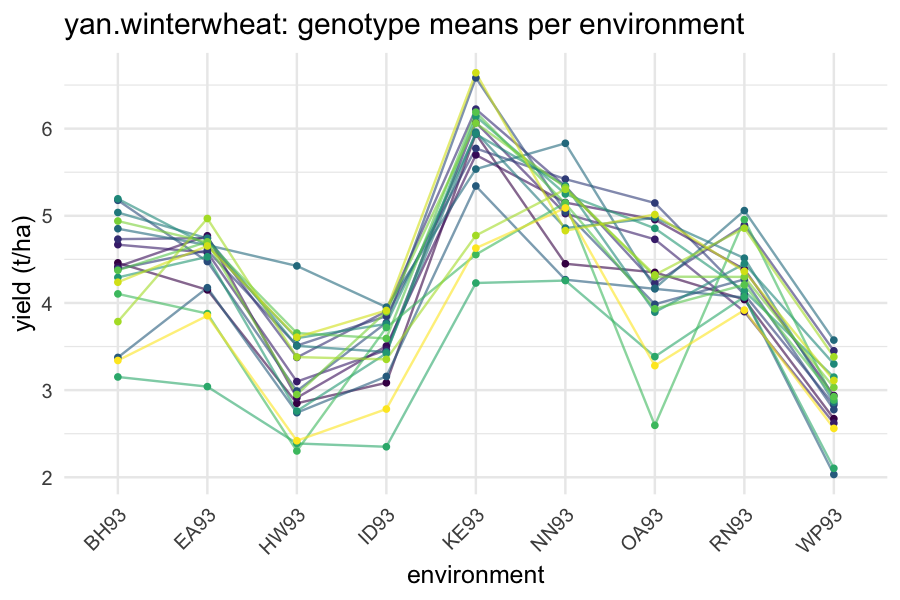

# 1. The two questions of plant breeding

Crop variety evaluation poses two intertwined questions, and
`flexyBayes` writes both in one syntax, with different coverage behind
each.

1. **Multi-environment trials (METs).** Genotypes are evaluated across
   many environments (locations by years). Their *rankings* change
   across environments -- *genotype-by-environment interaction* (GxE).
   The first question is which genotypes are best on average, and which
   trade off mean for stability.
2. **Genomic selection.** Modern breeding programmes have genome-wide
   markers on every candidate genotype, even those untested in the
   field. Predicting the field performance of an *unphenotyped*
   candidate from its markers is *genomic prediction*; selecting
   candidates by predicted performance is *genomic selection*
   (Meuwissen, Hayes, & Goddard, 2001).

> **What this vignette runs.** Every model below is fitted live at a
> budget and a `seed` stated in the call, so the numbers printed here
> are the numbers a re-run returns, and every fit that is presented as
> an estimate meets the package's convergence thresholds
> ($\widehat{R} \le 1.01$, effective size $\ge 400$) -- the MET fit in
> Section 2 is a 1,188-plot trial series and takes about a minute.
> Where a structure has no fitting route, or has one but is not
> identified by the data, the vignette says so at the point of use
> rather than fitting it and hoping.

# 2. The multi-environment trial: `agridat::besag.met`

`agridat::besag.met` (Besag & Higdon, 1999) records corn yield for 64
genotypes at 6 locations, each a randomised trial with three
replicates: 1,188 plots. The replication matters for what follows --
with more than one plot per genotype-location cell, the interaction
variance and the error variance are separately identified. A MET summary
table with a single mean per cell does not have that property, and
Section 2.4 returns to it.


``` r
library(flexyBayes)
data(besag.met, package = "agridat")
str(besag.met)
#> 'data.frame':	1188 obs. of  7 variables:
#>  $ county: Factor w/ 6 levels "C1","C2","C3",..: 1 1 1 1 1 1 1 1 1 1 ...
#>  $ row   : int  1 1 1 1 1 1 1 1 1 1 ...
#>  $ col   : int  1 2 3 4 5 6 7 8 9 10 ...
#>  $ rep   : Factor w/ 3 levels "R1","R2","R3": 1 1 1 1 1 1 1 1 1 1 ...
#>  $ block : Factor w/ 8 levels "B1","B2","B3",..: 2 2 2 2 2 2 2 2 5 5 ...
#>  $ yield : num  170 130 129 131 132 ...
#>  $ gen   : Factor w/ 64 levels "G01","G02","G03",..: 42 58 26 10 34 50 2 18 45 61 ...
table(besag.met$county, besag.met$rep)
#>     
#>      R1 R2 R3
#>   C1 64 64 70
#>   C2 64 64 70
#>   C3 64 64 70
#>   C4 64 64 70
#>   C5 64 64 70
#>   C6 64 64 70
```

The natural mixed model is

$$
y_{ijk} = \mu + e_j + g_i + (ge)_{ij} + \varepsilon_{ijk},
$$

with $e_j$ location effects (fixed), $g_i$ genotype effects (random),
$(ge)_{ij}$ the genotype-by-location interaction, and
$\varepsilon_{ijk}$ residuals. Two of those terms carry a modelling
choice.

**The interaction.** Three parameterisations span the parsimony
spectrum:

- **diagonal**, `diag(county):gen` -- one genotype variance per
  location, no correlation between locations. Six parameters here;
- **factor-analytic**, `fa(county, k):gen` -- a rank-$k$ approximation
  of the full covariance, the standard breeder's model for *stability*;
- **unstructured**, `us(county):gen` -- the full $6 \times 6$
  covariance, 21 free entries.

**The residual.** One error variance per location is the default
assumption of the trade, not an elaboration: a dry site and an
irrigated site do not have the same plot-to-plot noise.
`residual = ~ dsum(~ units | county)` writes it, in ASReml's spelling.

## 2.1 The model, fitted

Both halves go in one call. The chunk below pins `backend = "brms"` so the
page builds the same way on every machine. `backend = "auto"` would send
the model to the same engine: INLA collapses the finest strata of a
multi-stratum design, so the latent-Gaussian gate refuses it by name rather
than reporting a zero variance.


``` r
fit_met <- flexybayes(
  fixed    = yield ~ county,
  random   = ~ gen + diag(county):gen,
  residual = ~ dsum(~ units | county),
  data     = besag.met,
  backend  = "brms",
  n_samples = 1000, warmup = 1000, chains = 4, seed = 20260815L,
  verbose = FALSE, mcmc_verbose = FALSE
)
fit_met
#> Bayesian mixed model  [flexyBayes / brms passthrough]
#> ------------------------------------------------------- 
#>   Fixed  : yield ~ county 
#>   Random : ~gen + diag(county):gen 
#>   Family : gaussian ( identity link )
#>   MCMC   : 4 chain(s) x 1000 samples (warmup = 1000 ) -- 45.3 sec (Stan via brms)
#>   Params : 506 monitored; 6 fixed, 2 random terms
#>   Max Rhat: 1.008  [OK] 
#>   Min ESS: 914 
#> 
#> -- Residual by level of `county` (posterior median, 95% interval) --------
#>  level variance    lower    upper      SD SD.lower SD.upper
#>     C1 275.4760 224.4299 340.8738 16.5975  14.9810  18.4628
#>     C2 290.9915 237.6700 359.5908 17.0585  15.4166  18.9629
#>     C3 331.3053 270.3282 412.0062 18.2018  16.4417  20.2979
#>     C4 255.9566 208.7410 317.0614 15.9986  14.4479  17.8062
#>     C5 205.0199 166.2875 255.6567 14.3185  12.8953  15.9893
#>     C6 701.7100 580.8174 866.4185 26.4898  24.1002  29.4350
#>   Summarised from the draws of exp(2 * b_sigma_<level>); the fitted
#>   coefficients are on log sigma, so neither they nor their posterior
#>   means are variances. There is no scalar residual variance in this
#>   model -- the sectioning replaces it.
#> ------------------------------------------------------- 
#>   $glm    -- GLM-compatible shim (coef, vcov, fitted, etc.)
#>   $brms   -- live brmsfit (loo, posterior_predict, summary)
#>   $extras -- diagnostics, variance components, call info
```

Three blocks in that output carry the model.

The **variance components** give the genotype main-effect variance and
one genotype variance per location -- the diagonal interaction. A
location whose genotype variance is large is one where varieties
separate; a location where it is small is one where they do not, and
where trial resource is arguably wasted.

The **residual block** gives one error variance per location, on the
variance and the standard-deviation scale. These are *not* the fitted
coefficients: brms represents a sectioned residual as a predictor on
log sigma, so the coefficient `b_sigma_countyC2` exponentiates to a
standard deviation and squares from there to a variance. The block does
that arithmetic on the draws.

The **convergence lines** are the ones to read first. At this budget
the fit is clean; at a shorter one it would not be, and the numbers
above it would be a sketch rather than an estimate.


``` r
fit_met$extras$variance_comps
#>          component estimate        sd       q2.5    q97.5
#> 1           sd_gen 6.723825 0.8615424 5.20176187 8.588630
#> 2 sd_gen__countyC1 2.057226 1.5175334 0.08891827 5.585156
#> 3 sd_gen__countyC2 2.185504 1.5537638 0.10549686 5.823095
#> 4 sd_gen__countyC3 2.661386 1.8710887 0.07925454 6.850724
#> 5 sd_gen__countyC4 2.463533 1.7162416 0.11382371 6.363628
#> 6 sd_gen__countyC5 2.465549 1.7003933 0.10392895 6.124006
#> 7 sd_gen__countyC6 2.510718 1.8341202 0.10945793 6.809245
```

Read those intervals before reading the estimates. On this series the
genotype main-effect standard deviation is several times any of the
per-location interaction standard deviations, and each interaction
interval runs down close to zero. That is a finding about the trial, not
a fitting problem: these six locations rank the 64 genotypes largely
alike, so a model with a genotype main effect and a per-location error
variance already accounts for most of what is there, and the
interaction adds little. A MET where the interaction dominates looks the
other way round, and it is the case in which the factor-analytic model
of Section 2.3 earns its extra parameters.

## 2.2 Genotype means and stability

Mean performance comes from the posterior of the genotype main effect,
and stability from the spread of a genotype's interaction deviations
across locations. Both are posteriors, so both come with uncertainty
rather than as point rankings.


``` r
gen_effects <- brms::ranef(fit_met$brms)$gen[, "Estimate", "Intercept"]
head(sort(gen_effects, decreasing = TRUE), 8)
#>       G54       G05       G38       G55       G61       G22       G30       G45 
#> 11.484812 11.152551  8.005700  7.968102  7.757329  7.162561  6.540515  6.487529
```


``` r
# The diagonal term gives each genotype one deviation per location; a
# genotype whose deviations spread widely is unstable across the series.
dev <- brms::ranef(fit_met$brms)$gen[, "Estimate", ]
ge_cols <- setdiff(colnames(dev), "Intercept")
stability <- apply(dev[, ge_cols, drop = FALSE], 1L, stats::sd)
head(sort(stability), 8)   # the eight most stable genotypes
#>       G24       G22       G51       G43       G40       G50       G28       G52 
#> 0.2043498 0.3791065 0.3942158 0.3978067 0.4123765 0.4125561 0.4190648 0.4236141
```

A genotype high on the first list and low on the second is the one a
breeder wants: good on average and consistent about it. The two lists
disagreeing is the whole reason MET analysis exists -- though on this
particular series, where the interaction variances are small, the
stability ordering rests on differences the posterior barely resolves.
Point estimates of a deviation spread are the least trustworthy summary
in this vignette, and are shown here to demonstrate the accessor rather
than to nominate a variety.

## 2.3 The factor-analytic model: grammar, and the refusal

The factor-analytic parameterisation with $k = 2$ reduces the
unstructured $6 \times 6$ covariance to 12 entries (10 loadings and 2
specific variances) and is the standard model for stability in the
breeding literature (Smith, Cullis, & Thompson, 2001). The grammar
parses it, so the formula catalogue can describe it, and no active
engine emits it:


``` r
refused <- tryCatch(
  flexybayes(fixed = yield ~ county, random = ~ fa(county, 2):gen,
             data = besag.met, verbose = FALSE),
  error = function(e) e
)
cat("Refused:", conditionMessage(refused), "\n")
#> Refused: fa(county, 2):gen requests a factor-analytic covariance -- a rank-k loading matrix plus a diagonal. Neither active engine emits one: INLA's f() has no factor-analytic latent model, and brms group-level effects are either uncorrelated or fully unstructured. Use us(county):gen for the full unstructured covariance, diag(county):gen for heterogeneous variances with no correlation, or ASReml for the factor-analytic model itself. The term still parses, so fb_terms() will describe it.
```

Were it fittable, the variance-component block would report the loading
variances and the specific variances, and `fb_structured_cov()` would
reconstruct the implied location-by-location covariance
$\boldsymbol{\Sigma} = \boldsymbol{\Lambda}\boldsymbol{\Lambda}^\top + \boldsymbol{\Psi}$
(rotation- and sign-invariant, since raw loadings are identified only up
to rotation and sign). Until then, the diagonal model of Section 2.1
answers the mean-performance question, and the deviation spread of
Section 2.2 answers a coarse version of the stability question.

## 2.4 The unstructured model, and when it is identified

`us(county):gen` fits on brms. Whether it is *identified* is a question
about the data, not the engine.

The unstructured term estimates 6 standard deviations and 15
correlations alongside a residual variance. With replication inside each
genotype-location cell, as in `besag.met`, the residual has its own
information and the split is clean. With **one observation per cell** --
the shape of most published MET tables -- it is not: the residual
variance is confounded with the diagonal of the covariance, and the
sampler walks the ridge between them. On `agridat::yan.winterwheat` (18
genotypes, 9 environments, one plot per cell) the 45 covariance
parameters converge cleanly, while `sigma` reaches $\widehat{R}$ 1.13 at
an effective size of 36 with divergent transitions, and doubling the
budget makes every one of those worse rather than better. The fitted
covariance is then conditional on a residual the chains disagree about.

Replication within cell, an informative prior on the residual, or the
diagonal structure are the three ways out. Raising
`control = list(adapt_delta = 0.95)` is not a fourth: it lowers the
divergence count without identifying the split, so the covariance stays
conditional on a residual the chains disagree about. Diagnostics are not
optional here.

# 3. Visualising GxE: the interaction plot

Before any model is fitted, the canonical exploratory display of MET
data is the genotype-by-environment interaction plot. It is easiest to
read on a small trial, so this one uses `agridat::yan.winterwheat` (Yan
& Tinker, 2006) -- 18 genotypes in 9 Ontario environments, one plot per
cell, which is exactly the unreplicated shape Section 2.4 warns about
for modelling and which is perfectly good for looking at.


``` r
library(ggplot2)
data(yan.winterwheat, package = "agridat")
gxe <- aggregate(yield ~ gen + env, data = yan.winterwheat, mean)
ggplot(gxe, aes(x = env, y = yield, group = gen, colour = gen)) +
  geom_line(alpha = 0.6) +
  geom_point(size = 1) +
  scale_colour_viridis_d(option = "viridis") +
  theme_minimal(base_size = 12) +
  theme(axis.text.x = element_text(angle = 45, hjust = 1),
        legend.position = "none") +
  labs(x = "environment", y = "yield (t/ha)",
       title = "yan.winterwheat: genotype means per environment")
```



Crossing lines indicate GxE -- the rank of a genotype changes across
environments. Parallel lines indicate none, and a genotype main effect
alone would then suffice. In `yan.winterwheat` the lines cross visibly.

# 4. Genomic BLUP (GBLUP)

When genome-wide markers are available, the kinship matrix
$\mathbf{G}$ -- the realised additive genetic relationship matrix
computed from marker genotypes (VanRaden, 2008) -- replaces the default
identity covariance in the genotype random effect:

$$
\mathbf{u} \mid \sigma_g^2 \sim \mathcal{N}\!\left(\mathbf{0},\, \sigma_g^2 \mathbf{G}\right).
$$

This is *genomic BLUP*. It pools information across genotypes by
marker-based similarity and extrapolates to *unphenotyped*
genotypes whose markers are known.

`flexyBayes` plumbs this through the `vm()` term and the
`known_matrices` argument. The example dataset that ships with the
package carries a 10-genotype trial with its own $\mathbf{G}$ and
$\mathbf{A}$ matrices:


``` r
data(met_example, package = "flexyBayes")
fit_gblup <- flexybayes(
  fixed     = yield ~ env,
  random    = ~ vm(geno, Gmat),
  data      = met_example$dat,
  known_matrices = list(Gmat = met_example$G_mat),
  n_samples = 1000, warmup = 1000, chains = 4, seed = 20260815L,
  verbose = FALSE, mcmc_verbose = FALSE
)
fit_gblup
#> Bayesian mixed model  [flexyBayes / brms passthrough]
#> ------------------------------------------------------- 
#>   Fixed  : yield ~ env 
#>   Random : ~vm(geno, Gmat) 
#>   Family : gaussian ( identity link )
#>   MCMC   : 4 chain(s) x 1000 samples (warmup = 1000 ) -- 15.8 sec (Stan via brms)
#>   Params : 19 monitored; 4 fixed, 1 random terms
#>   Max Rhat: 1.002  [OK] 
#>   Min ESS: 1067 
#> ------------------------------------------------------- 
#>   $glm    -- GLM-compatible shim (coef, vcov, fitted, etc.)
#>   $brms   -- live brmsfit (loo, posterior_predict, summary)
#>   $extras -- diagnostics, variance components, call info
```

The variance-component block reports a single $\sigma_g^2$ -- the
*additive genetic variance* under this $\mathbf{G}$ -- alongside the
residual $\sigma_e^2$.

## 4.1 Heritability, and which one

Two heritabilities are in common use and they are not the same number.

**Plot-level** (individual-plot basis) heritability is the proportion of
single-plot phenotypic variance that is additive genetic:

$$
h^2_{\text{plot}} = \frac{\sigma_g^2}{\sigma_g^2 + \sigma_e^2}.
$$

**Mean-basis** (line-mean) heritability applies to a genotype *mean*
over $r$ plots, so the error term is divided by the number of plots
averaged (Falconer & Mackay, 1996):

$$
h^2_{\text{mean}} = \frac{\sigma_g^2}{\sigma_g^2 + \sigma_e^2 / r}.
$$

The mean-basis figure is always the larger of the two, and quoting it
without naming $r$ makes it uninterpretable. Both are computed here
from the draws, so each carries a credible interval rather than a point
value. In `met_example` each genotype appears in 4 environments with 3
replicates, so $r = 12$:


``` r
draws <- flexyBayes::fb_as_draws_simple(fit_gblup)
var_g <- draws[["sd_geno__Intercept"]]^2
var_e <- draws[["sigma"]]^2
r_plots <- nrow(met_example$dat) / nlevels(met_example$dat$geno)

h2_plot <- var_g / (var_g + var_e)
h2_mean <- var_g / (var_g + var_e / r_plots)

rbind(
  plot_level = c(mean = mean(h2_plot), stats::quantile(h2_plot, c(0.025, 0.975))),
  mean_basis = c(mean = mean(h2_mean), stats::quantile(h2_mean, c(0.025, 0.975)))
)
#>                 mean      2.5%     97.5%
#> plot_level 0.4458314 0.2158342 0.7265006
#> mean_basis 0.8936312 0.7675978 0.9695825
```

The interval is the practitioner's first quantity of interest, and here
it is the story. The plot-level point estimate is a plausible
heritability for yield, and its 95% interval spans a factor of three --
ten genotypes cannot settle the question, whatever the point estimate
says. The mean-basis figure is much higher, as it always is, because
averaging twelve plots removes most of the error variance from the
denominator. Neither number means anything quoted without its basis.

# 5. Pedigree BLUP

If a pedigree is available but no markers, the pedigree-derived
numerator relationship matrix $\mathbf{A}$ takes the role of
$\mathbf{G}$. The `ped()` term is the spelling that declares that
provenance; the model it emits is the same known-covariance random
effect that `vm()` emits, and either accepts either matrix.


``` r
fit_ped <- flexybayes(
  fixed     = yield ~ env,
  random    = ~ ped(geno, Amat),
  data      = met_example$dat,
  known_matrices = list(Amat = met_example$A_mat),
  n_samples = 1000, warmup = 1000, chains = 4, seed = 20260815L,
  verbose = FALSE, mcmc_verbose = FALSE
)
fit_ped$extras$variance_comps
#>   component estimate        sd     q2.5    q97.5
#> 1   sd_geno 2.168953 0.6431279 1.248873 3.756993
#> 2     sigma 1.806387 0.1268716 1.577531 2.080199
```

GBLUP and pedigree BLUP are structurally identical; only the
relationship matrix changes. $\mathbf{A}$ carries *expected* relatedness
from the pedigree, $\mathbf{G}$ the *realised* relatedness from markers,
and the difference between them is Mendelian sampling -- which is why
GBLUP separates full sibs and pedigree BLUP cannot. When both are
available, the genomic-pedigree blend (the $\mathbf{H}$ matrix;
Christensen & Lund, 2010) is on the roadmap.

# 6. Genomic prediction accuracy

Genomic selection is judged by *prediction accuracy*: the correlation
between predicted and observed performance for genotypes whose
phenotypes were held out, borrowing strength only through relatedness.
`fb_gblup_cv()` runs that cross-validation analytically -- the GBLUP
prediction equations evaluated per fold, with the variance components
re-estimated by REML on each training set. No MCMC and no extra
dependency: the folds are drawn internally from base R.

Ten genotypes are far too few for the answer to mean anything, so this
section uses a simulated population with family structure. That
structure is the point: prediction accuracy comes from relatives in the
training set, and a panel of genuinely unrelated individuals gives an
accuracy near zero however many markers it carries.


``` r
set.seed(2026)
n_fam <- 100L; n_sib <- 8L; n_marker <- 800L
p <- runif(n_marker, 0.15, 0.85)

# One founder genotype per family, then eight sibs that segregate at a
# quarter of the loci: relatives share most of the genome, families do
# not.
founder <- matrix(rbinom(n_fam * n_marker, 2L, rep(p, each = n_fam)),
                  n_fam, n_marker)
Z <- founder[rep(seq_len(n_fam), each = n_sib), , drop = FALSE]
n <- nrow(Z)
seg <- matrix(rbinom(n * n_marker, 2L, rep(p, each = n)), n, n_marker)
resegregate <- matrix(runif(n * n_marker) < 0.25, n, n_marker)
Z[resegregate] <- seg[resegregate]

# VanRaden's realised relationship matrix, scaled to unit mean diagonal.
Zc <- scale(Z, scale = FALSE)
G <- tcrossprod(Zc) / n_marker
G <- G / mean(diag(G)) + diag(n) * 1e-6

# Additive values with variance 1, residual variance 1.5: a plot-level
# heritability of 0.4 by construction.
u <- as.vector(t(chol(G)) %*% rnorm(n))
y <- 5 + u + rnorm(n, 0, sqrt(1.5))

cv <- fb_gblup_cv(y, G, folds = 5L, seed = 7L)
cv
#> <fb_gblup_cv>  genomic-prediction cross-validation
#>   800 genotypes, 5-fold
#>   REML heritability (full data): 0.432
#>   prediction accuracy: 0.431  (per-fold mean 0.439 +/- 0.046)
#>   bias (obs ~ pred slope): 0.984
```

The REML heritability sits near the 0.4 the data were generated with,
and the accuracy is the number a breeding programme would plan on. Both
are single-realisation estimates: at 200 individuals rather than 800 the
same code returns a heritability closer to 0.25, which is sampling
variation and not a property of the estimator.

Predictions come out of the object in input order, so they can be joined
back to the panel:


``` r
head(round(cv$predicted, 3))
#> [1] 5.171 4.926 4.787 4.823 5.061 4.931
c(accuracy = cv$accuracy, bias = cv$bias, h2 = cv$h2)
#>  accuracy      bias        h2 
#> 0.4311881 0.9838888 0.4315372
```

A bias (the slope of observed on predicted) near 1 means the predictions
are on the right scale as well as in the right order -- which matters as
soon as they are compared against a selection threshold rather than
merely ranked.

The Bayesian route propagates uncertainty further: each prediction from
a fitted model is a posterior distribution, not a single number, and
decision-theoretic selection uses the whole distribution (Bauer, Reif, &
Schipprack, 2009).

# 7. Pitfalls

**Kinship matrix scaling.** $\mathbf{G}$ matrices are conventionally
scaled so that their average diagonal equals 1. Different scaling
conventions (VanRaden 2008 against Astle & Balding 2009) shift the
posterior on $\sigma_g^2$ by a constant, and therefore shift
heritability. State the scaling when reporting either.

**Which heritability.** Section 4.1. A mean-basis figure without its
divisor $r$ cannot be compared with anything.

**One observation per cell.** Section 2.4. An unstructured GxE
covariance on unreplicated data is not identified against the residual,
and the fit will tell you so if the diagnostics are read.

**Connectedness across environments.** A factor-analytic GxE model needs
enough genotypes common to each pair of environments to identify the
loadings. Worth stating even while `fa(env, k):gen` has no active
fitting route, since it applies equally once one exists.

**`spl()` for environmental covariates.** Many MET analyses carry
quantitative environmental covariates (temperature, rainfall). Fit these
through `spl()` on the INLA backend to capture a non-linear response.

**Genotype-environment covariance is not a genotype variance.** The
factor-analytic model puts structure on $\mathrm{Var}(g_{ij})$ across
environments; it does not introduce a separate $\sigma_g^2$
hyperparameter. That is why a factor-analytic fit reports loading
variances rather than one genotype variance.

# 8. Active prompts

1. Refit `besag.met` with `random = ~ gen` only, dropping the
   interaction. Does the genotype ranking of Section 2.2 change, and do
   the residual variances absorb the difference?
2. Compare the plot-level and mean-basis heritabilities from Section
   4.1. How large is the gap at $r = 12$, and at $r = 2$?
3. Refit the GBLUP model with the pedigree matrix in place of the
   kinship matrix and triangulate the two fits. Where do they agree, and
   where does Mendelian sampling separate them?
4. Halve `n_fam` in Section 6 while holding the total sample size, so
   the families get larger. What happens to prediction accuracy, and
   why?

# 9. Session information


``` r
sessionInfo()
#> R version 4.5.2 (2025-10-31)
#> Platform: aarch64-apple-darwin20
#> Running under: macOS Tahoe 26.5.2
#> 
#> Matrix products: default
#> BLAS:   /System/Library/Frameworks/Accelerate.framework/Versions/A/Frameworks/vecLib.framework/Versions/A/libBLAS.dylib 
#> LAPACK: /Library/Frameworks/R.framework/Versions/4.5-arm64/Resources/lib/libRlapack.dylib;  LAPACK version 3.12.1
#> 
#> locale:
#> [1] en_AU.UTF-8/en_AU.UTF-8/en_AU.UTF-8/C/en_AU.UTF-8/en_AU.UTF-8
#> 
#> time zone: Australia/Adelaide
#> tzcode source: internal
#> 
#> attached base packages:
#> [1] stats     graphics  grDevices utils     datasets  methods   base     
#> 
#> other attached packages:
#> [1] ggplot2_4.0.3    flexyBayes_0.9.0
#> 
#> loaded via a namespace (and not attached):
#>   [1] tidyselect_1.2.1       viridisLite_0.4.3      dplyr_1.2.1           
#>   [4] farver_2.1.2           loo_2.9.0              S7_0.2.2              
#>   [7] INLA_25.10.19          TH.data_1.1-5          tensorA_0.36.2.1      
#>  [10] digest_0.6.39          estimability_1.5.1     lifecycle_1.0.5       
#>  [13] sf_1.1-0               StanHeaders_2.32.10    agridat_1.26          
#>  [16] processx_3.9.0         survival_3.8-3         magrittr_2.0.5        
#>  [19] posterior_1.7.0        compiler_4.5.2         rlang_1.2.0           
#>  [22] tools_4.5.2            data.table_1.18.2.1    sn_2.1.3              
#>  [25] knitr_1.51             labeling_0.4.3         bridgesampling_1.2-1  
#>  [28] mnormt_2.1.2           pkgbuild_1.4.8         classInt_0.4-11       
#>  [31] curl_7.0.0             plyr_1.8.9             RColorBrewer_1.1-3    
#>  [34] multcomp_1.4-29        abind_1.4-8            KernSmooth_2.23-26    
#>  [37] numDeriv_2016.8-1.1    withr_3.0.2            grid_4.5.2            
#>  [40] stats4_4.5.2           colorspace_2.1-2       xtable_1.8-8          
#>  [43] e1071_1.7-17           future_1.70.0          inline_0.3.21         
#>  [46] globals_0.19.1         emmeans_2.0.2          scales_1.4.0          
#>  [49] MASS_7.3-65            dichromat_2.0-0.1      cli_3.6.6             
#>  [52] mvtnorm_1.3-6          generics_0.1.4         otel_0.2.0            
#>  [55] RcppParallel_5.1.11-2  reshape2_1.4.5         DBI_1.3.0             
#>  [58] proxy_0.4-29           rstan_2.32.7           stringr_1.6.0         
#>  [61] splines_4.5.2          bayesplot_1.15.0       parallel_4.5.2        
#>  [64] matrixStats_1.5.0      marginaleffects_0.32.0 brms_2.23.0           
#>  [67] vctrs_0.7.3            V8_8.0.1               Matrix_1.7-4          
#>  [70] sandwich_3.1-1         jsonlite_2.0.0         callr_3.7.6           
#>  [73] listenv_0.10.1         units_1.0-1            glue_1.8.1            
#>  [76] parallelly_1.47.0      codetools_0.2-20       distributional_0.7.0  
#>  [79] stringi_1.8.7          gtable_0.3.6           QuickJSR_1.9.0        
#>  [82] tibble_3.3.1           pillar_1.11.1          Brobdingnag_1.2-9     
#>  [85] R6_2.6.1               fmesher_0.7.0          evaluate_1.0.5        
#>  [88] lattice_0.22-7         backports_1.5.1        MatrixModels_0.5-4    
#>  [91] rstantools_2.6.0       class_7.3-23           Rcpp_1.1.1-1.1        
#>  [94] coda_0.19-4.1          gridExtra_2.3          nlme_3.1-168          
#>  [97] checkmate_2.3.4        xfun_0.57              zoo_1.8-15            
#> [100] pkgconfig_2.0.3
```

# References

Bauer, A. M., Reif, J. C., & Schipprack, W. (2009). Reduction of the
genetic distance for marker-assisted backcrossing. *Theoretical and
Applied Genetics*, 119(1), 47--53.

Besag, J., & Higdon, D. (1999). Bayesian analysis of agricultural field
experiments. *Journal of the Royal Statistical Society, Series B*,
61(4), 691--746.

Christensen, O. F., & Lund, M. S. (2010). Genomic prediction when some
animals are not genotyped. *Genetics Selection Evolution*, 42(2), 1--8.

Falconer, D. S., & Mackay, T. F. C. (1996). *Introduction to
quantitative genetics* (4th ed.). Longman.

Meuwissen, T. H. E., Hayes, B. J., & Goddard, M. E. (2001). Prediction
of total genetic value using genome-wide dense marker maps. *Genetics*,
157(4), 1819--1829.

Piepho, H.-P., & Möhring, J. (2007). Computing heritability and
selection response from unbalanced plant breeding trials. *Genetics*,
177(3), 1881--1888.

Smith, A. B., Cullis, B. R., & Thompson, R. (2001). Analyzing variety by
environment data using multiplicative mixed models and adjustments for
spatial field trend. *Biometrics*, 57(4), 1138--1147.

VanRaden, P. M. (2008). Efficient methods to compute genomic
predictions. *Journal of Dairy Science*, 91(11), 4414--4423.

Yan, W., & Tinker, N. A. (2006). Biplot analysis of multi-environment
trial data: Principles and applications. *Canadian Journal of Plant
Science*, 86(3), 623--645.
