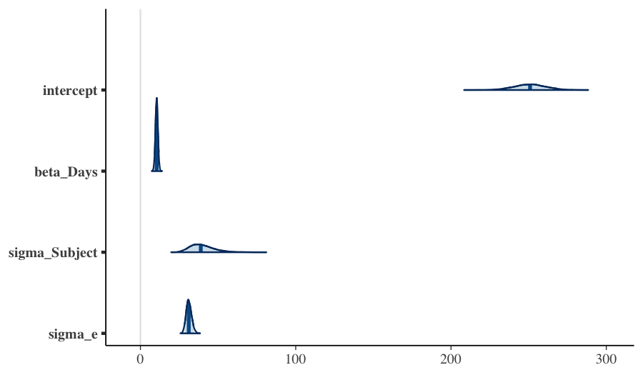
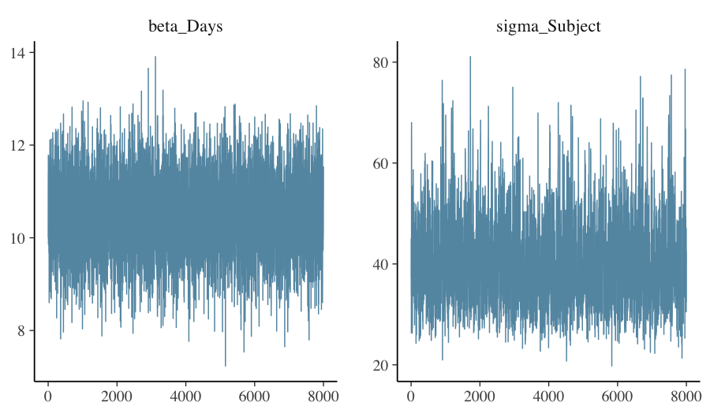

# 1. Once the fit is in hand

A fitted `flexybayes` object is the input to the standard R modelling
ecosystem: `summary()`, `predict()`, `emmeans::emmeans()`,
`marginaleffects::predictions()`, `bayesplot::*`, `posterior::*`,
`loo::loo()`, `effectsize::standardize_parameters()`. Each of these
downstream tools answers a different question. This vignette walks
through the most common ones using a single fit as the running
example.

The pedagogical point is that *the same posterior supports many
different summaries*. Choosing the right summary is part of the
analysis, not a clerical step at the end of it.

# 2. The running example

We re-fit the random-intercept model from the *getting started*
vignette and retain it for the rest of this vignette.


``` r
library(flexyBayes)
data(sleepstudy, package = "lme4")
fit <- flexybayes(
  Reaction ~ Days + (1 | Subject),
  data         = sleepstudy,
  backend      = "brms",
  seed         = 20260815L,
  n_samples    = 2000,
  warmup       = 5000,
  chains       = 4,
  verbose      = FALSE,
  mcmc_verbose = FALSE
)
fit
#> Bayesian mixed model  [flexyBayes / brms passthrough]
#> ------------------------------------------------------- 
#>   Fixed  : Reaction ~ Days + (1 | Subject) 
#>   Family : gaussian ( identity link )
#>   MCMC   : 4 chain(s) x 2000 samples (warmup = 5000 ) -- 17.2 sec (Stan via brms)
#>   Params : 25 monitored; 2 fixed, 1 random terms
#>   Max Rhat: 1.003  [OK] 
#>   Min ESS: 1099 
#> ------------------------------------------------------- 
#>   $glm    -- GLM-compatible shim (coef, vcov, fitted, etc.)
#>   $brms   -- live brmsfit (loo, posterior_predict, summary)
#>   $extras -- diagnostics, variance components, call info
```

> **`backend = "brms"` pinned.** This is the same `sleepstudy`
> random-intercept model discussed in the *getting started* and
> *hierarchical models* vignettes, where INLA's fit to it is known to
> be numerically unstable. brms does not share that failure mode.

`fit` is of class `flexybayes`. Its `summary()` method gives the
posterior digest; its `coef()` method returns the posterior means of
the fixed effects; its `predict()` method computes posterior
predictions on a `newdata` of your choice.

> **A note on the diagnostics.** This is a production-budget fit
> (warmup 5000, four chains). The fixed effects -- which the
> `emmeans` and `marginaleffects` analyses below rely on -- mix well;
> the Subject variance component mixes more slowly, so its worst
> $\widehat{R}$ can sit a little above the strict 1.01 target. The
> downstream summaries below are functions of the fixed-effect
> posterior and are unaffected.


``` r
summary(fit)
#> Bayesian mixed model summary  [flexyBayes]
#> ============================================================ 
#>   Fixed  : Reaction ~ Days + (1 | Subject) 
#>   Family : gaussian / identity 
#>   N = 180 , chains = 4 , samples = 2000 
#>   Representation: exact
#>   Engine:         brms / Stan HMC
#> 
#> -- Fixed effects (posterior)  --------------------------------- 
#>             Estimate Post.SD     2.5%    97.5%
#> (Intercept) 250.8424 10.3591 230.3852 270.7878
#> Days         10.4691  0.8070   8.8579  12.0614
#> 
#> -- Variance components  -------------------------------------- 
#>    Component Estimate     SD    2.5%   97.5%
#> 1 sd_Subject  39.8594 7.8662 27.3364 58.2728
#> 2      sigma  31.2342 1.7391 28.0638 34.9047
#> 
#> -- Convergence  --------------------------------------------- 
#>   Rhat range: 1 - 1.003 
#>   ESS  range: 1099 - 9124 
#>   Run time  : 17.2 sec
coef(fit)
#> (Intercept)        Days 
#>    250.8424     10.4691
```

# 3. `emmeans` -- marginal means and contrasts

`emmeans` (Lenth, 2022) computes *estimated marginal means*: the
predicted response (or any link-scale linear combination) evaluated
at a chosen reference grid, averaged appropriately over the other
variables. The integration with `flexyBayes` is via two S3 methods,
`recover_data.flexybayes()` and `emm_basis.flexybayes()`, which feed
`emmeans` the posterior-mean coefficient vector (`coef()`) and the
posterior covariance matrix (`vcov()`).

The resulting credible interval on each marginal mean is therefore a
**Gaussian approximation** to the true posterior of the linear
combination. For well-behaved fits the approximation is excellent
(linear combinations of approximately-jointly-Gaussian posteriors are
themselves approximately Gaussian); for skewed posteriors -- small
group counts, boundary problems -- it can understate the tail.

A typical first call estimates the predicted reaction time at three
days of the experiment:


``` r
library(emmeans)
em <- emmeans(fit, ~ Days, at = list(Days = c(0, 5, 9)))
em
#>  Days emmean    SE  df asymp.LCL asymp.UCL
#>     0    251 10.40 Inf       231       271
#>     5    303  9.68 Inf       284       322
#>     9    345 10.30 Inf       325       365
#> 
#> Confidence level used: 0.95
```

For pairwise contrasts:


``` r
pairs(em)
#>  contrast      estimate   SE  df z.ratio p.value
#>  Days0 - Days5    -52.3 4.03 Inf -12.974 <0.0001
#>  Days0 - Days9    -94.2 7.26 Inf -12.974 <0.0001
#>  Days5 - Days9    -41.9 3.23 Inf -12.974 <0.0001
#> 
#> P value adjustment: tukey method for comparing a family of 3 estimates
```

For full posterior propagation through marginal means -- the version
that reports an exact equal-tailed credible interval rather than a
Gaussian-approximate one -- drop down to `fb_as_draws_simple()` and
compute the linear combination per draw:


``` r
draws <- flexyBayes::fb_as_draws_simple(fit)
mu_d <- function(d) draws[["b_Intercept"]] + d * draws[["b_Days"]]
sapply(c(0, 5, 9), function(d) {
  s <- mu_d(d)
  c(mean = mean(s), q025 = quantile(s, 0.025), q975 = quantile(s, 0.975))
})
#>                [,1]     [,2]     [,3]
#> mean       250.8424 303.1880 345.0644
#> q025.2.5%  230.3852 284.1454 324.7088
#> q975.97.5% 270.7878 322.1363 365.3797
```

# 4. `marginaleffects` -- predictions, comparisons, and slopes

`marginaleffects` (Arel-Bundock, 2024) provides three closely-related
summaries.

- `predictions()` evaluates the *response* on a grid of predictors;
- `comparisons()` evaluates *differences in predictions* across
  user-specified contrasts;
- `slopes()` evaluates *partial derivatives* of predictions with
  respect to a continuous predictor.

`marginaleffects` works directly on `flexyBayes` fits on both the
brms and INLA backends. The functions dispatch through the package's
`get_predict()` / `get_coef()` / `get_vcov()` accessors and return
population-level (fixed-effect) predictions on the identity link:

```r
predictions(fit, newdata = data.frame(Days = c(0, 5, 9), Subject = "308"))

avg_comparisons(fit,
                variables = list(Days = c(0, 9)),
                newdata   = data.frame(Days = NA, Subject = "308"))

avg_slopes(fit, variables = "Days",
           newdata = data.frame(Days = 5, Subject = "308"))
```

The manual route through `fb_as_draws_simple()` remains available and
covers the same ground with full posterior draws:


``` r
draws <- flexyBayes::fb_as_draws_simple(fit)
predict_pop <- function(d) draws[["b_Intercept"]] + d * draws[["b_Days"]]
sapply(c(0, 5, 9), function(d) {
  s <- predict_pop(d)
  c(pred = mean(s), q025 = quantile(s, 0.025), q975 = quantile(s, 0.975))
})
#>                [,1]     [,2]     [,3]
#> pred       250.8424 303.1880 345.0644
#> q025.2.5%  230.3852 284.1454 324.7088
#> q975.97.5% 270.7878 322.1363 365.3797
# Comparison: difference between day 9 and day 0
diff_9_0 <- predict_pop(9) - predict_pop(0)
c(diff = mean(diff_9_0), q025 = quantile(diff_9_0, 0.025),
  q975 = quantile(diff_9_0, 0.975))
#>       diff  q025.2.5% q975.97.5% 
#>   94.22191   79.72071  108.55282
```

For full posterior propagation through complex counterfactuals -- where
`marginaleffects` summarises to population means while the draws carry
the entire posterior -- the manual draws-based route stays useful.

`marginaleffects` and `emmeans` overlap in scope. The rule of thumb:
`emmeans` for grouped means and pairwise contrasts on factors;
`marginaleffects` for derivative-based summaries and complex
counterfactuals.

# 5. `bayesplot` -- diagnostic and posterior plots

`bayesplot` (Gabry, Simpson, Vehtari, Betancourt, & Gelman, 2019)
provides the canonical posterior visualisations. The bridge from
`flexyBayes` to `bayesplot` is the `posterior::draws_array` interface,
exposed via `fb_as_draws_simple()`.


``` r
library(bayesplot)
draws <- flexyBayes::fb_as_draws_simple(fit)
da <- do.call(cbind, draws[c("b_Intercept", "b_Days",
                             "sd_Subject__Intercept", "sigma")])
colnames(da) <- c("intercept", "beta_Days", "sigma_Subject", "sigma_e")
mcmc_areas(da, prob = 0.9)
```



Diagnostic plots -- trace, autocorrelation, rank -- are equally
straightforward:


``` r
mcmc_trace(da, pars = c("beta_Days", "sigma_Subject"))
```



A trustworthy fit shows trace plots that look like *fuzzy
caterpillars*, autocorrelations that decay rapidly, and rank
histograms close to uniform. Departure from any of these is a
diagnostic prompt -- see the *cross-engine triangulation* vignette
for what to do.

# 6. `loo` -- predictive performance and model comparison

`loo::loo()` (Vehtari, Gelman, & Gabry, 2017; Vehtari, Simpson,
Gelman, Yao, & Gabry, 2024) computes *Pareto-smoothed importance-
sampling leave-one-out cross-validation* (PSIS-LOO), an estimator of
out-of-sample predictive log-density. Each observation receives a
Pareto-shape estimate $\hat{k}$, with $\hat{k} > 0.7$ indicating an
overly-influential observation that the importance-sampling
approximation cannot trust.

A canonical `loo` integration requires a `log_lik` method that
returns the pointwise log-likelihood draws array (S × N for S
posterior draws and N observations). `flexyBayes` ships
`logLik.flexybayes()` (a single-scalar plug-in method) and does not
ship `log_lik.flexybayes()` (the pointwise draws-array method that
`loo` requires). On a brms fit the array is one call away, because the
underlying `brmsfit` is kept on the object and brms supplies the
method:


``` r
ll_hier <- brms::log_lik(fit$brms)   # S x N, subject offsets included
loo_hier <- loo::loo(ll_hier)
loo_hier
#> 
#> Computed from 8000 by 180 log-likelihood matrix.
#> 
#>          Estimate   SE
#> elpd_loo   -885.0 14.3
#> p_loo        19.5  3.3
#> looic      1770.0 28.6
#> ------
#> MCSE of elpd_loo is 0.1.
#> MCSE and ESS estimates assume independent draws (r_eff=1).
#> 
#> All Pareto k estimates are good (k < 0.7).
#> See help('pareto-k-diagnostic') for details.
```

**Which log-likelihood you hand `loo` decides what it estimates, and
the wrong one looks plausible.** The hand-rolled version below builds
`mu` from the population-level coefficients only, dropping the
per-subject intercepts. It runs, it returns a finite ELPD, and it
answers a different question -- the leave-one-out predictive density
for a *new* subject rather than for a new observation on a subject
already in the data.


``` r
draws   <- flexyBayes::fb_as_draws_simple(fit)
n_draws <- length(draws[["b_Intercept"]])
n_obs   <- nrow(sleepstudy)
ll_pop  <- matrix(NA_real_, nrow = n_draws, ncol = n_obs)
for (s in seq_len(n_draws)) {
  mu_s <- draws[["b_Intercept"]][s] + draws[["b_Days"]][s] * sleepstudy$Days
  ll_pop[s, ] <- dnorm(sleepstudy$Reaction, mu_s, draws[["sigma"]][s],
                       log = TRUE)
}
loo_pop <- loo::loo(ll_pop)
loo_pop
#> 
#> Computed from 8000 by 180 log-likelihood matrix.
#> 
#>          Estimate   SE
#> elpd_loo  -1035.2 28.3
#> p_loo        54.6  7.0
#> looic      2070.3 56.7
#> ------
#> MCSE of elpd_loo is NA.
#> MCSE and ESS estimates assume independent draws (r_eff=1).
#> 
#> Pareto k diagnostic values:
#>                          Count Pct.    Min. ESS
#> (-Inf, 0.7]   (good)     173   96.1%   146     
#>    (0.7, 1]   (bad)        7    3.9%   <NA>    
#>    (1, Inf)   (very bad)   0    0.0%   <NA>    
#> See help('pareto-k-diagnostic') for details.
```

The tell is `p_loo`, the effective number of parameters. The mean
structure carries three population-level parameters, so a `p_loo` far
above three on the population-level array is not counting parameters at
all -- it is the estimator absorbing, as misfit, the eighteen subject
offsets it was not given. Compare the two directly:


``` r
data.frame(
  version = c("subject offsets included", "population level only"),
  elpd_loo = c(loo_hier$estimates["elpd_loo", "Estimate"],
               loo_pop$estimates["elpd_loo", "Estimate"]),
  p_loo = c(loo_hier$estimates["p_loo", "Estimate"],
            loo_pop$estimates["p_loo", "Estimate"])
)
#>                    version   elpd_loo    p_loo
#> 1 subject offsets included  -885.0108 19.48328
#> 2    population level only -1035.1539 54.57611
```

Use `loo_hier` for anything presented as a check on this hierarchical
model. `loo_pop` appears here only because it is the version a reader
would otherwise write.

The Pareto-$\hat{k}$ diagnostic is reported per observation. For two
competing models on the same data, `loo_compare()` returns the
expected log pointwise predictive density (ELPD) difference and its
standard error:

```r
loo_compare(loo_a, loo_b)
```

The right interpretation of `loo_compare` is *predictive*: model A is
predicted to do better than model B by `elpd_diff` log-points per
observation, with uncertainty `se_diff`. It is *not* a hypothesis
test.

# 7. `effectsize` -- standardised contrasts and partial $R^2$

`effectsize` (Ben-Shachar, Lüdecke, & Makowski, 2020) standardises
contrasts to a common scale (Cohen's $d$, partial $R^2$) and is
useful when reporting effect magnitudes across studies that use
different response scales.

The package's `flexybayes`-class method dispatches via
`parameters::model_parameters()`, which does not yet recognise the
`flexybayes` class -- `effectsize` integration is queued for a
subsequent release. For now, the manual standardisation path is
straightforward:


``` r
draws  <- flexyBayes::fb_as_draws_simple(fit)
sd_y   <- sd(sleepstudy$Reaction)
beta_std <- draws[["b_Days"]] * sd(sleepstudy$Days) / sd_y
c(mean = mean(beta_std),
  q025 = quantile(beta_std, 0.025),
  q975 = quantile(beta_std, 0.975))
#>       mean  q025.2.5% q975.97.5% 
#>  0.5353230  0.4529343  0.6167443
```

The `beta_std` values are interpretable as Cohen's $d$-style
standardised slopes -- one standard-deviation change in `Days`
shifts standardised reaction time by `mean(beta_std)`.

# 8. Pareto-$\hat{k}$ in interpretation

The Pareto-shape estimate $\hat{k}$ is more than a regularity check --
it identifies *which observations dominate the posterior*. When an
observation has $\hat{k} > 0.7$, the importance-sampling
approximation to its leave-one-out density is unreliable, but more
fundamentally it tells you that this observation is doing a lot of
work. Removing it would visibly change the posterior.

In practice:

- Plot $\hat{k}$ values; expect the right tail to thin quickly.
- For each $\hat{k} > 0.7$ observation, ask: is this observation a
  leverage point we should investigate, an outlier we should refit
  with a robust likelihood, or a routine high-information
  observation?

The cross-engine triangulation vignette uses the high-$\hat{k}$
observations from a Poisson fit as the trigger for refitting with a
heavier-tailed likelihood.

# 9. Pitfalls

**`emmeans` defaults assume balanced data.** When cell counts are
unbalanced or random effects are unequally represented, the default
weighting may not be what you want. Read `?emmeans::weights.emmGrid`
and pass `weights = "proportional"` or `weights = "equal"` as
appropriate.

**`marginaleffects` predictions on the link versus response scale.**
For non-Gaussian families, `predictions(type = "link")` and
`predictions(type = "response")` give different scales. Always state
the scale you are reporting.

**`loo` requires a pointwise log-likelihood, and which one you supply
changes the estimand.** On a brms fit, take it from
`brms::log_lik(fit$brms)`: that array includes the group-level
offsets, so the ELPD is the leave-one-out density for a new
observation on a known group. Building the array by hand from
population-level coefficients answers the new-group question instead,
and the symptom is a `p_loo` well above the number of parameters in
the mean structure. Section 6 shows both on the same fit.

**Bayes factors are not implemented.** `flexyBayes` does not
estimate marginal likelihoods directly. PSIS-LOO is the recommended
model-comparison instrument. Bayes factors via bridge sampling are
queued for a subsequent release.

**Raw draw names are backend-specific.** The manual routes above use
brms's raw Stan parameter names (`b_Intercept`, `b_Days`, `sigma`,
`sd_<group>__Intercept`). An INLA fit of the same model uses
different raw names (`(Intercept)`, `Days`, `Precision for the
Gaussian observations`, `Precision for <group>`) -- check
`names(fb_as_draws_simple(fit))` before reusing this code on a fit
from a different engine.

# 10. Active prompts

1. Refit the model on a subset (e.g., the first 12 subjects) and
   compare `emmeans` outputs with the full fit. How much does
   removing subjects change the best linear unbiased predictor
   (BLUP) intervals?
2. Run `loo()` on two fits -- the random-intercept and a
   fixed-effect-only model. Does the random-intercept model win on
   ELPD? By how much?
3. Use `marginaleffects::comparisons()` to compute the predicted
   increase in `Reaction` from day 0 to day 9 for an *average*
   subject (set `Subject = NA`). Compare with the per-subject
   prediction.

# 11. Session information


``` r
sessionInfo()
#> R version 4.5.2 (2025-10-31)
#> Platform: aarch64-apple-darwin20
#> Running under: macOS Tahoe 26.5.2
#> 
#> Matrix products: default
#> BLAS:   /System/Library/Frameworks/Accelerate.framework/Versions/A/Frameworks/vecLib.framework/Versions/A/libBLAS.dylib 
#> LAPACK: /Library/Frameworks/R.framework/Versions/4.5-arm64/Resources/lib/libRlapack.dylib;  LAPACK version 3.12.1
#> 
#> locale:
#> [1] en_AU.UTF-8/en_AU.UTF-8/en_AU.UTF-8/C/en_AU.UTF-8/en_AU.UTF-8
#> 
#> time zone: Australia/Adelaide
#> tzcode source: internal
#> 
#> attached base packages:
#> [1] stats     graphics  grDevices utils     datasets  methods   base     
#> 
#> other attached packages:
#> [1] bayesplot_1.15.0 emmeans_2.0.2    flexyBayes_0.9.0
#> 
#> loaded via a namespace (and not attached):
#>   [1] tidyselect_1.2.1       dplyr_1.2.1            farver_2.1.2          
#>   [4] loo_2.9.0              S7_0.2.2               INLA_25.10.19         
#>   [7] TH.data_1.1-5          tensorA_0.36.2.1       bayestestR_0.17.0     
#>  [10] digest_0.6.39          estimability_1.5.1     lifecycle_1.0.5       
#>  [13] sf_1.1-0               StanHeaders_2.32.10    processx_3.9.0        
#>  [16] survival_3.8-3         magrittr_2.0.5         posterior_1.7.0       
#>  [19] compiler_4.5.2         rlang_1.2.0            tools_4.5.2           
#>  [22] data.table_1.18.2.1    sn_2.1.3               knitr_1.51            
#>  [25] labeling_0.4.3         bridgesampling_1.2-1   mnormt_2.1.2          
#>  [28] curl_7.0.0             pkgbuild_1.4.8         classInt_0.4-11       
#>  [31] plyr_1.8.9             RColorBrewer_1.1-3     multcomp_1.4-29       
#>  [34] abind_1.4-8            KernSmooth_2.23-26     numDeriv_2016.8-1.1   
#>  [37] withr_3.0.2            datawizard_1.3.0       grid_4.5.2            
#>  [40] stats4_4.5.2           colorspace_2.1-2       inline_0.3.21         
#>  [43] xtable_1.8-8           e1071_1.7-17           future_1.70.0         
#>  [46] ggplot2_4.0.3          ggridges_0.5.7         globals_0.19.1        
#>  [49] scales_1.4.0           MASS_7.3-65            insight_1.4.6         
#>  [52] dichromat_2.0-0.1      cli_3.6.6              mvtnorm_1.3-6         
#>  [55] reformulas_0.4.4       generics_0.1.4         otel_0.2.0            
#>  [58] RcppParallel_5.1.11-2  reshape2_1.4.5         parameters_0.28.3     
#>  [61] minqa_1.2.8            DBI_1.3.0              proxy_0.4-29          
#>  [64] rstan_2.32.7           stringr_1.6.0          splines_4.5.2         
#>  [67] parallel_4.5.2         effectsize_1.0.2       matrixStats_1.5.0     
#>  [70] marginaleffects_0.32.0 brms_2.23.0            vctrs_0.7.3           
#>  [73] V8_8.0.1               boot_1.3-32            Matrix_1.7-4          
#>  [76] sandwich_3.1-1         jsonlite_2.0.0         callr_3.7.6           
#>  [79] listenv_0.10.1         units_1.0-1            glue_1.8.1            
#>  [82] parallelly_1.47.0      nloptr_2.2.1           codetools_0.2-20      
#>  [85] distributional_0.7.0   stringi_1.8.7          gtable_0.3.6          
#>  [88] QuickJSR_1.9.0         lme4_2.0-1             tibble_3.3.1          
#>  [91] pillar_1.11.1          Brobdingnag_1.2-9      R6_2.6.1              
#>  [94] fmesher_0.7.0          Rdpack_2.6.6           evaluate_1.0.5        
#>  [97] lattice_0.22-7         rbibutils_2.4.1        backports_1.5.1       
#> [100] MatrixModels_0.5-4     rstantools_2.6.0       class_7.3-23          
#> [103] Rcpp_1.1.1-1.1         gridExtra_2.3          coda_0.19-4.1         
#> [106] nlme_3.1-168           checkmate_2.3.4        xfun_0.57             
#> [109] zoo_1.8-15             pkgconfig_2.0.3
```

# References

Arel-Bundock, V. (2024). marginaleffects: Predictions, comparisons,
slopes, marginal means, and hypothesis tests. R package.

Ben-Shachar, M. S., Lüdecke, D., & Makowski, D. (2020). effectsize:
Estimation of effect size indices and standardized parameters.
*Journal of Open Source Software*, 5(56), 2815.

Gabry, J., Simpson, D., Vehtari, A., Betancourt, M., & Gelman, A.
(2019). Visualization in Bayesian workflow. *Journal of the Royal
Statistical Society: Series A*, 182(2), 389--402.

Lenth, R. V. (2022). emmeans: Estimated marginal means, aka
least-squares means. R package.

Vehtari, A., Gelman, A., & Gabry, J. (2017). Practical Bayesian model
evaluation using leave-one-out cross-validation and WAIC. *Statistics
and Computing*, 27(5), 1413--1432.

Vehtari, A., Simpson, D., Gelman, A., Yao, Y., & Gabry, J. (2024).
Pareto smoothed importance sampling. *Journal of Machine Learning
Research*, 25(72), 1--58.
